# Access Dictionary Items

## Accessing Items

### You can access the items of a dictionary by referring to its key name, inside square brackets:

#### Example:

```
address = dict(name = "Rajeev", age = 32, profession = "DevOps")
print(address)
print(type(address))
print(len(address))
print(address["name"])
print(address["age"])
print(address["profession"])

```

Output:

```
python3 access-dictionary-items-using-key.py
{'name': 'Rajeev', 'age': 32, 'profession': 'DevOps'}
<class 'dict'>
3
Rajeev
32
DevOps
```

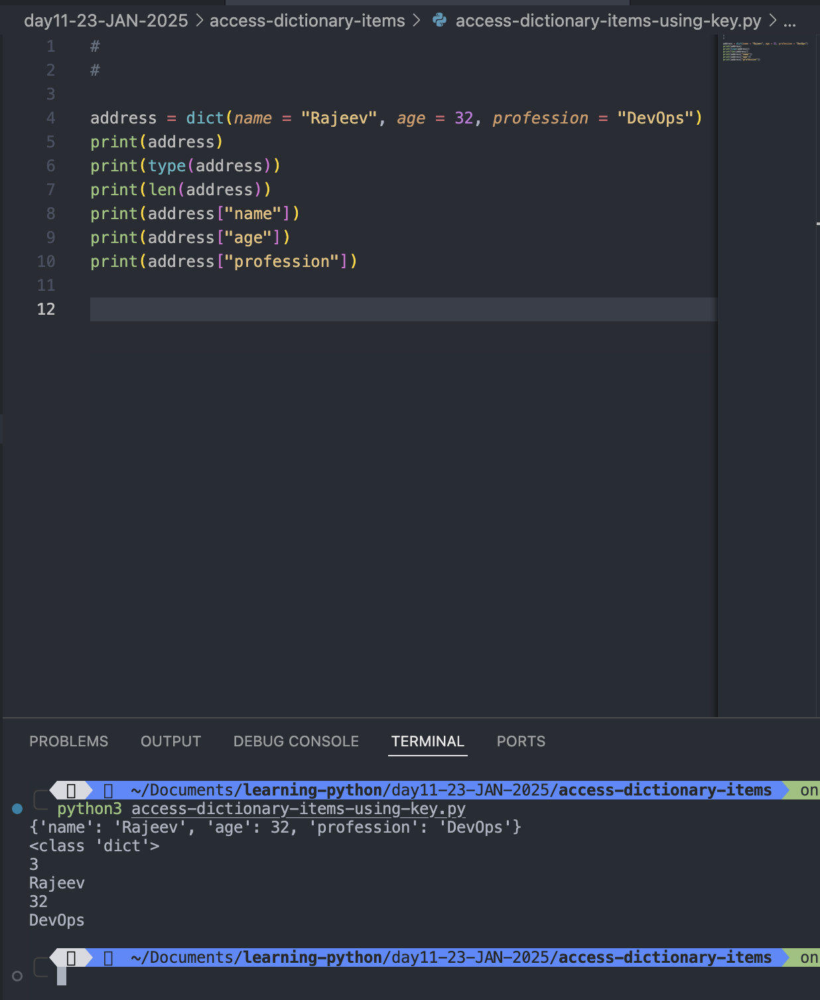

# get()

## There is also a method called get() that will give you the same result:

```
address = dict(name = "Rajeev", age = 32, profession = "DevOps")
print(address)
print(type(address))
print(len(address))
print(address["name"])
print(address["age"])
print(address["profession"])


personalDetails ={
"name": "Rajeev Kumar Singh",
"address": {
  "Street": "BTM 2nd Stage",
  "Layout": "BTM",
  "Pin Code": 560076
},
"Phone Number": 6299491504,
"Heigth": 5.11,
"measurement type": "foot and inch"

}

print(len(personalDetails))
print(personalDetails["address"])
print(personalDetails.get("address"))
print(type(personalDetails))
```

Output:

```
python3 get-method.py
{'name': 'Rajeev', 'age': 32, 'profession': 'DevOps'}
<class 'dict'>
3
Rajeev
32
DevOps
5
{'Street': 'BTM 2nd Stage', 'Layout': 'BTM', 'Pin Code': 560076}
{'Street': 'BTM 2nd Stage', 'Layout': 'BTM', 'Pin Code': 560076}
<class 'dict'>
```

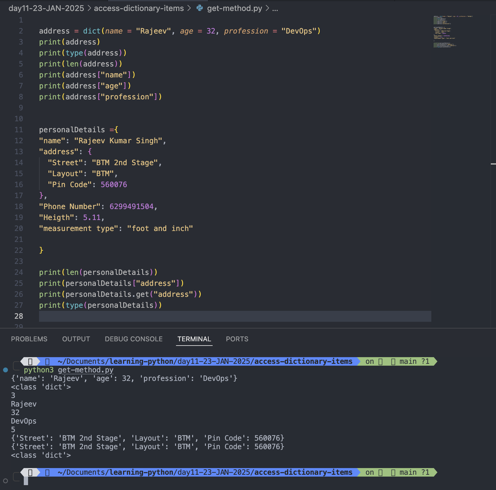

# Get Keys

## The keys() method will return a list of all the keys in the dictionary.

### Example:

```
personalDetails ={
"name": "Rajeev Kumar Singh",
"address": {
  "Street": "BTM 2nd Stage",
  "Layout": "BTM",
  "Pin Code": 560076
},
"Phone Number": 6299491504,
"Heigth": 5.11,
"measurement type": "foot and inch"

}

print(len(personalDetails))
print(personalDetails["address"])
print(personalDetails.get("address"))
print(type(personalDetails))
x = personalDetails.keys()
print(x)
```

Output:

```
5
{'Street': 'BTM 2nd Stage', 'Layout': 'BTM', 'Pin Code': 560076}
{'Street': 'BTM 2nd Stage', 'Layout': 'BTM', 'Pin Code': 560076}
<class 'dict'>
dict_keys(['name', 'address', 'Phone Number', 'Heigth', 'measurement type'])
```

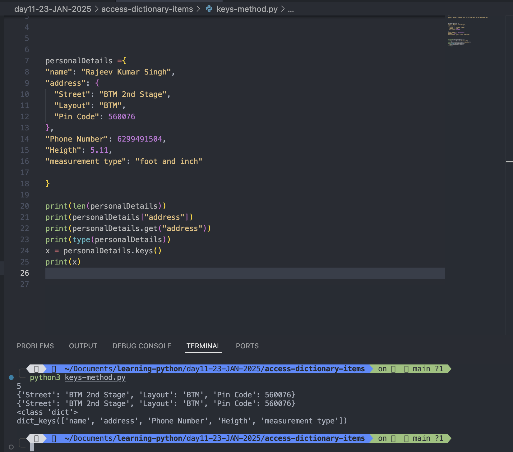

## The list of the keys is a view of the dictionary, meaning that any changes done to the dictionary will be reflected in the keys list.

### Example:

```
car = {
"brand": "Ford",
"model": "Mustang",
"year": 1964
}

x = car.keys()

print(x) #before the change
print("\n")
print("Length of car dictionary before change is: ",len(car))
print("\n")
car["color"] = "white"
print(x) #after the change
print("\n")
print("car dictionary after added color key and valur white is: ",car)
print("\n")
print("Length of car dictionary after change is:",len(car))
```

Output:

```
python3 keys-method.py
dict_keys(['brand', 'model', 'year'])


Length of car dictionary before change is:  3


dict_keys(['brand', 'model', 'year', 'color'])


car dictionary after added color key and valur white is:  {'brand': 'Ford', 'model': 'Mustang', 'year': 1964, 'color': 'white'}


Length of car dictionary after change is: 4
```

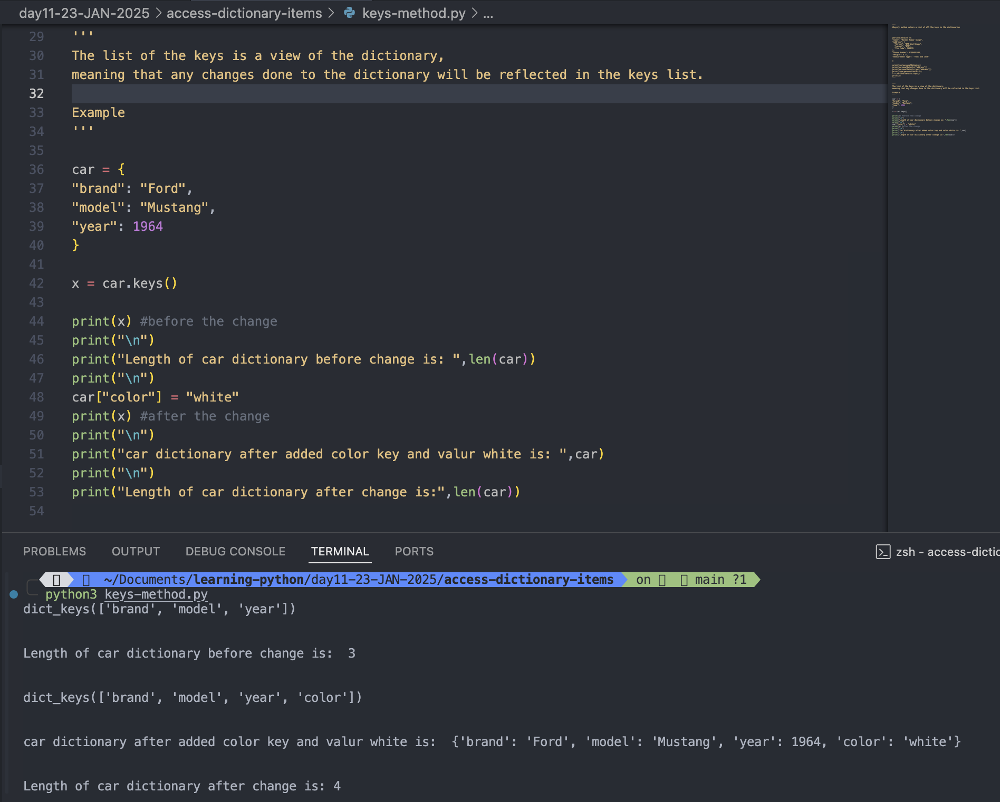

# Get Values

## The values() method will return a list of all the values in the dictionary.

### Example:

```
course = {
 "name": "DevOps",
 "UsedIn": "IT Operations",
 "Duration": 10.5,
 "Type": "Months"

}
print("course dictionary is:", course)
print("length of course dictionary is: ", len(course))
print("name of the course is: ", course["name"])
print("where we can use DevOps: ", course.get("UsedIn"))
print("Values of course dictionary is:  ", course.values())

```

Output:

```
python3 values-method.py
course dictionary is: {'name': 'DevOps', 'UsedIn': 'IT Operations', 'Duration': 10.5, 'Type': 'Months'}
length of course dictionary is:  4
name of the course is:  DevOps
where we can use DevOps:  IT Operations
Values of course dictionary is:   dict_values(['DevOps', 'IT Operations', 10.5, 'Months'])
```

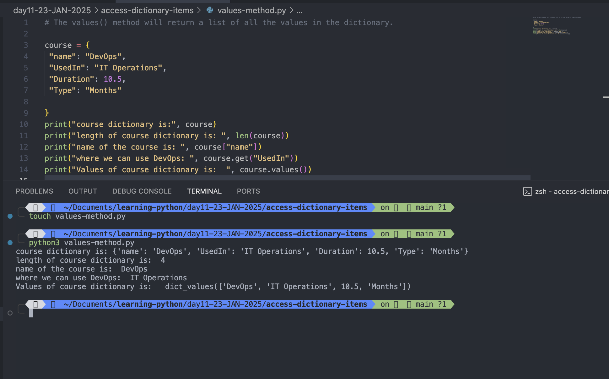

## The list of the values is a view of the dictionary, meaning that any changes done to the dictionary will be reflected in the values list.

```
course = {
 "name": "DevOps",
 "UsedIn": "IT Operations",
 "Duration": 10.5,
 "Type": "Months"

}
print("course dictionary is:", course)
print("length of course dictionary is: ", len(course))
print("name of the course is: ", course["name"])
print("where we can use DevOps: ", course.get("UsedIn"))
print("Values of course dictionary before change is:  ", course.values())

course["Duration"] = 8
print("course dictionary values after change is: ", course.values())
```

Output:

```
python3 values-method.py
course dictionary is: {'name': 'DevOps', 'UsedIn': 'IT Operations', 'Duration': 10.5, 'Type': 'Months'}
length of course dictionary is:  4
name of the course is:  DevOps
where we can use DevOps:  IT Operations
Values of course dictionary before change is:   dict_values(['DevOps', 'IT Operations', 10.5, 'Months'])
course dictionary values after change is:  dict_values(['DevOps', 'IT Operations', 8, 'Months'])
```

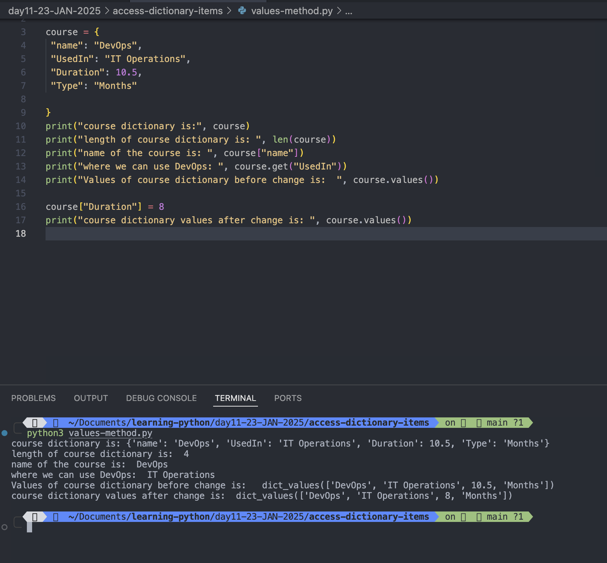

## Add a new item to the original dictionary, and see that the values list gets updated as well:

```
course = {
 "name": "DevOps",
 "UsedIn": "IT Operations",
 "Duration": 10.5,
 "Type": "Months"

}
print("course dictionary is:", course)
print("length of course dictionary is: ", len(course))
print("name of the course is: ", course["name"])
print("where we can use DevOps: ", course.get("UsedIn"))
print("Values of course dictionary before change is:  ", course.values())
print("course dictionary key before adding a new item is: ", course.keys())
course["Duration"] = 8
print("course dictionary values after change is: ", course.values())
# Add a new item to the original dictionary, and see that the values list gets updated as well:
course["Enroll"] = "ASAP"
print("Updated course dictionary values after adding a new item is: ", course.values())
print("course dictionary keys after adding a new item is: ", course.keys())
```

Output:

```
python3 values-method.py
course dictionary is: {'name': 'DevOps', 'UsedIn': 'IT Operations', 'Duration': 10.5, 'Type': 'Months'}
length of course dictionary is:  4
name of the course is:  DevOps
where we can use DevOps:  IT Operations
Values of course dictionary before change is:   dict_values(['DevOps', 'IT Operations', 10.5, 'Months'])
course dictionary key before adding a new item is:  dict_keys(['name', 'UsedIn', 'Duration', 'Type'])
course dictionary values after change is:  dict_values(['DevOps', 'IT Operations', 8, 'Months'])
Updated course dictionary values after adding a new item is:  dict_values(['DevOps', 'IT Operations', 8, 'Months', 'ASAP'])
course dictionary keys after adding a new item is:  dict_keys(['name', 'UsedIn', 'Duration', 'Type', 'Enroll'])
```

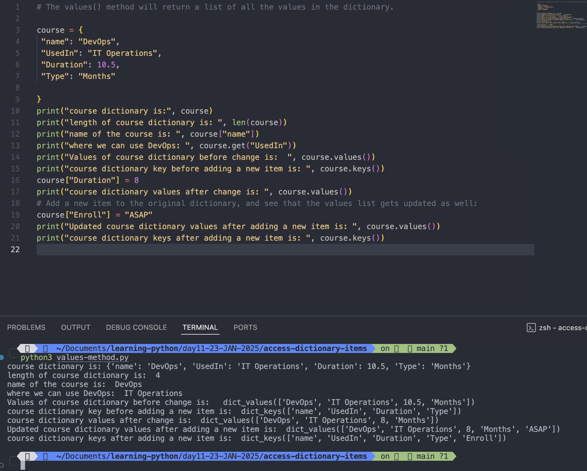

# Get Items

## The items() method will return each item in a dictionary, as tuples in a list.

### Example:

```
course = {
 "name": "DevOps",
 "UsedIn": "IT Operations",
 "Duration": 10.5,
 "Type": "Months"

}
print(course)
print(course.keys())
print(course.values())
print(course.items())
print(len(course))
```

Output:

```
python3 items-method.py
{'name': 'DevOps', 'UsedIn': 'IT Operations', 'Duration': 10.5, 'Type': 'Months'}
dict_keys(['name', 'UsedIn', 'Duration', 'Type'])
dict_values(['DevOps', 'IT Operations', 10.5, 'Months'])
dict_items([('name', 'DevOps'), ('UsedIn', 'IT Operations'), ('Duration', 10.5), ('Type', 'Months')])
4
```

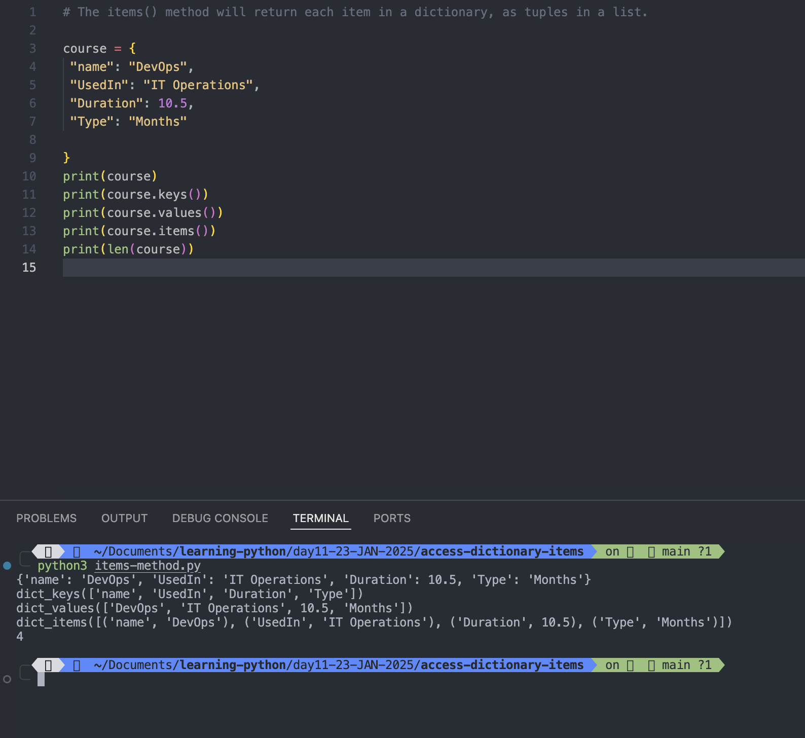

## The returned list is a view of the items of the dictionary, meaning that any changes done to the dictionary will be reflected in the items list.

### Example

```
course = {
 "name": "DevOps",
 "UsedIn": "IT Operations",
 "Duration": 10.5,
 "Type": "Months"

}
print(course)
print("\n")
print(course.keys())
print("\n")
print(course.values())
print("\n")
print("course dictionary items before change",course.items())
print("\n")
print(len(course))
#The returned list is a view of the items of the dictionary,
# meaning that any changes done to the dictionary will be reflected in the items list.
course["Duration"] = 8
course["enroll"] = "ASAP"
print("course dictionary items after changes: ", course.items())

```

Output:

```
python3 items-method.py
{'name': 'DevOps', 'UsedIn': 'IT Operations', 'Duration': 10.5, 'Type': 'Months'}


dict_keys(['name', 'UsedIn', 'Duration', 'Type'])


dict_values(['DevOps', 'IT Operations', 10.5, 'Months'])


course dictionary items before change dict_items([('name', 'DevOps'), ('UsedIn', 'IT Operations'), ('Duration', 10.5), ('Type', 'Months')])


4
course dictionary items after changes:  dict_items([('name', 'DevOps'), ('UsedIn', 'IT Operations'), ('Duration', 8), ('Type', 'Months'), ('enroll', 'ASAP')])


```

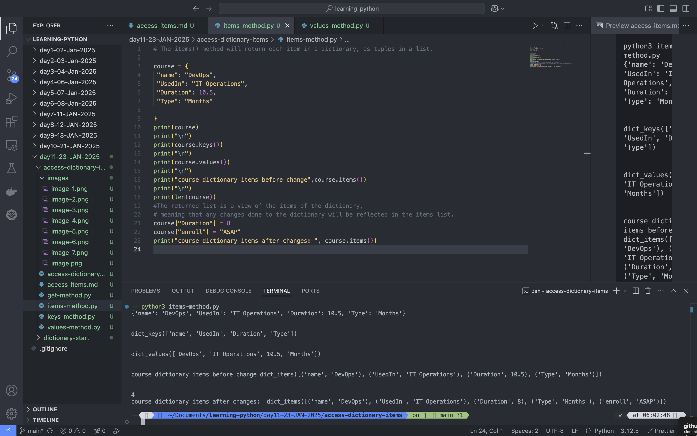

# Check if Key Exists

To determine if a specified key is present in a dictionary use the **in** keyword:

## Example:

```
course = {
 "name": "DevOps",
 "UsedIn": "IT Operations",
 "Duration": 10.5,
 "Type": "Months"

}
if "name" in course:
  print("Yes, 'name'  is one of the key in the course dictionary! ")
```

Output:

```
 python3 items-method.py
Yes, 'name'  is one of the key in the course dictionary!
```

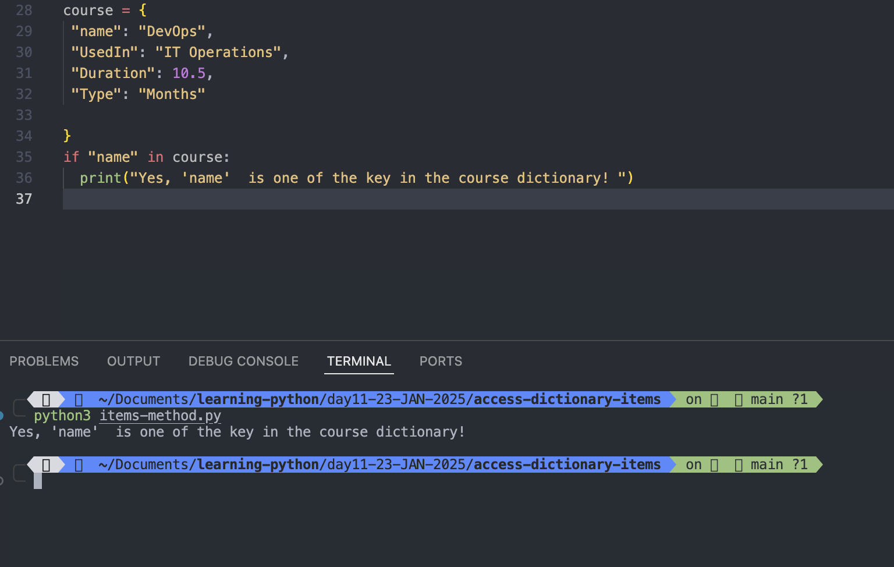

# Change and add Dictionary Items

### Examples

```

course = {
 "name": "DevOps",
 "UsedIn": "IT Operations",
 "Duration": 10.5,
 "Type": "Months"

}
print("Before change: ", course)
print("Items before change: ", course.items())
print("Values before change: ", course.values())
# Change Values
course["Duration"] = 7
course["UsedIn"] = "Operations Works in IT company"
# Add items
course["Platform"] = "Online"
print("After change: ", course)
print("Items after change: ", course.items())
print("Values after change: ", course.values())

```

Output:

```
python3 change-key-values.py
Before change:  {'name': 'DevOps', 'UsedIn': 'IT Operations', 'Duration': 10.5, 'Type': 'Months'}
Items before change:  dict_items([('name', 'DevOps'), ('UsedIn', 'IT Operations'), ('Duration', 10.5), ('Type', 'Months')])
Values before change:  dict_values(['DevOps', 'IT Operations', 10.5, 'Months'])
After change:  {'name': 'DevOps', 'UsedIn': 'Operations Works in IT company', 'Duration': 7, 'Type': 'Months', 'Platform': 'Online'}
Items after change:  dict_items([('name', 'DevOps'), ('UsedIn', 'Operations Works in IT company'), ('Duration', 7), ('Type', 'Months'), ('Platform', 'Online')])
Values after change:  dict_values(['DevOps', 'Operations Works in IT company', 7, 'Months', 'Online'])
```

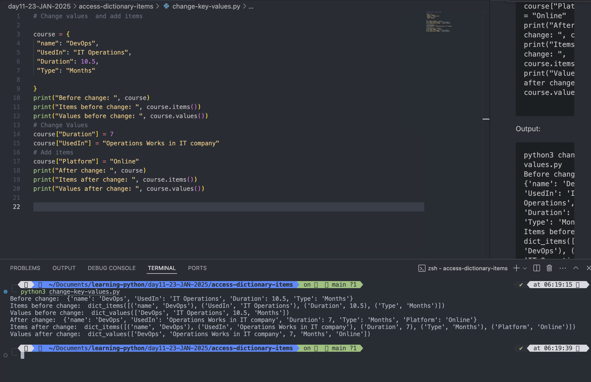

# Update Dictionary

- The **update()** method will update the dictionary with the items from the given argument.

- The **argument** must be a **dictionary**, or an **iterable object** with **key:value** pairs.

### Example:

#### Update the "year" of the car by using the update() method:

```
course = {
 "name": "DevOps",
 "UsedIn": "IT Operations",
 "Duration": 10.5,
 "Type": "Months"

}
print("Before change: ", course)
print("Items before change: ", course.items())
print("Values before change: ", course.values())
# Change Values
course["Duration"] = 7
course["UsedIn"] = "Operations Works in IT company"
# Add items
course["Platform"] = "Online"
print("After change: ", course)
print("Items after change: ", course.items())
print("Values after change: ", course.values())
# update the  "Duration" of the course by using the update() method
course.update({"Duration": "9"})
course.update({"fullName": "Rajeev Kumar Singh"})
print(course.values())
print(course.items())
```

Output:

```
python3 change-key-values.py
Before change:  {'name': 'DevOps', 'UsedIn': 'IT Operations', 'Duration': 10.5, 'Type': 'Months'}
Items before change:  dict_items([('name', 'DevOps'), ('UsedIn', 'IT Operations'), ('Duration', 10.5), ('Type', 'Months')])
Values before change:  dict_values(['DevOps', 'IT Operations', 10.5, 'Months'])
After change:  {'name': 'DevOps', 'UsedIn': 'Operations Works in IT company', 'Duration': 7, 'Type': 'Months', 'Platform': 'Online'}
Items after change:  dict_items([('name', 'DevOps'), ('UsedIn', 'Operations Works in IT company'), ('Duration', 7), ('Type', 'Months'), ('Platform', 'Online')])
Values after change:  dict_values(['DevOps', 'Operations Works in IT company', 7, 'Months', 'Online'])
dict_values(['DevOps', 'Operations Works in IT company', '9', 'Months', 'Online', 'Rajeev Kumar Singh'])
dict_items([('name', 'DevOps'), ('UsedIn', 'Operations Works in IT company'), ('Duration', '9'), ('Type', 'Months'), ('Platform', 'Online'), ('fullName', 'Rajeev Kumar Singh')])
```

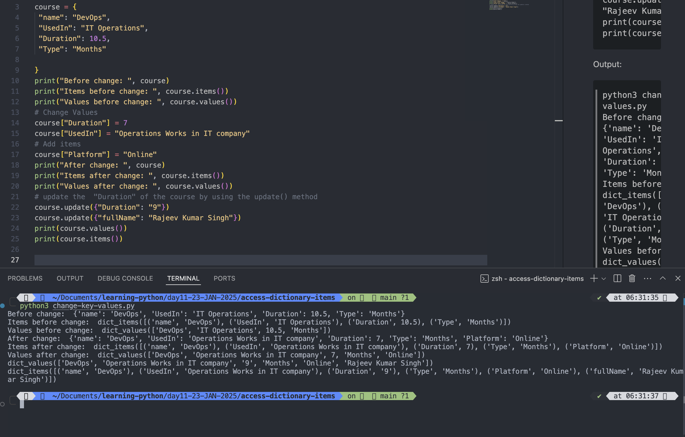
