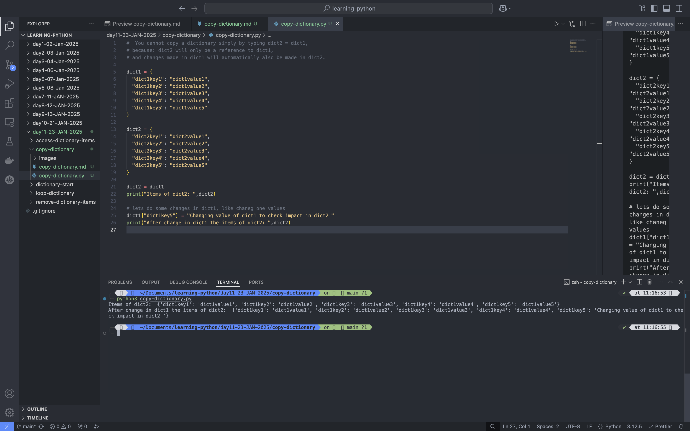
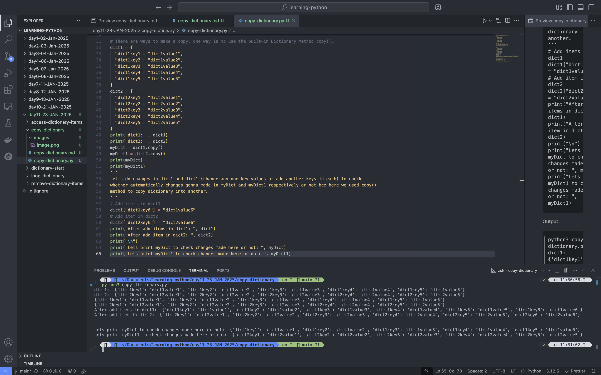
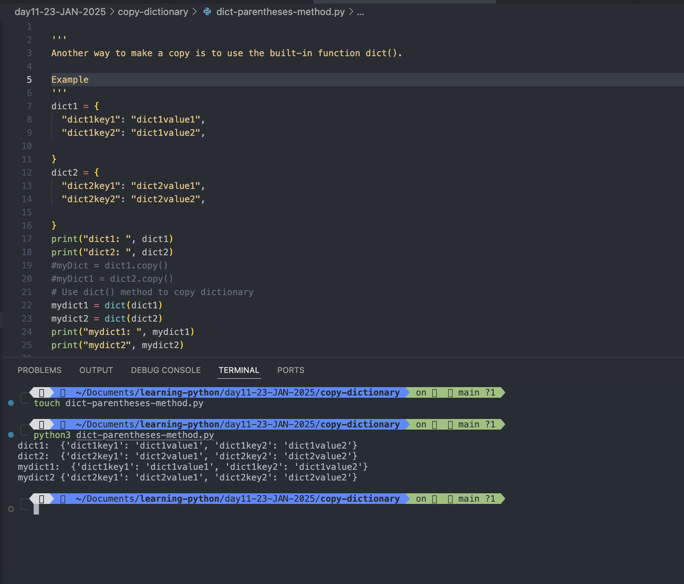

# Copy Dictionaries

- You cannot copy a dictionary simply by typing **dict2 = dict1**, because: dict2 will only be a reference to **dict1**, and changes made in **dict1** will automatically also be made in **dict2**.

## Example

```
dict1 = {
  "dict1key1": "dict1value1",
  "dict1key2": "dict1value2",
  "dict1key3": "dict1value3",
  "dict1key4": "dict1value4",
  "dict1key5": "dict1value5"
}

dict2 = {
  "dict2key1": "dict2value1",
  "dict2key2": "dict2value2",
  "dict2key3": "dict2value3",
  "dict2key4": "dict2value4",
  "dict2key5": "dict2value5"
}

dict2 = dict1
print("Items of dict2: ",dict2)

# lets do some changes in dict1, like chaneg one values
dict1["dict1key5"] = "Changing value of dict1 to check impact in dict2 "
print("After change in dict1 the items of dict2: ",dict2)
```

Output:

```
python3 copy-dictionary.py
Items of dict2:  {'dict1key1': 'dict1value1', 'dict1key2': 'dict1value2', 'dict1key3': 'dict1value3', 'dict1key4': 'dict1value4', 'dict1key5': 'dict1value5'}
After change in dict1 the items of dict2:  {'dict1key1': 'dict1value1', 'dict1key2': 'dict1value2', 'dict1key3': 'dict1value3', 'dict1key4': 'dict1value4', 'dict1key5': 'Changing value of dict1 to check impact in dict2 '}
```



#

- There are ways to make a copy, one way is to use the **built-in Dictionary method** **copy()**.

## Example:

```
# There are ways to make a copy, one way is to use the built-in Dictionary method copy().
dict1 = {
  "dict1key1": "dict1value1",
  "dict1key2": "dict1value2",
  "dict1key3": "dict1value3",
  "dict1key4": "dict1value4",
  "dict1key5": "dict1value5"
}
dict2 = {
  "dict2key1": "dict2value1",
  "dict2key2": "dict2value2",
  "dict2key3": "dict2value3",
  "dict2key4": "dict2value4",
  "dict2key5": "dict2value5"
}
print("dict1: ", dict1)
print("dict2: ", dict2)
myDict = dict1.copy()
myDict1 = dict2.copy()
print(myDict)
print(myDict1)
'''
Let's do changes in dict1 and dict1 (change any one key values or add another keys in each) to check
whether automatically changes gonna made in myDict and myDict1 respectively or not bcz here we used copy()
method to copy dictionary into another.
'''
# Add items in dict1
dict1["dict1key6"] = "dict1value6"
# Add item in dict2
dict2["dict2key6"] = "dict2value6"
print("After add items in dict1: ", dict1)
print("After add item in dict2: ", dict2)
print("\n")
print("Lets print myDict to check changes made here or not: ", myDict)
print("Lets print myDict1 to check changes made here or not: ", myDict1)
```

Output:

```
python3 copy-dictionary.py
dict1:  {'dict1key1': 'dict1value1', 'dict1key2': 'dict1value2', 'dict1key3': 'dict1value3', 'dict1key4': 'dict1value4', 'dict1key5': 'dict1value5'}
dict2:  {'dict2key1': 'dict2value1', 'dict2key2': 'dict2value2', 'dict2key3': 'dict2value3', 'dict2key4': 'dict2value4', 'dict2key5': 'dict2value5'}
{'dict1key1': 'dict1value1', 'dict1key2': 'dict1value2', 'dict1key3': 'dict1value3', 'dict1key4': 'dict1value4', 'dict1key5': 'dict1value5'}
{'dict2key1': 'dict2value1', 'dict2key2': 'dict2value2', 'dict2key3': 'dict2value3', 'dict2key4': 'dict2value4', 'dict2key5': 'dict2value5'}
After add items in dict1:  {'dict1key1': 'dict1value1', 'dict1key2': 'dict1value2', 'dict1key3': 'dict1value3', 'dict1key4': 'dict1value4', 'dict1key5': 'dict1value5', 'dict1key6': 'dict1value6'}
After add item in dict2:  {'dict2key1': 'dict2value1', 'dict2key2': 'dict2value2', 'dict2key3': 'dict2value3', 'dict2key4': 'dict2value4', 'dict2key5': 'dict2value5', 'dict2key6': 'dict2value6'}


Lets print myDict to check changes made here or not:  {'dict1key1': 'dict1value1', 'dict1key2': 'dict1value2', 'dict1key3': 'dict1value3', 'dict1key4': 'dict1value4', 'dict1key5': 'dict1value5'}
Lets print myDict1 to check changes made here or not:  {'dict2key1': 'dict2value1', 'dict2key2': 'dict2value2', 'dict2key3': 'dict2value3', 'dict2key4': 'dict2value4', 'dict2key5': 'dict2value5'}
```



#

# Another way to make a copy is to use the built-in function dict().

## Example:

```
dict1 = {
  "dict1key1": "dict1value1",
  "dict1key2": "dict1value2",

}
dict2 = {
  "dict2key1": "dict2value1",
  "dict2key2": "dict2value2",

}
print("dict1: ", dict1)
print("dict2: ", dict2)
#myDict = dict1.copy()
#myDict1 = dict2.copy()
# Use dict() method to copy dictionary
mydict1 = dict(dict1)
mydict2 = dict(dict2)
print("mydict1: ", mydict1)
print("mydict2", mydict2)
```

Output

```
 python3 dict-parentheses-method.py
dict1:  {'dict1key1': 'dict1value1', 'dict1key2': 'dict1value2'}
dict2:  {'dict2key1': 'dict2value1', 'dict2key2': 'dict2value2'}
mydict1:  {'dict1key1': 'dict1value1', 'dict1key2': 'dict1value2'}
mydict2 {'dict2key1': 'dict2value1', 'dict2key2': 'dict2value2'}
```


