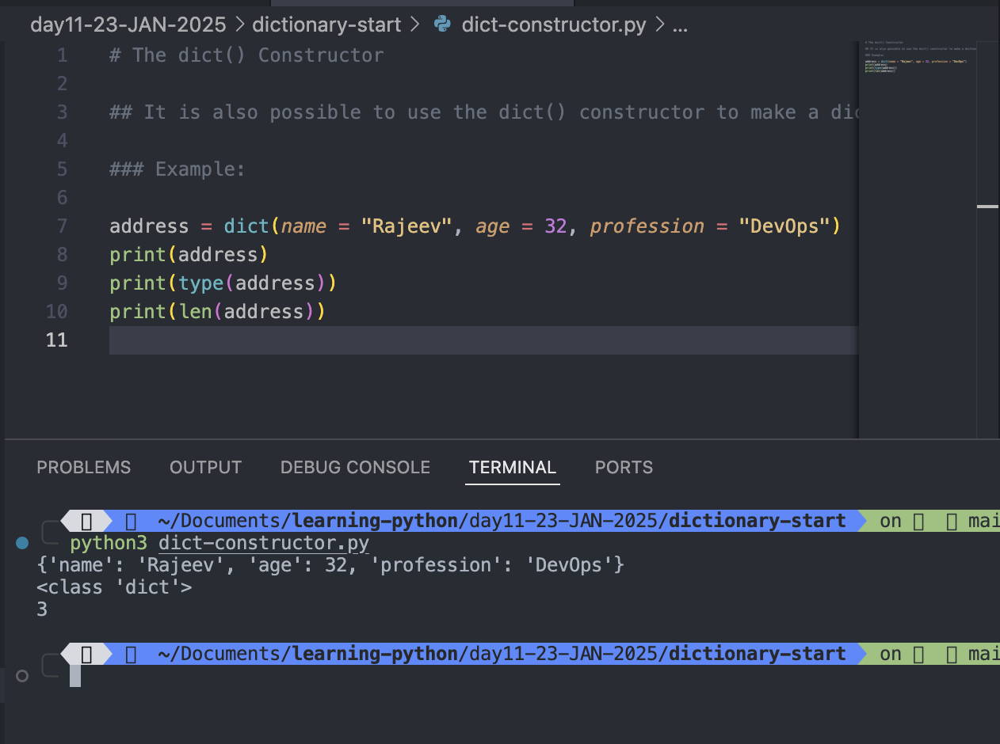

# Python Dictionary

```
address = {
"name": "Rajeev Kumar Singh",
"phone-number": 6299491504,
"address": "btm 2nd stage",
"city": "bangalore",
"state": "karnataka"
}
print(address)
print(type(address))

```

Output:

```
python3 dictionaries.py
{'name': 'Rajeev Kumar Singh', 'phone-number': 6299491504, 'address': 'btm 2nd stage', 'city': 'bangalore', 'state': 'karnataka'}
<class 'dict'>
```


#

# Dictionary

- Dictionaries are used to store data values in key:value pairs.
- A dictionary is a collection which is ordered\*, changeable and do not allow duplicates.
- Dictionaries are written with curly brackets, and have keys and values:

## Note

#### As of Python version 3.7, dictionaries are ordered. In Python 3.6 and earlier, dictionaries are unordered.

#

## Dictionary Items

- Dictionary items are ordered, changeable, and do not allow duplicates.
- Dictionary items are presented in key:value pairs, and can be referred to by using the key name.

### Example:

```
address = {
"myName": "Rajeev Kumar Singh",
"phone-number": 6299491504,
"address": "btm 2nd stage",
"city": "bangalore",
"state": "karnataka"
}
print(address["myName"])
print(address["phone-number"])
print(address["city"])
print(address["state"])

```

Output:

```
python3 dictionaries.py
Rajeev Kumar Singh
6299491504
bangalore
karnataka
```


## Ordered or Unordered?

## As of Python version 3.7, dictionaries are ordered. In Python 3.6 and earlier, dictionaries are unordered.

- When we say that dictionaries are ordered, it means that the items have a defined order, and that order will not change.
- Unordered means that the items do not have a defined order, you cannot refer to an item by using an index.

## Changeable

### Dictionaries are changeable, meaning that we can change, add or remove items after the dictionary has been created.

## Duplicates Not Allowed

### Dictionaries cannot have two items with the same key:

#### Example

```
address = {
"myName": "Rajeev Kumar Singh",
"phone-number": 6299491504,
"address": "btm 2nd stage",
"city": "bangalore",
"state": "karnataka"
"state": "karnataka"

}
print(address["myName"])
print(address["phone-number"])
print(address["city"])
print(address["state"])
```

Output:

```
File "/Users/rajeevsingh/Documents/learning-python/day11-23-JAN-2025/dictionary-start/dictionaries.py", line 41
    "state": "karnataka"
           ^
SyntaxError: invalid syntax
```


# Dictionary Length

## To determine how many items a dictionary has, use the len() function:

## Example:

```
address = {
"myName": "Rajeev Kumar Singh",
"phone-number": 6299491504,
"address": "btm 2nd stage",
"city": "bangalore",
"state": "karnataka"
}
print(address["myName"])
print(address["phone-number"])
print(address["city"])
print(address["state"])
print("Length of address dictionary is: ",len(address))

```

Output:

```
python3 dictionaries.py
Rajeev Kumar Singh
6299491504
bangalore
karnataka
Length of address dictionary is:  5
```


# Dictionary Items - Data Types

## The values in dictionary items can be of any data type:

### Example:

```
personalDetails = {
"name": "Rajeev Kumar Singh",
"age": 32,
"birthTime": 4.05,
"AMORPM": "AM",
"travelled": ["Patna","Ara","Bangalore","Dubai","Allahabad","Mangalore","Chennai"],
"City": ("Bangalore","Chennai","Mangalore"),
"Job": {"DevOps", "Engineer"},


}
print(personalDetails)
print("Length of personalDetail Dictionary is: ",len(personalDetails))

```

Output:

```
python3 dictionaries.py
{'name': 'Rajeev Kumar Singh', 'age': 32, 'birthTime': 4.05, 'AMORPM': 'AM', 'travelled': ['Patna', 'Ara', 'Bangalore', 'Dubai', 'Allahabad', 'Mangalore', 'Chennai'], 'City': ('Bangalore', 'Chennai', 'Mangalore'), 'Job': {'DevOps', 'Engineer'}}
Length of personalDetail Dictionary is:  7
```


# type()

## From Python's perspective, dictionaries are defined as objects with the data type 'dict':

### Example:

```
personalDetails = {
"name": "Rajeev Kumar Singh",
"age": 32,
"birthTime": 4.05,
"AMORPM": "AM",
"travelled": ["Patna","Ara","Bangalore","Dubai"],
"City": ("Bangalore","Chennai","Mangalore"),
"Job": {"DevOps", "Engineer"},


}
print(personalDetails)
print("Length of personalDetail Dictionary is: ",len(personalDetails))
print(type(personalDetails))
```

Output:

```
python3 dictionaries.py
{'name': 'Rajeev Kumar Singh', 'age': 32, 'birthTime': 4.05, 'AMORPM': 'AM', 'travelled': ['Patna', 'Ara', 'Bangalore', 'Dubai'], 'City': ('Bangalore', 'Chennai', 'Mangalore'), 'Job': {'Engineer', 'DevOps'}}
Length of personalDetail Dictionary is:  7
<class 'dict'>

```


# The dict() Constructor

## It is also possible to use the dict() constructor to make a dictionary.

### Example:

```
address = dict(name = "Rajeev", age = 32, profession = "DevOps")
print(address)
print(type(address))
print(len(address))
```

Output:

```python3 dict-constructor.py
{'name': 'Rajeev', 'age': 32, 'profession': 'DevOps'}
<class 'dict'>
3

```



# Python Collections (Arrays)

There are four collection data types in the Python programming language:

- **List** is a collection which is ordered and changeable. Allows duplicate members.
- **Tuple** is a collection which is ordered and unchangeable. Allows duplicate members.
- **Set** is a collection which is unordered, unchangeable\*, and unindexed. No duplicate members.
- **Dictionary** is a collection which is ordered\*\* and changeable. No duplicate members.

#
