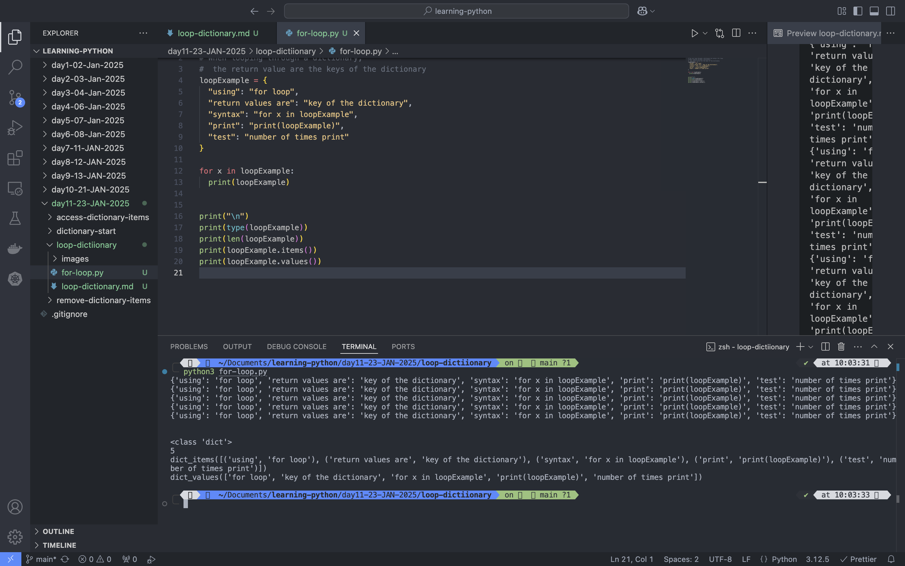
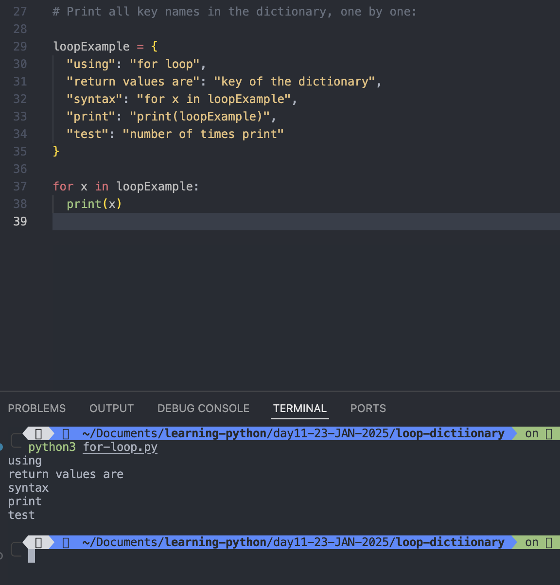
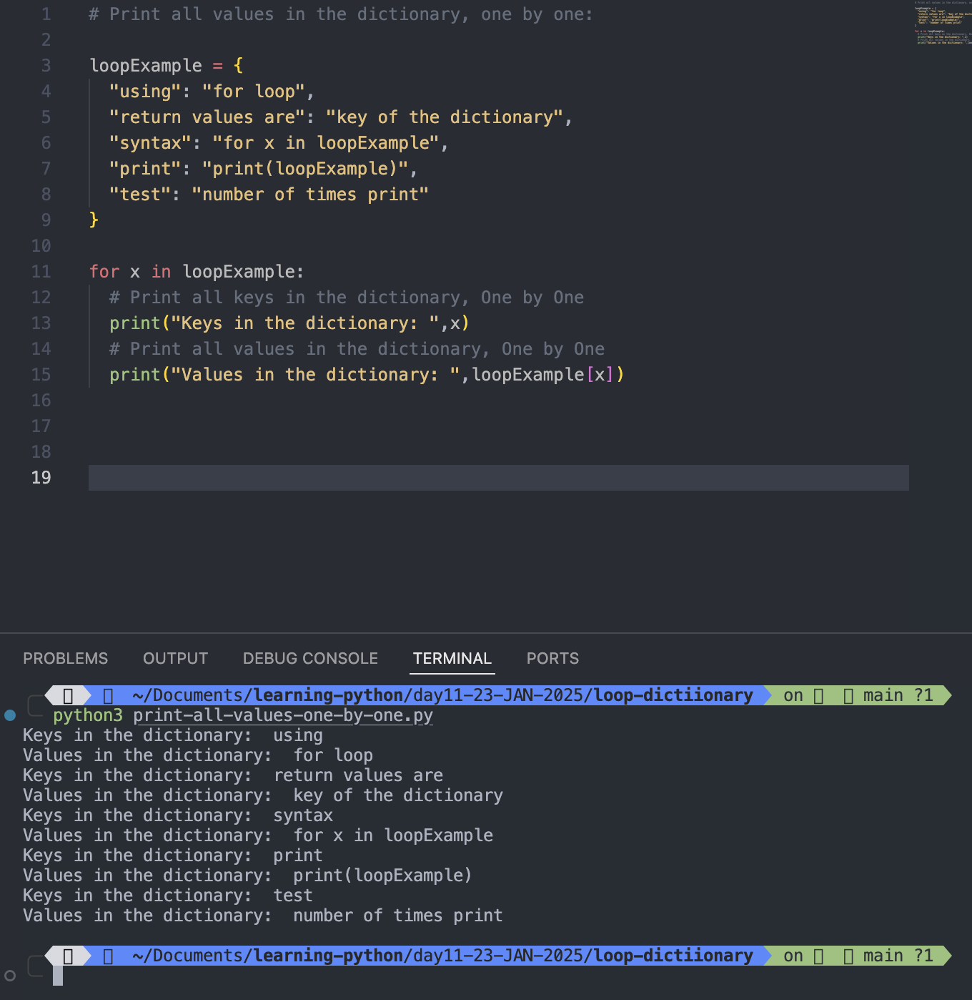
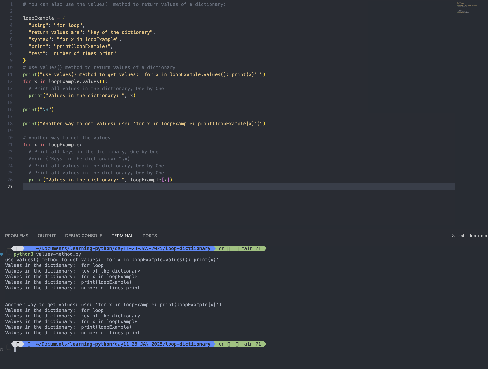
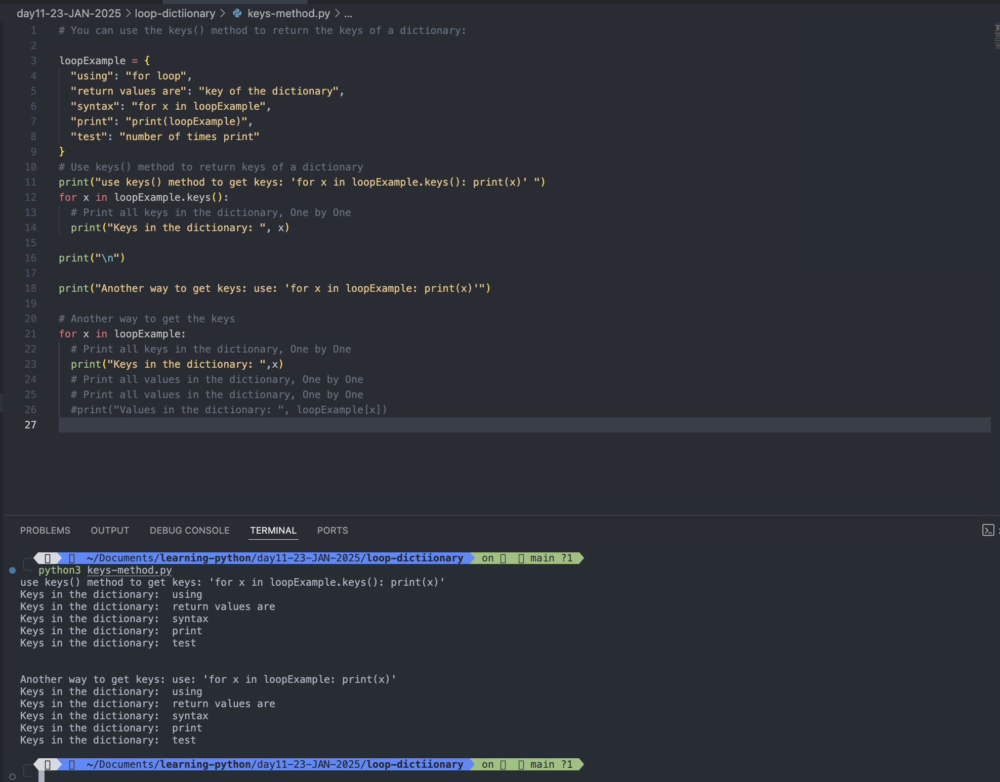
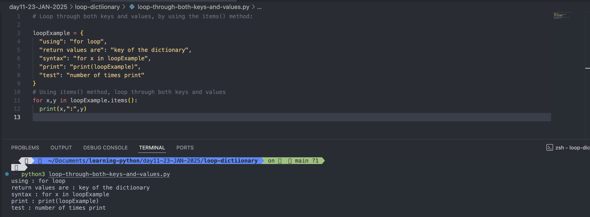

# Loop Dictionary

## Loop Through a Dictionary

- You can loop through a dictionary by using a **_for loop_**.
- When looping through a dictionary, the return value are the **keys** of the dictionary, but there are methods to return the **values** as well.

### Example:

```
loopExample = {
  "using": "for loop",
  "return values are": "key of the dictionary",
  "syntax": "for x in loopExample",
  "print": "print(loopExample)",
  "test": "number of times print"
}

for x in loopExample:
  print(loopExample)


print("\n")
print(type(loopExample))
print(len(loopExample))
print(loopExample.items())
print(loopExample.values())
```

Output:

```
python3 for-loop.py
{'using': 'for loop', 'return values are': 'key of the dictionary', 'syntax': 'for x in loopExample', 'print': 'print(loopExample)', 'test': 'number of times print'}
{'using': 'for loop', 'return values are': 'key of the dictionary', 'syntax': 'for x in loopExample', 'print': 'print(loopExample)', 'test': 'number of times print'}
{'using': 'for loop', 'return values are': 'key of the dictionary', 'syntax': 'for x in loopExample', 'print': 'print(loopExample)', 'test': 'number of times print'}
{'using': 'for loop', 'return values are': 'key of the dictionary', 'syntax': 'for x in loopExample', 'print': 'print(loopExample)', 'test': 'number of times print'}
{'using': 'for loop', 'return values are': 'key of the dictionary', 'syntax': 'for x in loopExample', 'print': 'print(loopExample)', 'test': 'number of times print'}


<class 'dict'>
5
dict_items([('using', 'for loop'), ('return values are', 'key of the dictionary'), ('syntax', 'for x in loopExample'), ('print', 'print(loopExample)'), ('test', 'number of times print')])
dict_values(['for loop', 'key of the dictionary', 'for x in loopExample', 'print(loopExample)', 'number of times print'])
```



#

## Print all key names in the dictionary, one by one:

```
loopExample = {
  "using": "for loop",
  "return values are": "key of the dictionary",
  "syntax": "for x in loopExample",
  "print": "print(loopExample)",
  "test": "number of times print"
}

for x in loopExample:
  print(x)

```

Output:

```
python3 for-loop.py
using
return values are
syntax
print
test
```



#

## Print all values in the dictionary, one by one:

```
loopExample = {
  "using": "for loop",
  "return values are": "key of the dictionary",
  "syntax": "for x in loopExample",
  "print": "print(loopExample)",
  "test": "number of times print"
}

for x in loopExample:
  # Print all keys in the dictionary, One by One
  print("Keys in the dictionary: ",x)
  # Print all values in the dictionary, One by One
  print("Values in the dictionary: ",loopExample[x])

```

Output:

```
python3 print-all-values-one-by-one.py
Keys in the dictionary:  using
Values in the dictionary:  for loop
Keys in the dictionary:  return values are
Values in the dictionary:  key of the dictionary
Keys in the dictionary:  syntax
Values in the dictionary:  for x in loopExample
Keys in the dictionary:  print
Values in the dictionary:  print(loopExample)
Keys in the dictionary:  test
Values in the dictionary:  number of times print
```



#

## You can also use the values() method to return values of a dictionary:

### Example:

```
loopExample = {
  "using": "for loop",
  "return values are": "key of the dictionary",
  "syntax": "for x in loopExample",
  "print": "print(loopExample)",
  "test": "number of times print"
}
# Use values() method to return values of a dictionary
print("use values() method to get values: 'for x in loopExample.values(): print(x)' ")
for x in loopExample.values():
  # Print all values in the dictionary, One by One
  print("Values in the dictionary: ", x)

print("\n")

print("Another way to get values: use: 'for x in loopExample: print(loopExample[x]')")

# Another way to get the values
for x in loopExample:
  # Print all keys in the dictionary, One by One
  #print("Keys in the dictionary: ",x)
  # Print all values in the dictionary, One by One
  # Print all values in the dictionary, One by One
  print("Values in the dictionary: ", loopExample[x])
```

Output:

```
python3 values-method.py
use values() method to get values: 'for x in loopExample.values(): print(x)'
Values in the dictionary:  for loop
Values in the dictionary:  key of the dictionary
Values in the dictionary:  for x in loopExample
Values in the dictionary:  print(loopExample)
Values in the dictionary:  number of times print


Another way to get values: use: 'for x in loopExample: print(loopExample[x]')
Values in the dictionary:  for loop
Values in the dictionary:  key of the dictionary
Values in the dictionary:  for x in loopExample
Values in the dictionary:  print(loopExample)
Values in the dictionary:  number of times print
```



#

## You can use the keys() method to return the keys of a dictionary:

### Example:

```
loopExample = {
  "using": "for loop",
  "return values are": "key of the dictionary",
  "syntax": "for x in loopExample",
  "print": "print(loopExample)",
  "test": "number of times print"
}
# Use keys() method to return keys of a dictionary
print("use keys() method to get keys: 'for x in loopExample.keys(): print(x)' ")
for x in loopExample.keys():
  # Print all keys in the dictionary, One by One
  print("Keys in the dictionary: ", x)

print("\n")

print("Another way to get keys: use: 'for x in loopExample: print(x)'")

# Another way to get the keys
for x in loopExample:
  # Print all keys in the dictionary, One by One
  print("Keys in the dictionary: ",x)
  # Print all values in the dictionary, One by One
  # Print all values in the dictionary, One by One
  #print("Values in the dictionary: ", loopExample[x])
```

Output:

```
python3 keys-method.py
use keys() method to get keys: 'for x in loopExample.keys(): print(x)'
Keys in the dictionary:  using
Keys in the dictionary:  return values are
Keys in the dictionary:  syntax
Keys in the dictionary:  print
Keys in the dictionary:  test


Another way to get keys: use: 'for x in loopExample: print(x)'
Keys in the dictionary:  using
Keys in the dictionary:  return values are
Keys in the dictionary:  syntax
Keys in the dictionary:  print
Keys in the dictionary:  test
```



#

## Loop through both keys and values, by using the items() method:

### Example:

```
loopExample = {
  "using": "for loop",
  "return values are": "key of the dictionary",
  "syntax": "for x in loopExample",
  "print": "print(loopExample)",
  "test": "number of times print"
}
# Using items() method, loop through both keys and values
for x,y in loopExample.items():
  print(x,":",y)

```

Output:

```
python3 loop-through-both-keys-and-values.py
using : for loop
return values are : key of the dictionary
syntax : for x in loopExample
print : print(loopExample)
test : number of times print
```


