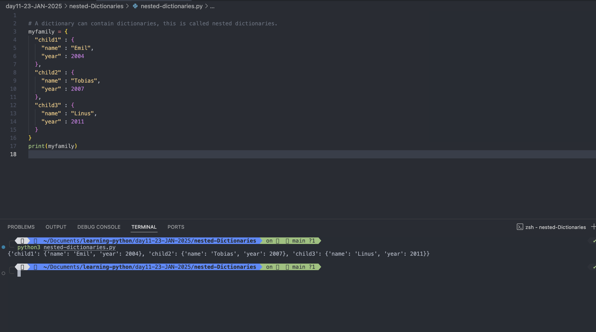
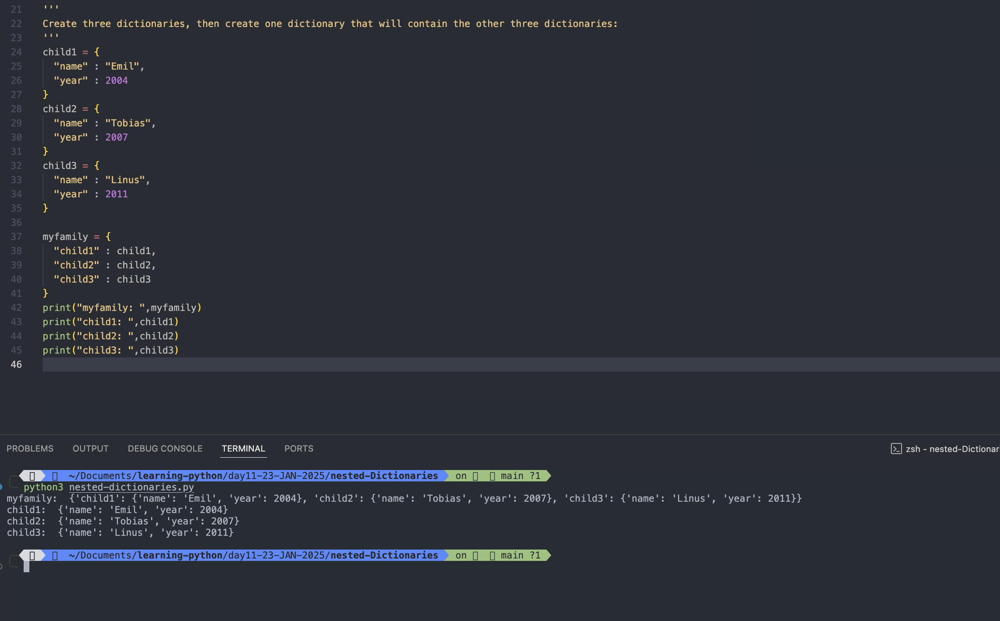
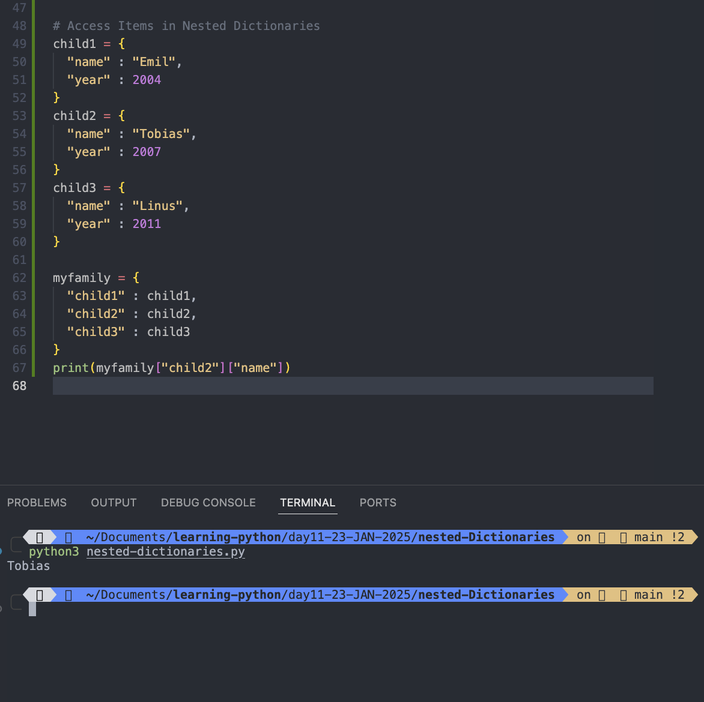
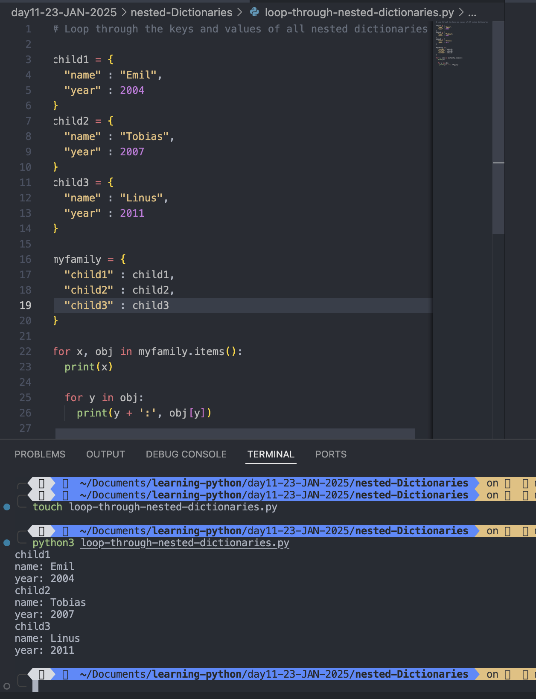
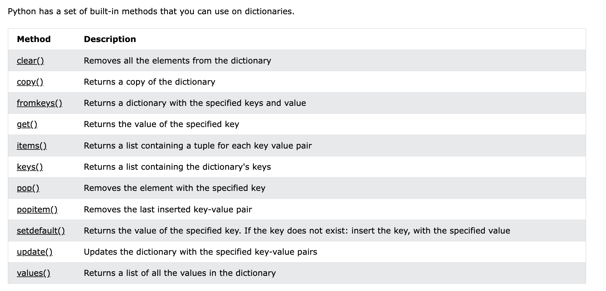

# Nested Dictionaries

- A dictionary can contain dictionaries, this is called nested dictionaries.

## Example: Create a dictionary that contain three dictionaries:

```
myfamily = {
  "child1" : {
    "name" : "Emil",
    "year" : 2004
  },
  "child2" : {
    "name" : "Tobias",
    "year" : 2007
  },
  "child3" : {
    "name" : "Linus",
    "year" : 2011
  }
}

```

Output:

```
python3 nested-dictionaries.py
{'child1': {'name': 'Emil', 'year': 2004}, 'child2': {'name': 'Tobias', 'year': 2007}, 'child3': {'name': 'Linus', 'year': 2011}}
```



#

## Or, if you want to add three dictionaries into a new dictionary:

### Example: Create three dictionaries, then create one dictionary that will contain the other three dictionaries:

```
'''
Create three dictionaries, then create one dictionary that will contain the other three dictionaries:
'''
child1 = {
  "name" : "Emil",
  "year" : 2004
}
child2 = {
  "name" : "Tobias",
  "year" : 2007
}
child3 = {
  "name" : "Linus",
  "year" : 2011
}

myfamily = {
  "child1" : child1,
  "child2" : child2,
  "child3" : child3
}
print("myfamily: ",myfamily)
print("child1: ",child1)
print("child2: ",child2)
print("child3: ",child3)


```

Output:

```
python3 nested-dictionaries.py
myfamily:  {'child1': {'name': 'Emil', 'year': 2004}, 'child2': {'name': 'Tobias', 'year': 2007}, 'child3': {'name': 'Linus', 'year': 2011}}
child1:  {'name': 'Emil', 'year': 2004}
child2:  {'name': 'Tobias', 'year': 2007}
child3:  {'name': 'Linus', 'year': 2011}
```



#

# Access Items in Nested Dictionaries

## To access items from a nested dictionary, you use the name of the dictionaries, starting with the outer dictionary:

### Example:

```
'''
Create three dictionaries, then create one dictionary that will contain the other three dictionaries:
'''
child1 = {
  "name" : "Emil",
  "year" : 2004
}
child2 = {
  "name" : "Tobias",
  "year" : 2007
}
child3 = {
  "name" : "Linus",
  "year" : 2011
}

myfamily = {
  "child1" : child1,
  "child2" : child2,
  "child3" : child3
}
print(myfamily["child2"]["name"])


```

Output:

```
python3 nested-dictionaries.py
Tobias
```



#

# Loop Through Nested Dictionaries

## You can loop through a dictionary by using the items() method like this:

### Examples:

#### Loop through the keys and values of all nested dictionaries:

```

for x, obj in myfamily.items():
  print(x)

  for y in obj:
    print(y + ':', obj[y])

```

Output:

```
python3 loop-through-nested-dictionaries.py
child1
name: Emil
year: 2004
child2
name: Tobias
year: 2007
child3
name: Linus
year: 2011
```



#

# Dictionary Methods


