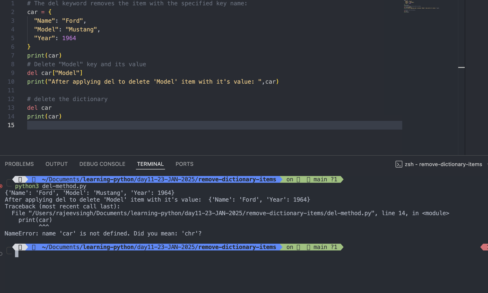

# Remove Dictionary Items

## Removing Items

### There are several methods to remove items from dictionary

- **pop()**: The **pop()** method removes the item with the specified key name

### Example:

```
car = {
  "Name": "Ford",
  "Model": "Mustang",
  "Year": 1964
}
print(car)
car.pop("Year")
print(car)
```

Output:

```
python3 pop-method.py
{'Name': 'Ford', 'Model': 'Mustang', 'Year': 1964}
{'Name': 'Ford', 'Model': 'Mustang'}
```


#

- **popitem()**: The popitem() method removes the last inserted item (in versions before 3.7, a random item is removed instead)

### Example:

```
car = {
  "Name": "Ford",
  "Model": "Mustang",
  "Year": 1964
}
print(car)
car.popitem()
print("after apply popitem(): ", car)

```

Output:

```
python3 popitem-method.py
{'Name': 'Ford', 'Model': 'Mustang', 'Year': 1964}
after apply popitem():  {'Name': 'Ford', 'Model': 'Mustang'}
```


#

- **del()**: The **del** keyword removes the item with the specified key name

### Example

```
# The del keyword removes the item with the specified key name:
car = {
  "Name": "Ford",
  "Model": "Mustang",
  "Year": 1964
}
print(car)
# Delete "Model" key and its value
del car["Model"]
print("After applying del to delete 'Model' item with it's value: ",car)
```

Output:

```
python3 del-method.py
{'Name': 'Ford', 'Model': 'Mustang', 'Year': 1964}
After applying del to delete 'Model' item with it's value:  {'Name': 'Ford', 'Year': 1964}
```


#

- **del()**: The **del** keyword can also delete the dictionary completely

### Example:

```

car = {
  "Name": "Ford",
  "Model": "Mustang",
  "Year": 1964
}
print(car)
# Delete "Model" key and its value
del car["Model"]
print("After applying del to delete 'Model' item with it's value: ",car)

# delete the dictionary
del car
print(car)
```

Output:

```
python3 del-method.py
{'Name': 'Ford', 'Model': 'Mustang', 'Year': 1964}
After applying del to delete 'Model' item with it's value:  {'Name': 'Ford', 'Year': 1964}
Traceback (most recent call last):
  File "/Users/rajeevsingh/Documents/learning-python/day11-23-JAN-2025/remove-dictionary-items/del-method.py", line 14, in <module>
    print(car)
          ^^^
NameError: name 'car' is not defined. Did you mean: 'chr'?
```



#

- **_clear()_**: The clear() method empties the dictionary:

### Example:

```
car = {
  "Name": "Ford",
  "Model": "Mustang",
  "Year": 1964
}
print(car)
car.clear()
print(car)
```

Output:

```
python3 clear-method.py
{'Name': 'Ford', 'Model': 'Mustang', 'Year': 1964}
{}
```


