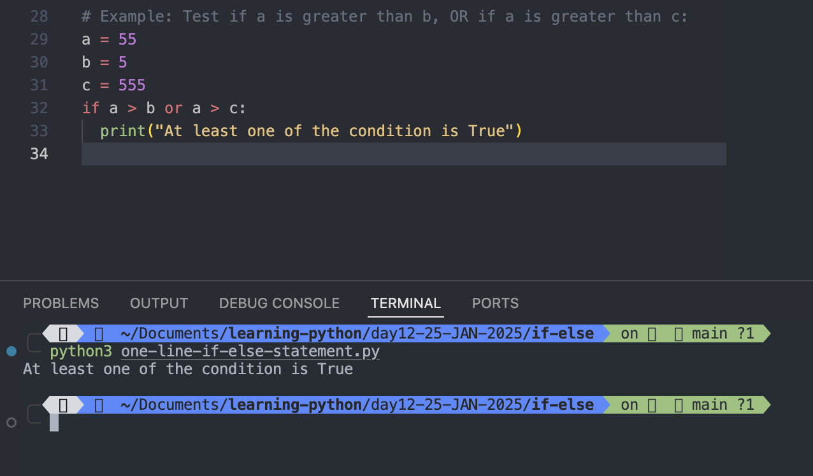

# Python If ...Else

## Python Conditions and If statements

- Python supports the usual logical conditions from mathematics:
  - Equals: a == b
  - Not Equals: a != b
  - Less than: a < b
  - Less than or equal to: a <= b
  - Greater than: a > b
  - Greater than or equal to: a >= b
- These conditions can be used in several ways, most commonly in "if statements" and loops.
- An "if statement" is written by using the if keyword.

## Example:

```

# If else example
a = 5
b = 55
if b > a :
  print("b is greater than a ")
```

Output:

```
python3 if-else.py
b is greater than a
```


#

# Indentation

## Python relies on indentation (whitespace at the beginning of a line) to define scope in the code. Other programming languages often use curly-brackets for this purpose.

```
# If else example
a = 5
b = 55
if b > a :
print("b is greater than a ")
```

Output:

```
python3 if-else.py
  File "/Users/rajeevsingh/Documents/learning-python/day12-25-JAN-2025/if-else/if-else.py", line 12
    print("b is greater than a ")
    ^
IndentationError: expected an indented block after 'if' statement on line 11
```


#

# Elif

## The elif keyword is Python's way of saying "if the previous conditions were not true, then try this condition".

### Example:

```
a = 5
b = 5

if a > b:
  print("a is greater than b")
elif a == b:
  print("a is equal to b")
```

Output:

```
python3 elif.py
a is equal to b
```


## In this example a is equal to b, so the first condition is not true, but the elif condition is true, so we print to screen that "a and b are equal".

#

# Else

## The else keyword catches anything which isn't caught by the preceding conditions.

### Example:

```
a = 10
b = 20
if a > b:
  print("a is greater than b")
else:
  print("b is greater than a")
```

Output:

```
python3 else.py
b is greater than a
```


```
a = 10
b = 20
if a > b:
  print("a is greater than b")
elif a == b:
  print("a is equal to b")
else:
  print("b is greater than a")
```

Output

```
python3 else.py
b is greater than a
```


#

# Short Hand If

- If you have only one statement to execute, you can put it on the same line as the if statement.

## Example : One line if statement:

```
a = 10
b = 20
if a > b: print("a is greater than b")

```

Output:

```
python3 else.py
a is greater than b
```


#

# Short Hand If ... Else

## If you have only one statement to execute, one for if, and one for else, you can put it all on the same line:

### Example: One line if else statement:

```
a = 5
b = 55
print("A") if a > b else print("B")
```

Output:

```
python3 one-line-if-else-statement.py
B
```


This technique is known as <mark>Ternary Operators</mark>, or <mark>Conditional Expressions</mark>.

#

## You can also have multiple else statements on the same line:

### Example: One line if else statement, with 3 conditions:

```
# Example: One line if else statement, with 3 conditions:

a = 555
b = 555
print("A") if a > b else print("=") if a == b else print("B")
```

Output:

```
python3 one-line-if-else-statement.py
=
```


#

## And

### The <mark>and</mark> keyword is a logical operator, and us used to combine conditional statements.

Example: Test if a is greater than b, AND if c is greater than a:

```
a = 5
b = 3
c = 55
if a > b and c > a:
  print("Both condition are True")

```

Output:

```
python3 one-line-if-else-statement.py
Both condition are True
```


#

## Or

The <mark>or</mark> keyword is a logical operator, and is used to combine conditional statement

### Example: Test if a is greater than b, OR if a is greater than c:

```
# Example: Test if a is greater than b, OR if a is greater than c:
a = 55
b = 5
c = 555
if a > b or a > c:
  print("At least one of the condition is True")

```

Output:

```
python3 one-line-if-else-statement.py
At least one of the condition is True

```



#

## Not

The <mark>not</mark> keyword is a logical operator, and is used to reverse the result of the conditional statement.

### Example: Test if a is NOT greater than b:

```
# Example: Test if a is NOT greater than b:
a = 5
b = 55
if not a > b:
  print("a is NOT greater than b")
```

Output:

```
python3 one-line-if-else-statement.py
a is NOT greater than b
```


#

# Nested If

```
x = 51
if x > 10:
  print("Above Ten")
  if x > 20:
    print("and also Above Twenty")
  else :
    print("but not above 20")

```

Output:

```
python3 nested-if.py
Above Ten
and also Above Twenty
```


#

# The pass Statement

## <mark>if</mark> statements cannot be empty, but <mark>if</mark> you for some reason have an if statement with no content, put in the <mark>pass</mark> statement to avoid getting an error.

### Example:

```
a = 5
b = 55
if a > b:
  pass
```

Output:

```
python3 the-pass-statement.py
```


