# Python for loops

- A <mark>for</mark> loop is used for iterating over a sequence (that is either a list, a tuple, a dictionary, a set, or a string).
- This is less like the <mark>for</mark> keyword in other programming languages, and works more like an iterator method as found in other object-orientated programming languages.
- With the <mark>for</mark> loop we can execute a set of statements, once for each item in a list, tuple, set etc.

#

# Example: Print each item in the list

```
# Example: Print each items of the set
myList = {"Rajeev", "Kumar", "Singh"}
for items in myList:
  print("Set items: ",items)

# Example: Print each items of the tuples
myTuple = ("Rajeev", "Kumar", "Singh")
for items in myTuple:
  print("Tuple items: ", items)

# Example: Print each items of the list
myList = ["Rajeev", "Kumar", "Singh"]
for items in myList:
  print("List Items: ",items)
# Example: Print each items of the dictionary
myDict = {
  "Name": "Rajeev", "Age": "32", "Profession":"DevOps Engineer"
  }
# Print all keys
for keys in myDict:
  print("Key of Dictionary:",keys)
# Print all values
for values in myDict.values():
  print("Values of Dictionary keys: ",values)
```

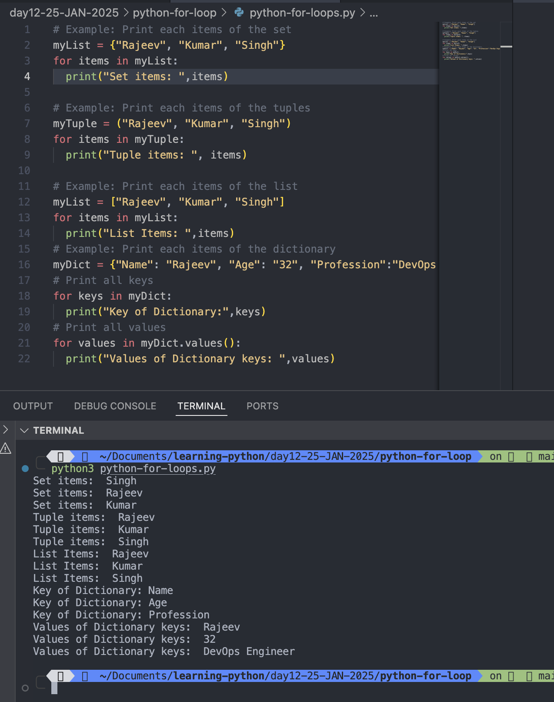

#

# The for loop does not require an indexing variable to set beforehand.

# Looping Through a String

## Even strings are iterable objects, they contain a sequence of characters:

### Example: Loop through the letters in the word

```
name = "Rajeev Kumar Singh"
for letters in name:
  print(letters)
```

Output:

```
python3 looping-through-string.py
R
a
j
e
e
v

K
u
m
a
r

S
i
n
g
h
```


#

# The break Statement

## With the <mark>break</mark> statement we can stop the loop before it has looped through all the items:

```
name = ["Rajeev", "Kumar", "Singh"]
for items in name:
  print(items)
  if items == "Singh":
    break
```

Output:

```
python3 break-statement.py
Rajeev
Kumar
Singh
```

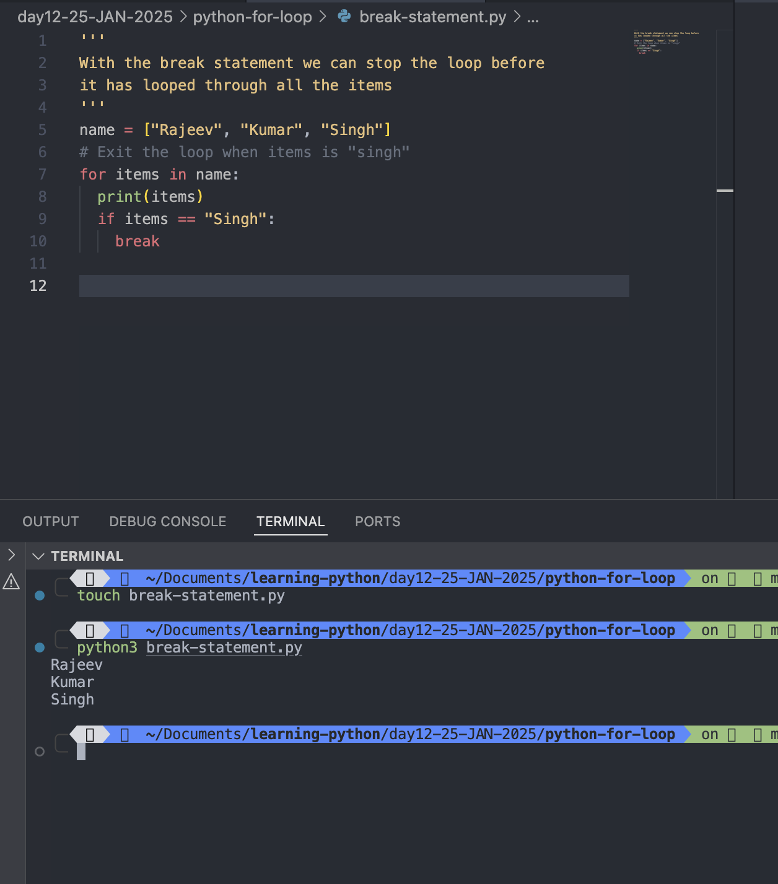

#

```
details = ["Rajeev", "Kumar", "Singh", "Devops Engineer"]
print(details)
print(type(details))
for items in details:
  print(items)
  if items == "Singh":
    break
```

Output:

```
python3 break-statement.py
['Rajeev', 'Kumar', 'Singh', 'Devops Engineer']
<class 'list'>
Rajeev
Kumar
Singh
```

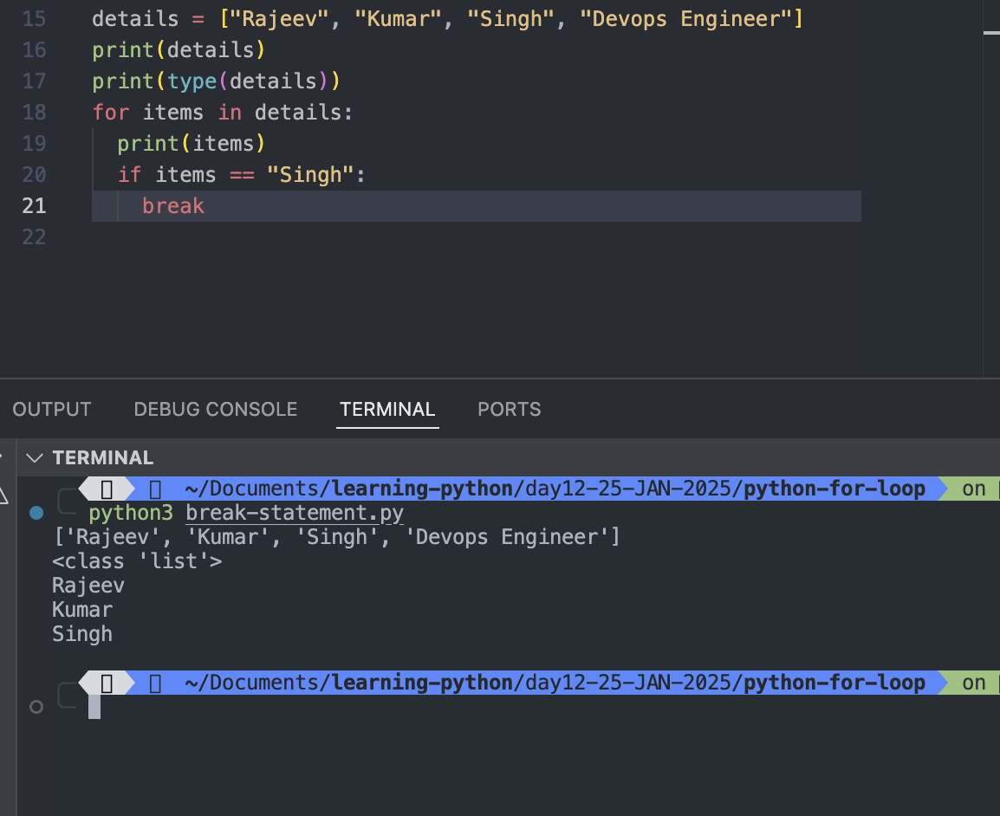

#

## Example: Exit the loop when items is "Singh", but this time the break comes before the print:

```
details = ["Rajeev", "Kumar", "Singh", "Devops Engineer"]
print(details)
print(type(details))
for items in details:
  if items == "Singh":
    break
  print(items)
```

Output:

```
python3 break-statement.py
['Rajeev', 'Kumar', 'Singh', 'Devops Engineer']
<class 'list'>
Rajeev
Kumar
```

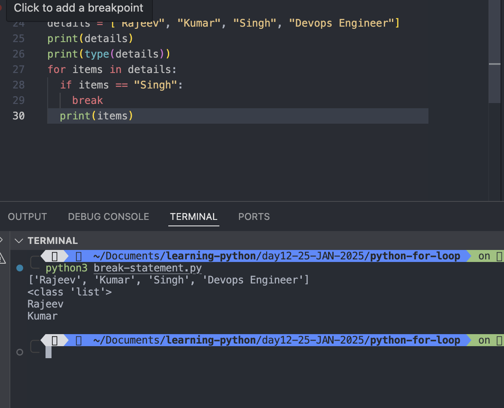

#

```
details = {
  "name": "Rajeev Kumar Singh",
  "Age": 32,
  "Profession": "DevOps Engineer"
}
for items in details:
  print(details.items())
  print(details.values())
  if items == "Age":
    break
print("\n")
for items in details:
  if items == "Age":
    break
  print(details.items())
  print(details.values())
```

Output:

```
python3 break-statement.py
dict_items([('name', 'Rajeev Kumar Singh'), ('Age', 32), ('Profession', 'DevOps Engineer')])
dict_values(['Rajeev Kumar Singh', 32, 'DevOps Engineer'])
dict_items([('name', 'Rajeev Kumar Singh'), ('Age', 32), ('Profession', 'DevOps Engineer')])
dict_values(['Rajeev Kumar Singh', 32, 'DevOps Engineer'])


dict_items([('name', 'Rajeev Kumar Singh'), ('Age', 32), ('Profession', 'DevOps Engineer')])
dict_values(['Rajeev Kumar Singh', 32, 'DevOps Engineer'])
```

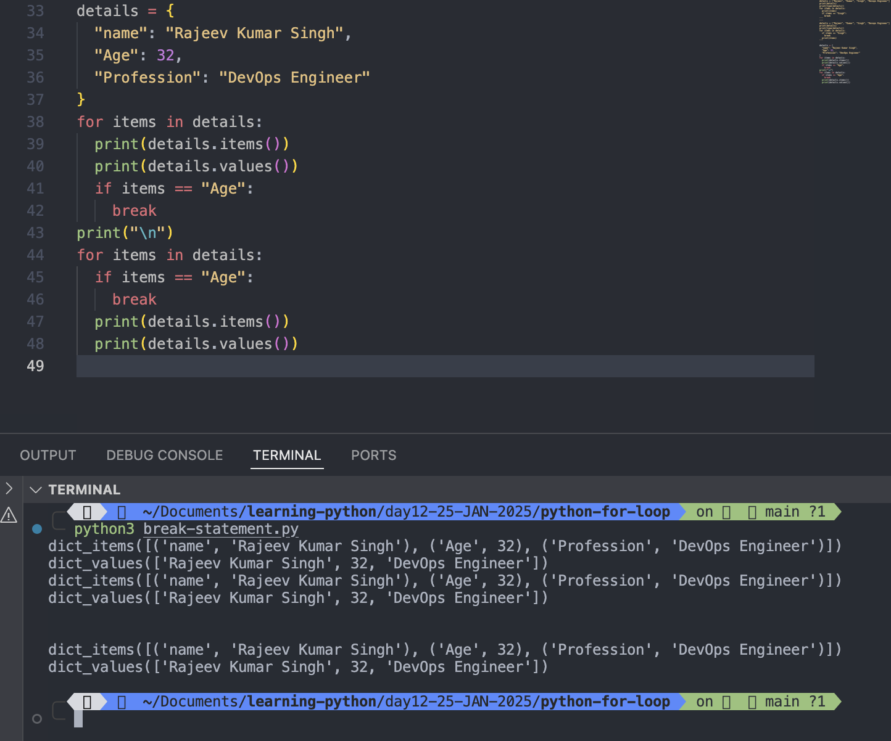

#

```
details = {
  "name": "Rajeev Kumar Singh",
  "Age": 32,
  "Profession": "DevOps Engineer"
}
for items in details:
  print(items)

  if items == "Age":
    break
print("\n")
for items in details:
  if items == "Age":
    break
  print(items)
```

Output:

```
python3 break-statement.py
name
Age


name
```

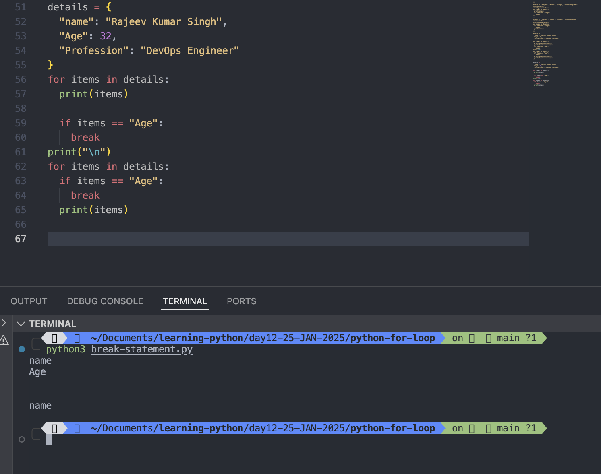

#

# The continue Statement

## With the <mark>continue</mark> statement we can stop the current iteration of the loop, and continue with the next:

```
details = ["Rajeev", "Kumar", "Singh"]
for items in details:
  if items == "Kumar":
    continue
  print(items)
```

Output:

```
python3 continue-statement-in-for-loop.py
Rajeev
Singh
```

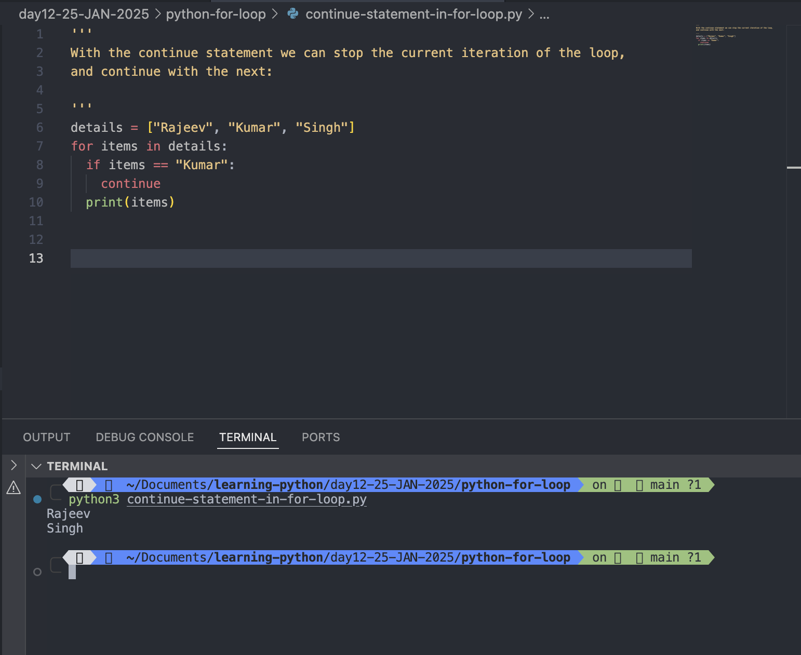

#

# The range() Function

- To loop through a set of code a specified number of times, we can use the range() function,
- The range() function returns a sequence of numbers, starting from 0 by default, and increments by 1 (by default), and ends at a specified number.
- The range() function in Python is used to generate a sequence of numbers. It is commonly used in loops to iterate over a specific range of values.

```
range(start, stop, step)
```

### Parameters

1. <mark>start</mark>(optional): The starting number of the sequence. Default is 0.
2. <mark>stop</mark>(required): The end of the sequence (exclusive).
3. <mark>step</mark>(optional): The difference between each number in the sequence. Default is 1.

## Key Features

- The range() function returns a sequence of numbers.
- The sequence generated is immutable and must be converted to a list or iterated directly to see the numbers.

## Example: Using the range(function)

```
for i in range(6):
  print(i)

```

Output:

```
python3 range-function.py
0
1
2
3
4
5
```

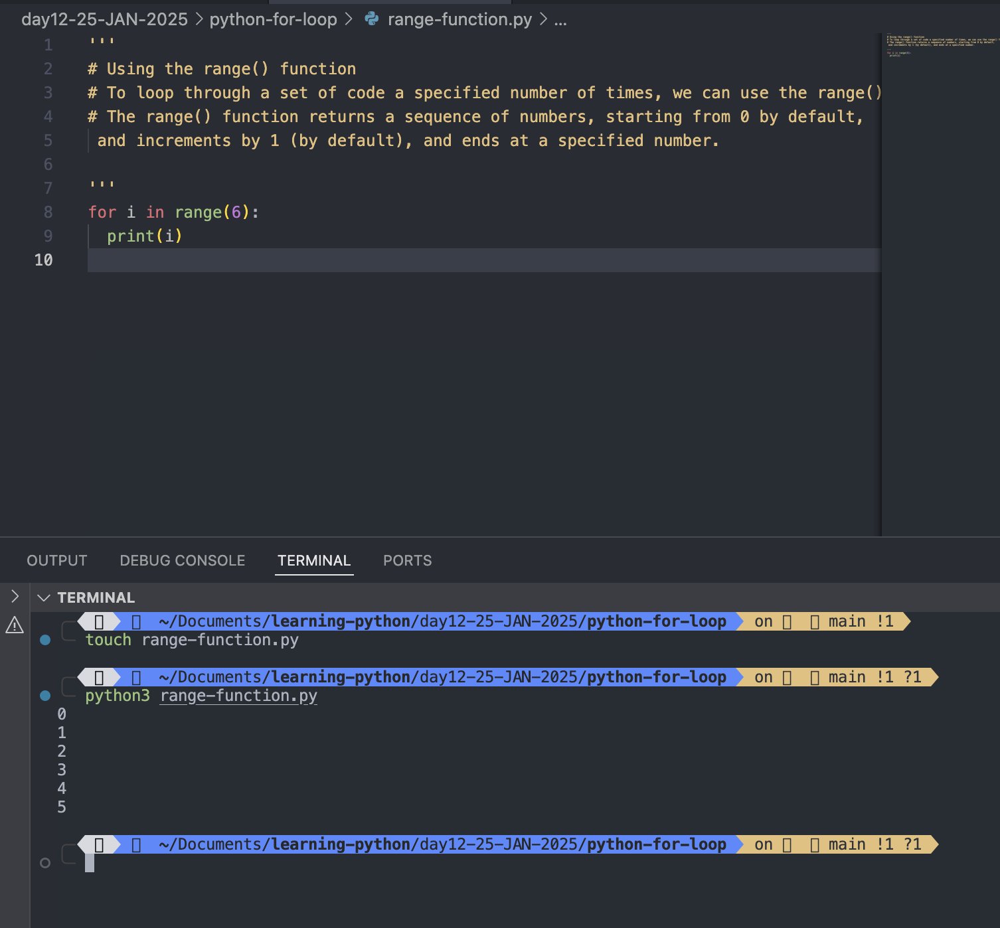

#

## Specifying a Start and Stop

```
for i in range(2, 8):
  print(i)
```

Output:

```
python3 range-function.py
2
3
4
5
6
7
```

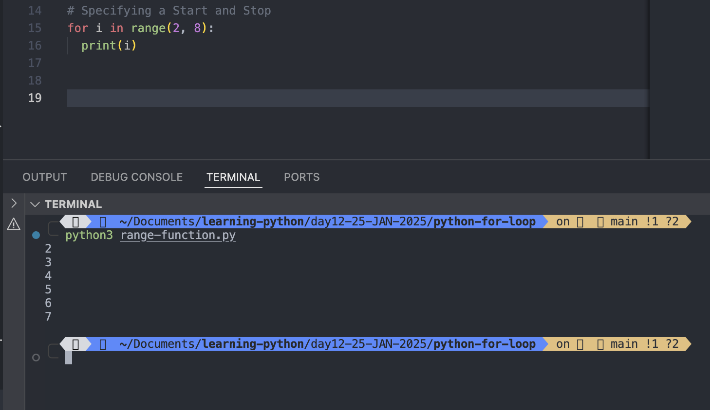

#

## Specifying a Step

```
for i in range(1,10,2):
  print(i)
```

Output:

```
python3 range-function.py
1
3
5
7
9
```

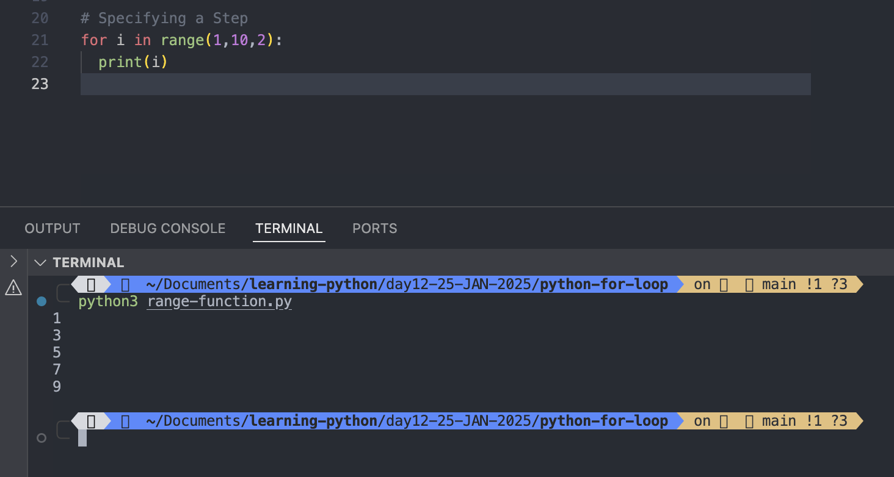

```
for i in range(1,10,4):
  print(i)
```

Output:

```
python3 range-function.py
1
5
9
```

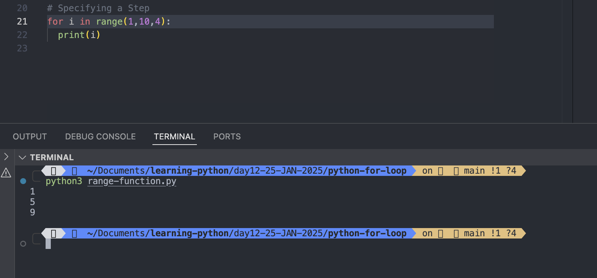

#

## Reverse Sequence

```
for i in range(10, 0, -2):
  print(i)
```

Output:

```
python3 range-function.py
10
8
6
4
2

```

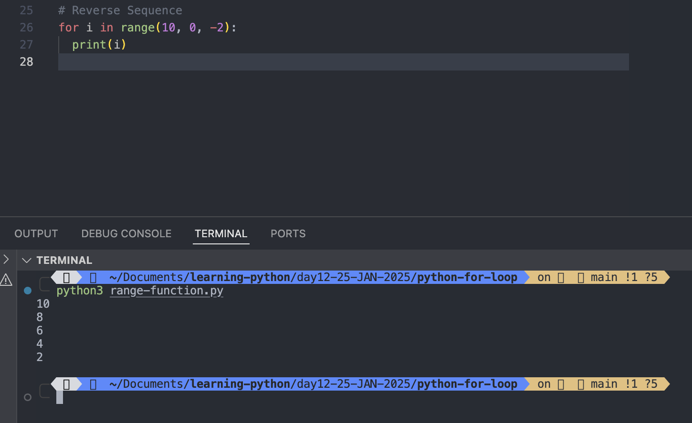

#

## Converting to a List

```
# Converting to a List
number = list(range(5))
print(number)
print("\n")
#  Specifying a Start and Stop
number = list(range(0,10))
print(number)
print("\n")
# Specifying a Step
number = list(range(0,10,2))
print(number)
print("\n")
# Reverse Sequence
number = list(range(20,0,-4))
print("Reverse sequence: ",number)
print("\n")
number = list(range(20,-10,-4))
print("Reverse sequence: ",number)
```

Output:

```
python3 range-function.py
[0, 1, 2, 3, 4]


[0, 1, 2, 3, 4, 5, 6, 7, 8, 9]


[0, 2, 4, 6, 8]


Reverse sequence:  [20, 16, 12, 8, 4]


Reverse sequence:  [20, 16, 12, 8, 4, 0, -4, -8]

```

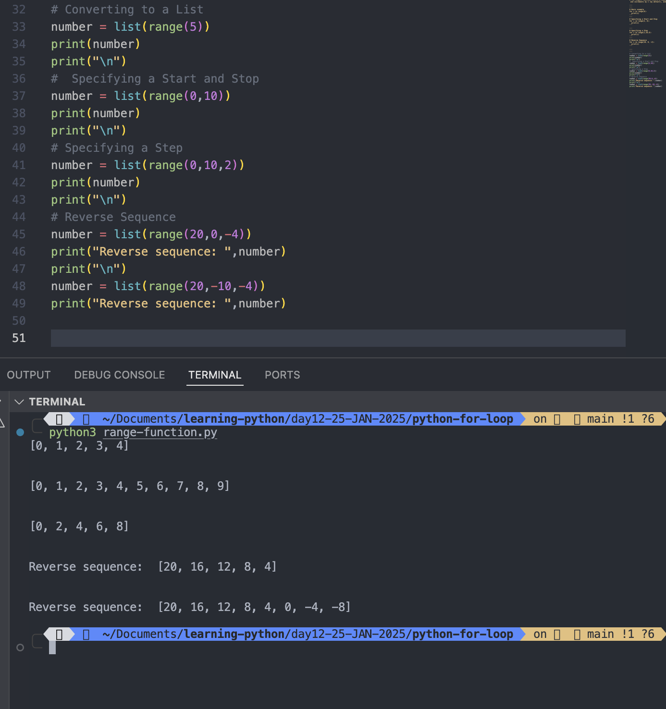

#

## Common Use Cases

1. Iterating in Loops:

```
for i in range(3):
  print(f"Iteration {i}")
```

Output:

```
python3 range-function.py
iteration 0
iteration 1
iteration 2
```

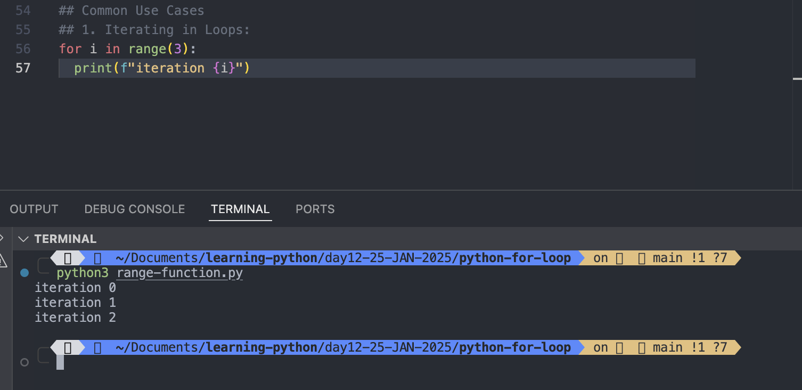

#

2. Generation index for list

```
list1 = ["item1", "item2", "item3", "item4", "item4"]
for index in range(len(list1)):
print(f"Index-{index} : {list1[index]}")
```

Output:

```
python3 range-function.py
Index-0 : item1
Index-1 : item2
Index-2 : item3
Index-3 : item4
Index-4 : item4
```

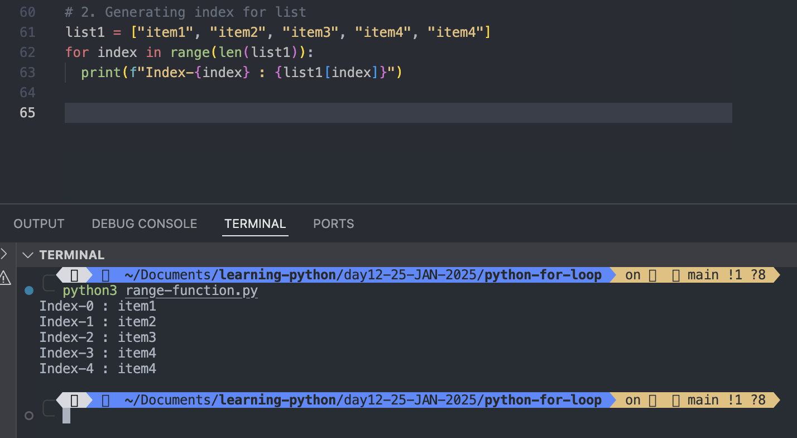

#

3. Creating ranges of numbers

```
# Creating ranges of numbers
even = list(range(2,24,2))
print("Even number list between 2 to 24: ",even)
print(type(even))
print("\n")
odd = list(range(1,24,2))
print("Odd number list between 1 to 24: ",odd)
print(type(odd))
```

Output:

```
python3 range-function.py
Even number list between 2 to 24:  [2, 4, 6, 8, 10, 12, 14, 16, 18, 20, 22]
<class 'list'>


Odd number list between 1 to 24:  [1, 3, 5, 7, 9, 11, 13, 15, 17, 19, 21, 23]
<class 'list'>
```

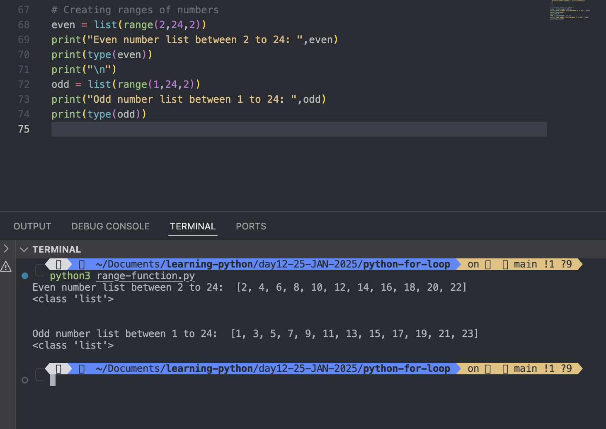

#

# Important Notes

- range() does not generate the numbers immediately; it creates a range object that generates numbers on demand (lazy evaluation).
- To see the numbers as a list, you need to explicitly convert it using list().

#

# Else in For Loop

## The else keyword in a for loop specifies a block of code to be executed when the loop is finished:

### Example: Print all numbers from 0 to 5, and print a message when the loop has ended:

```
# Example :Print all numbers from 0 to 5 and print message when the loop has ended
numbers = [10,1,25,3,444,5]
for i in range(len(numbers)):
  print(f"{i} number: {numbers[i]}")
else:
  print("Finally loop has ended!")
```

Output:

```
python3 else-in-for-loop.py
0 number: 10
1 number: 1
2 number: 25
3 number: 3
4 number: 444
5 number: 5
Finally loop has ended!
```

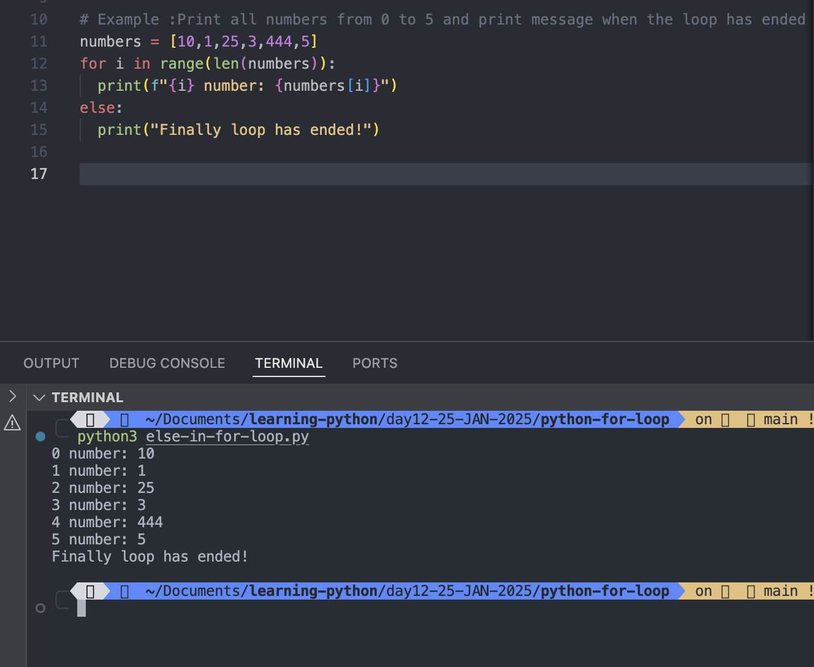

#

```
'''
numbers = [10,1,25,3,444,5]
for i in range(len(numbers)):
  print(f"{i} number: {numbers[i]}")
else:
  print("Finally loop has ended!")
'''
for i in range(6):
  print(i)
else:
  print("finally loop has ended")
```

Output:

```
python3 else-in-for-loop.py
0
1
2
3
4
5
finally loop has ended
```

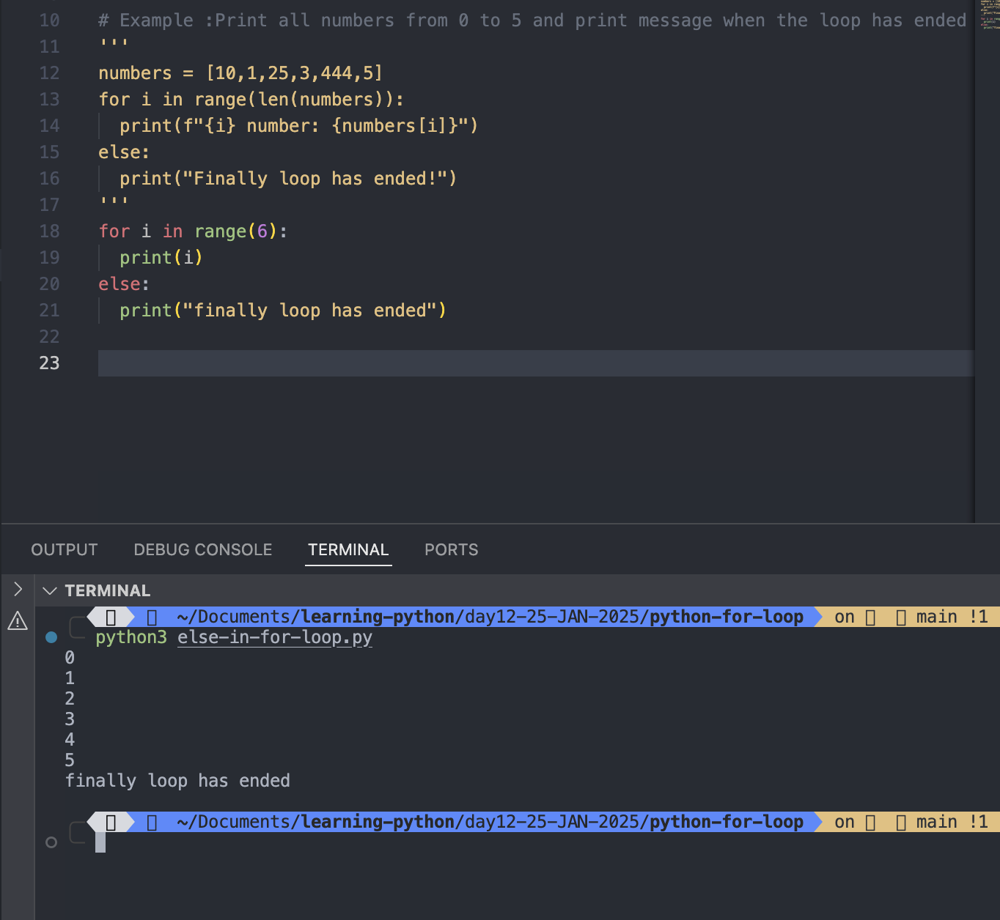

#

# <mark>Note</mark>: The else block will NOT be executed if the loop is stopped by a break statement.

## Example

```
for i in range(6)
  print(i)
  if i == 3:
    break:
else:
  print(finally the block has ended)
```

Output:

```
python3 else-in-for-loop.py
0
1
2
3
```

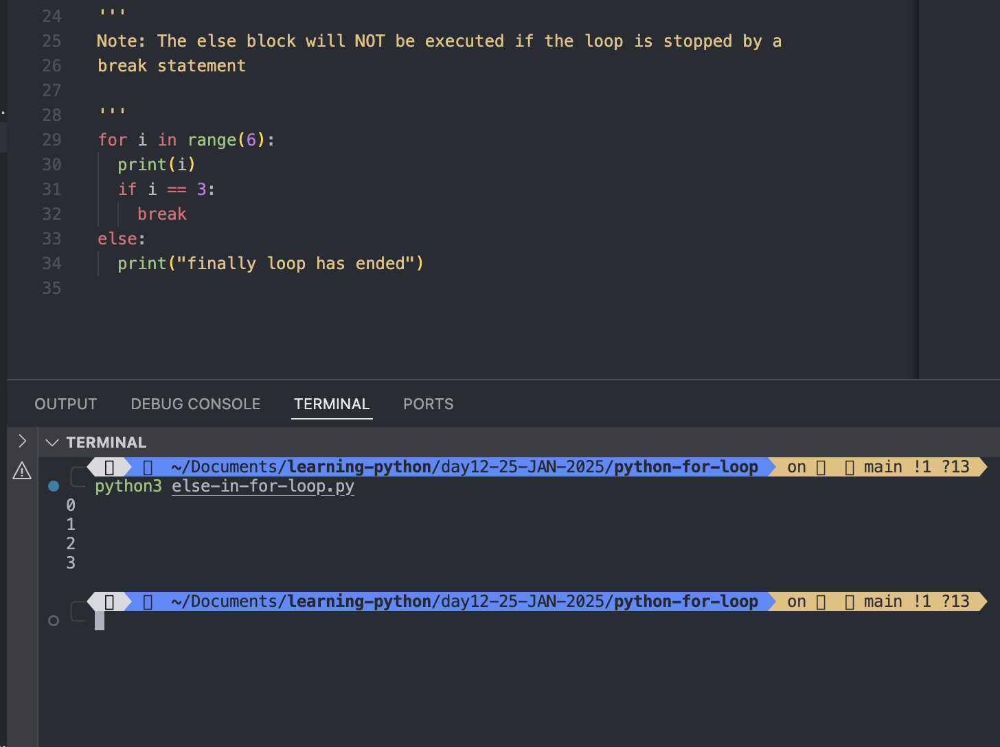

#

# Nested Loops

- A nested loop is a loop inside a loop.
- The "inner loop" will be executed one time for each iteration of the "outer loop":

## Example: Print each adjective for every fruit:

```
# Example: Print each adjective for every fruit:
adj = ["red", "big", "tasty"]
fruits = ["apple", "banana", "cherry"]
for x in adj:
  for y in fruits:
    print(x,y)
```

Output:

```
python3 nested-loops.py
red apple
red banana
red cherry
big apple
big banana
big cherry
tasty apple
tasty banana
tasty cherry
```

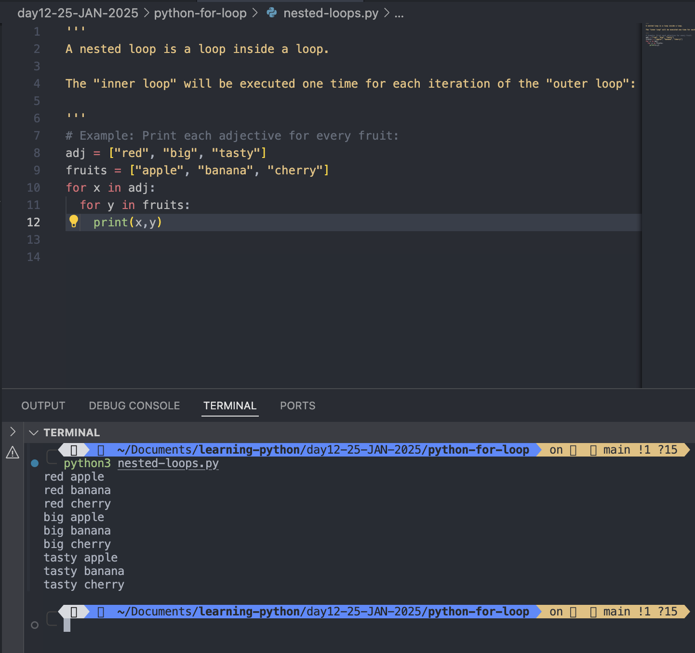

#

# The pass Statement

## for loops cannot be empty, but if you for some reason have a for loop with no content, put in the pass statement to avoid getting an error.

```
for i in [0,2,3,4,65]:
  pass
print("\n")
myName = "Rajeev Kumar Singh"
for i in myName:
  pass
myAddr = {
  "city": "Bangalore",
  "location": "BTM",
  "pin-code": 560076
}
for i in myAddr:
  pass
```

Output:

```
python3 pass-statement.py


```

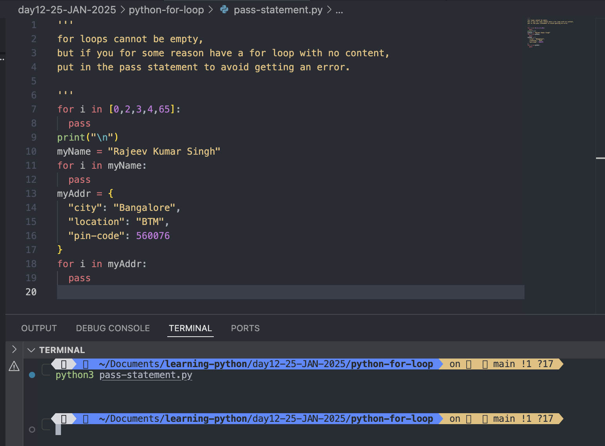

#

```
myAddr = {
  "city": "Bangalore",
  "location": "BTM",
  "pin-code": 560076
}
for i in myAddr:
  #pass
```

Output:

```
python3 pass-statement.py
  File "/Users/rajeevsingh/Documents/learning-python/day12-25-JAN-2025/python-for-loop/pass-statement.py", line 30
    #pass
IndentationError: expected an indented block after 'for' statement on line 29
```

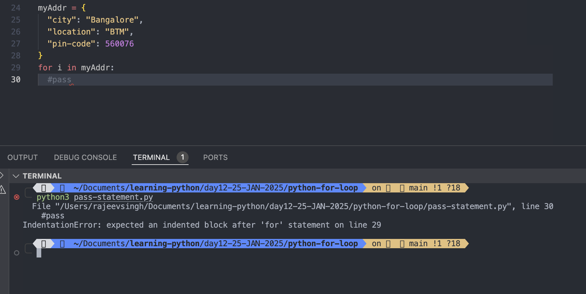
