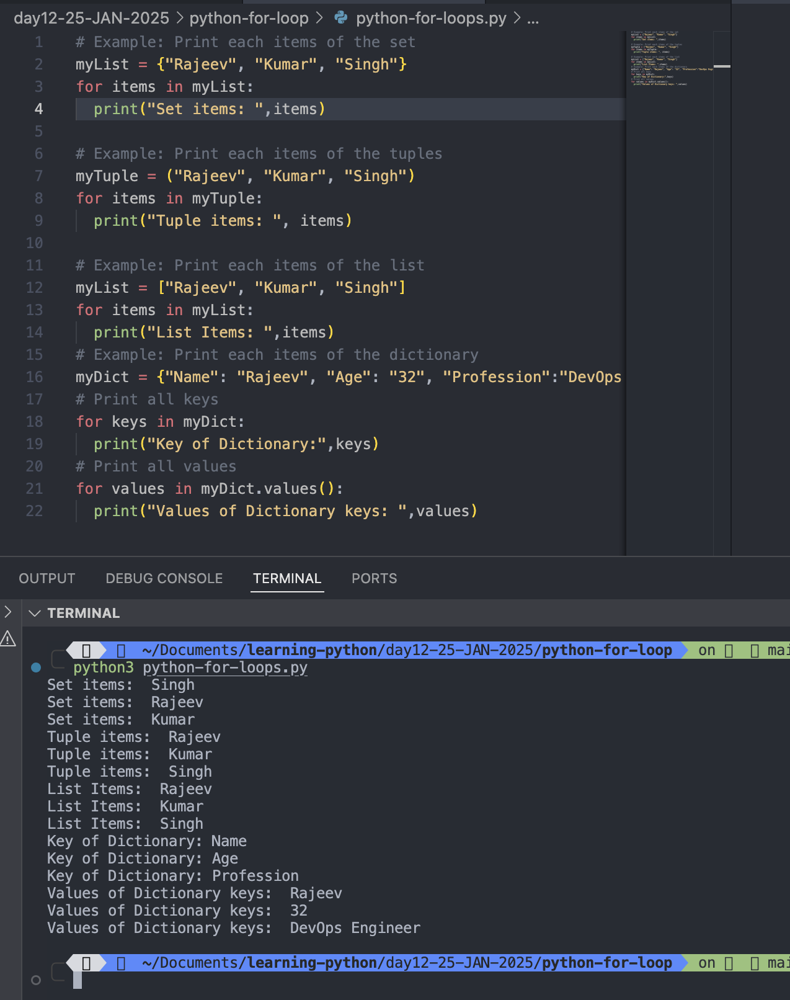
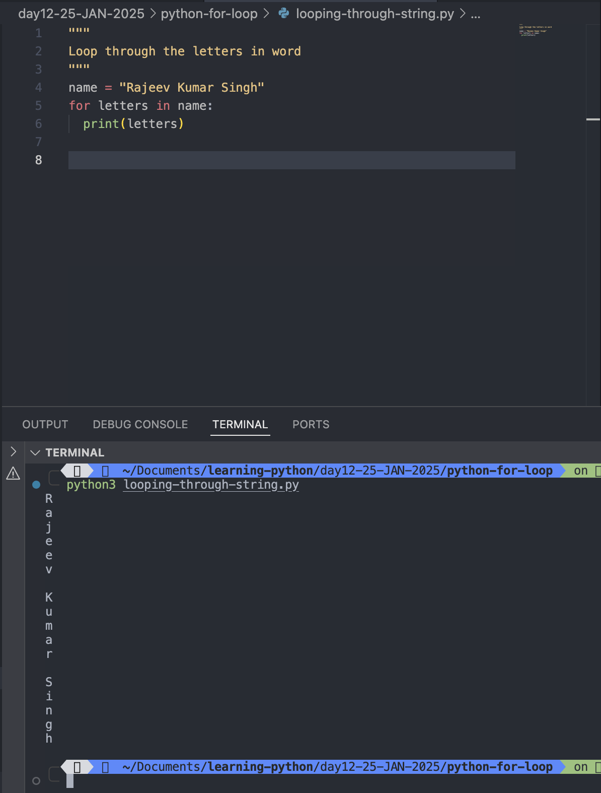
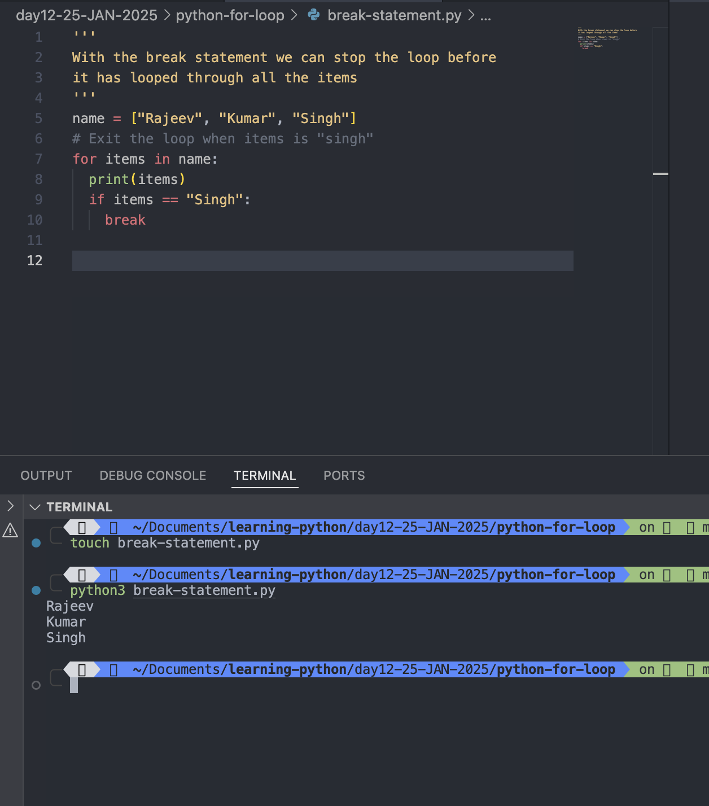
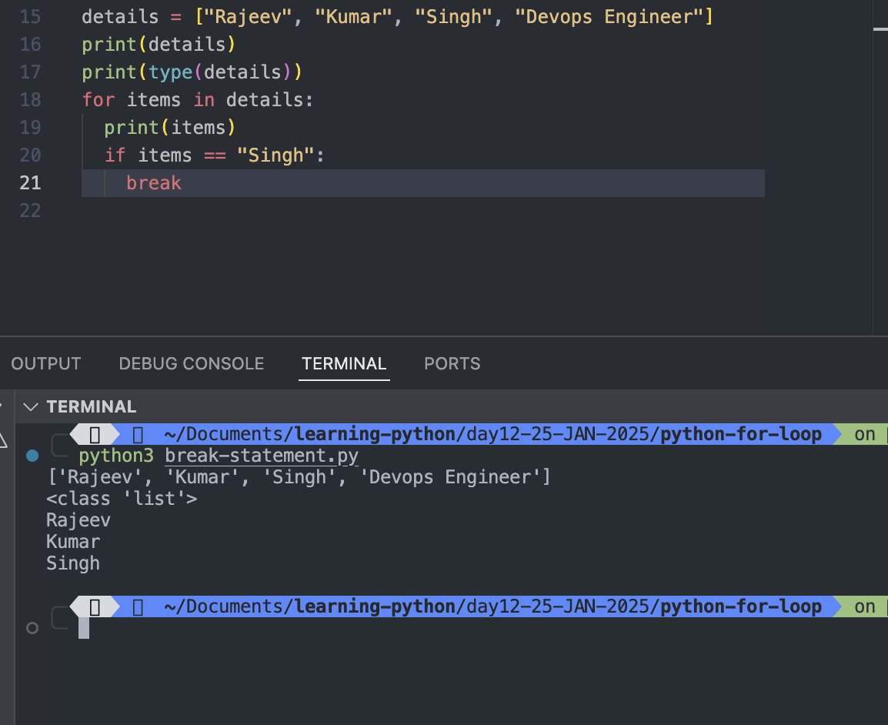
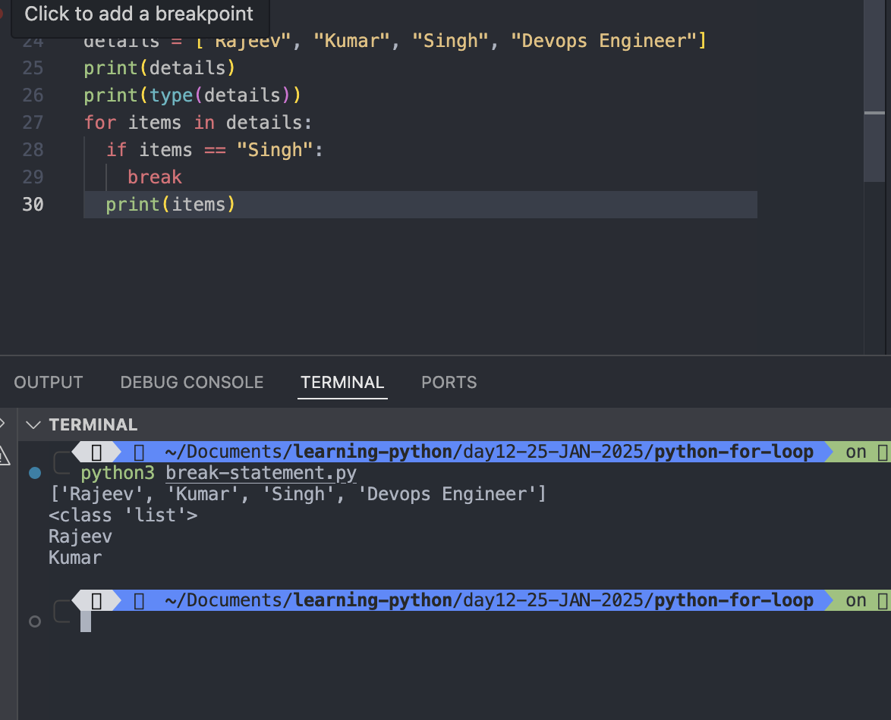
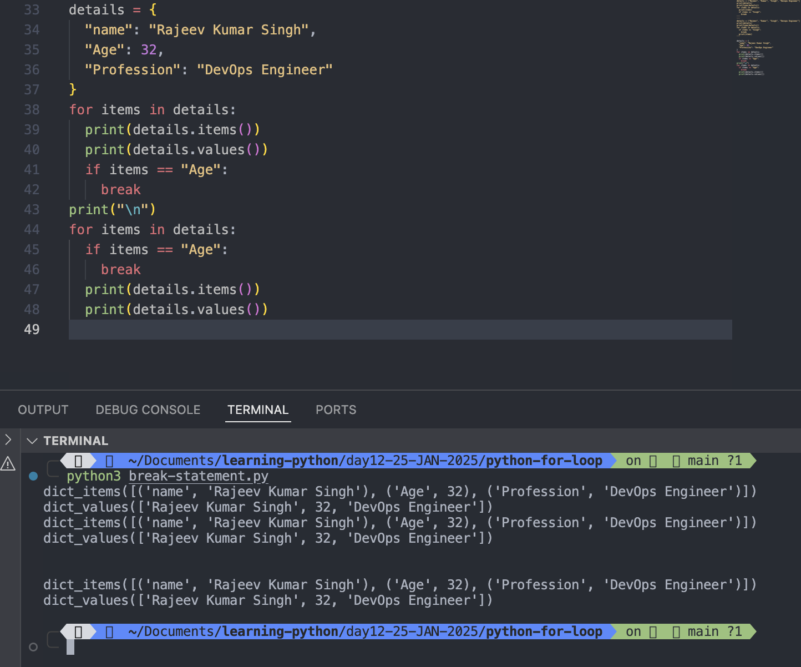
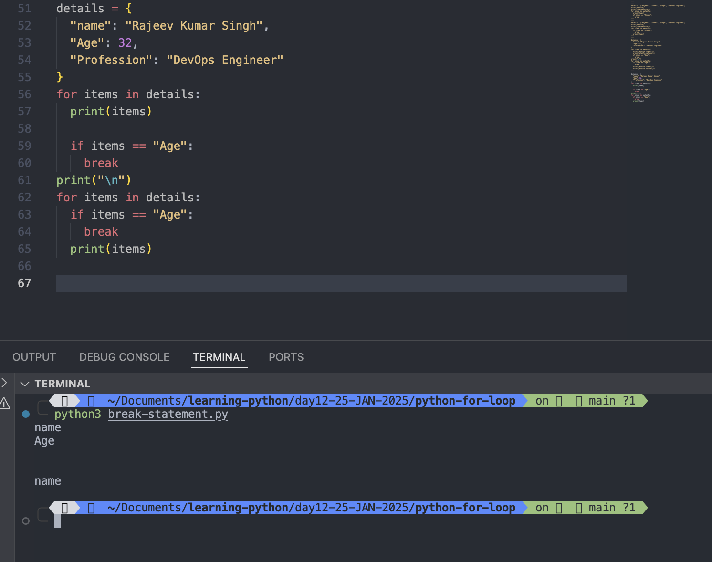
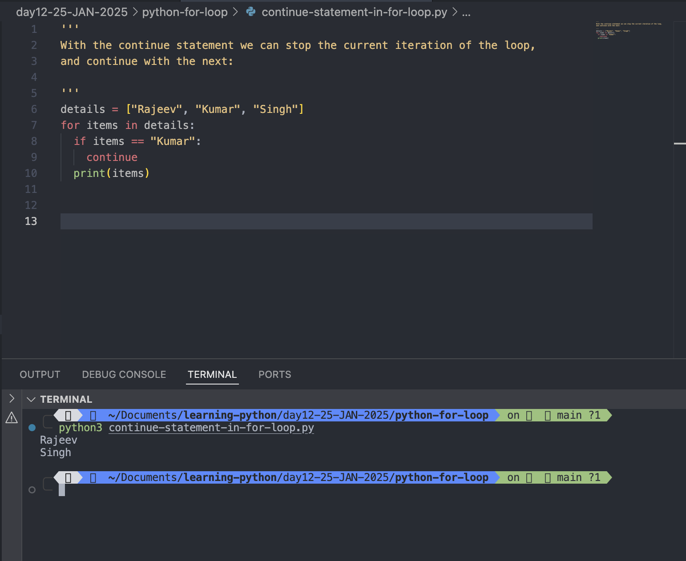

# Python for loops

- A <mark>for</mark> loop is used for iterating over a sequence (that is either a list, a tuple, a dictionary, a set, or a string).
- This is less like the <mark>for</mark> keyword in other programming languages, and works more like an iterator method as found in other object-orientated programming languages.
- With the <mark>for</mark> loop we can execute a set of statements, once for each item in a list, tuple, set etc.

#

# Example: Print each item in the list

```
# Example: Print each items of the set
myList = {"Rajeev", "Kumar", "Singh"}
for items in myList:
  print("Set items: ",items)

# Example: Print each items of the tuples
myTuple = ("Rajeev", "Kumar", "Singh")
for items in myTuple:
  print("Tuple items: ", items)

# Example: Print each items of the list
myList = ["Rajeev", "Kumar", "Singh"]
for items in myList:
  print("List Items: ",items)
# Example: Print each items of the dictionary
myDict = {
  "Name": "Rajeev", "Age": "32", "Profession":"DevOps Engineer"
  }
# Print all keys
for keys in myDict:
  print("Key of Dictionary:",keys)
# Print all values
for values in myDict.values():
  print("Values of Dictionary keys: ",values)
```



#

# The for loop does not require an indexing variable to set beforehand.

# Looping Through a String

## Even strings are iterable objects, they contain a sequence of characters:

### Example: Loop through the letters in the word

```
name = "Rajeev Kumar Singh"
for letters in name:
  print(letters)
```

Output:

```
python3 looping-through-string.py
R
a
j
e
e
v

K
u
m
a
r

S
i
n
g
h
```



#

# The break Statement

## With the <mark>break</mark> statement we can stop the loop before it has looped through all the items:

```
name = ["Rajeev", "Kumar", "Singh"]
for items in name:
  print(items)
  if items == "Singh":
    break
```

Output:

```
python3 break-statement.py
Rajeev
Kumar
Singh
```



#

```
details = ["Rajeev", "Kumar", "Singh", "Devops Engineer"]
print(details)
print(type(details))
for items in details:
  print(items)
  if items == "Singh":
    break
```

Output:

```
python3 break-statement.py
['Rajeev', 'Kumar', 'Singh', 'Devops Engineer']
<class 'list'>
Rajeev
Kumar
Singh
```



#

## Example: Exit the loop when items is "Singh", but this time the break comes before the print:

```
details = ["Rajeev", "Kumar", "Singh", "Devops Engineer"]
print(details)
print(type(details))
for items in details:
  if items == "Singh":
    break
  print(items)
```

Output:

```
python3 break-statement.py
['Rajeev', 'Kumar', 'Singh', 'Devops Engineer']
<class 'list'>
Rajeev
Kumar
```



#

```
details = {
  "name": "Rajeev Kumar Singh",
  "Age": 32,
  "Profession": "DevOps Engineer"
}
for items in details:
  print(details.items())
  print(details.values())
  if items == "Age":
    break
print("\n")
for items in details:
  if items == "Age":
    break
  print(details.items())
  print(details.values())
```

Output:

```
python3 break-statement.py
dict_items([('name', 'Rajeev Kumar Singh'), ('Age', 32), ('Profession', 'DevOps Engineer')])
dict_values(['Rajeev Kumar Singh', 32, 'DevOps Engineer'])
dict_items([('name', 'Rajeev Kumar Singh'), ('Age', 32), ('Profession', 'DevOps Engineer')])
dict_values(['Rajeev Kumar Singh', 32, 'DevOps Engineer'])


dict_items([('name', 'Rajeev Kumar Singh'), ('Age', 32), ('Profession', 'DevOps Engineer')])
dict_values(['Rajeev Kumar Singh', 32, 'DevOps Engineer'])
```



#

```
details = {
  "name": "Rajeev Kumar Singh",
  "Age": 32,
  "Profession": "DevOps Engineer"
}
for items in details:
  print(items)

  if items == "Age":
    break
print("\n")
for items in details:
  if items == "Age":
    break
  print(items)
```

Output:

```
python3 break-statement.py
name
Age


name
```



#

# The continue Statement

## With the <mark>continue</mark> statement we can stop the current iteration of the loop, and continue with the next:

```
details = ["Rajeev", "Kumar", "Singh"]
for items in details:
  if items == "Kumar":
    continue
  print(items)
```

Output:

```
python3 continue-statement-in-for-loop.py
Rajeev
Singh
```



#

# The range() Function
