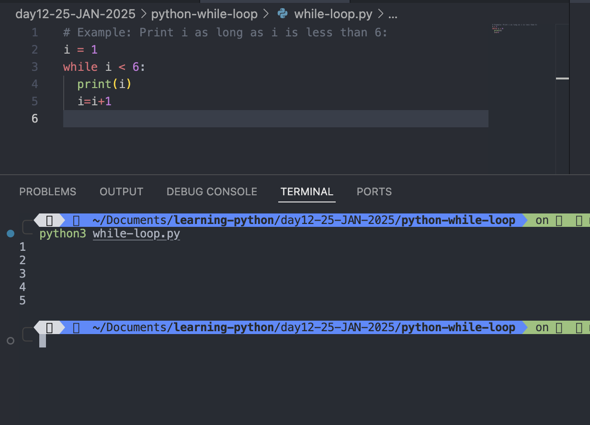
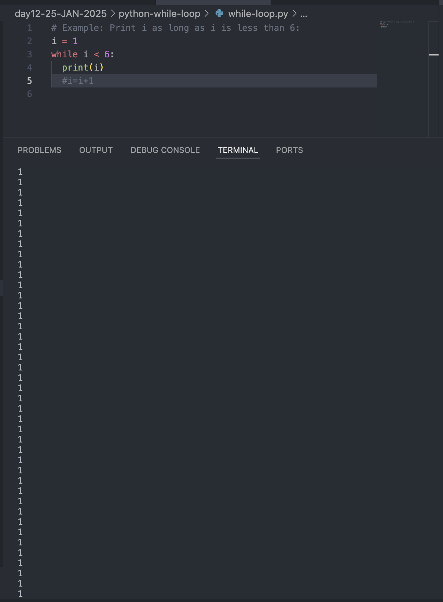
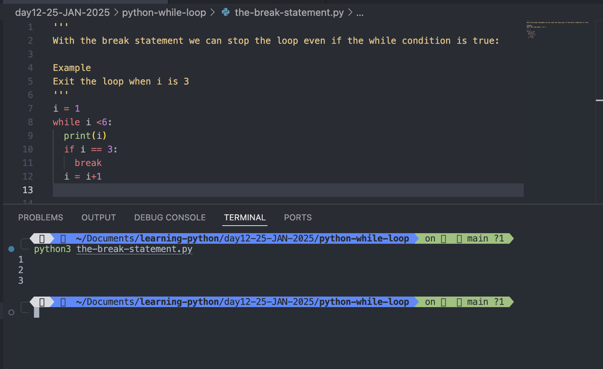
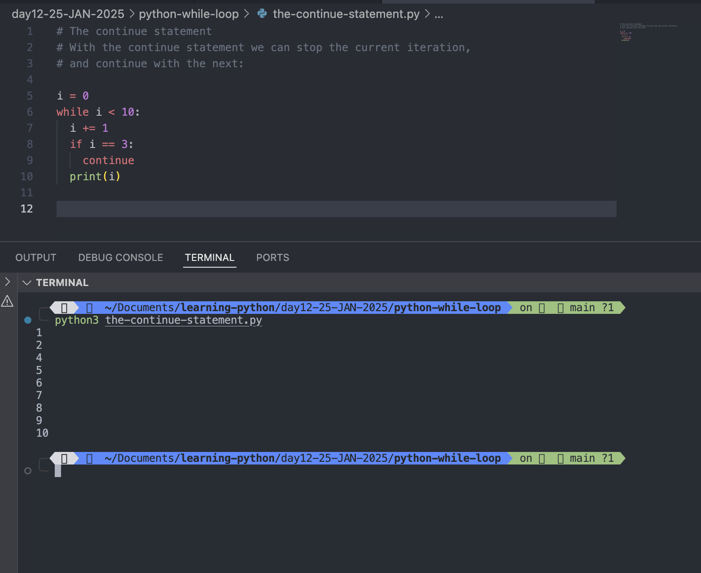
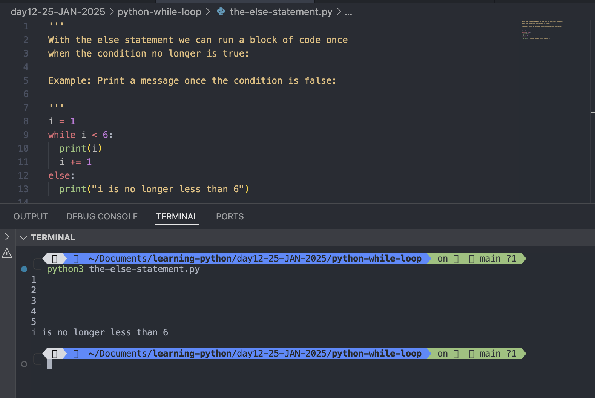

# Python while loop

## Python Loops

Python has two primitive loop commands:

1. <mark>while</mark> loops
2. <mark>for</mark> loops

#

# The while Loop

## With the <mark>while</mark> loop we can execute a set of statements as long as a condition is true.

### Example: Print i as long as i is less than 6:

```
i = 1
while i < 6:
  print(i)
  i=i+1
```

Output:

```
python3 while-loop.py
1
2
3
4
5
```



## Note:

remember to increment i, or else the loop will continue forever.


#

## The <mark>while</mark> loop requires relevant variables to be ready, in this example we need to define an indexing variable, i, which we set to 1.

#

# The break Statement

## With the break statement we can stop the loop even if the while condition is true:

### Example: Exit the loop when i is 3:

```
i = 1
while i <6:
  print(i)
  if (i == 3):
    break
  i=i+1
```

Output:

```
python3 the-break-statement.py
1
2
3

```



#

# The continue Statement

## With the <mark>continue</mark> statement we can stop the current iteration, and continue with the next:

### Continue to the next iteration if i is 3:

```
i = 1
while i < 6:
  print(i)
  if i == 3:
    continue
  i = i + 1
```

Output:

```
python3 the-continue-statement.py
3
3
3
3
3
3
3
3
3
3
3
3
3
3
3
3
3
3
3
3
3
3
3
3
3
3
3
3
3
3
3
3
3
3
3
3
3
3
3
3
3
3
3
3
3
3
3
3
3
3
3
3
3
3
3
3
3
3
3
3
3
3
3
3
3
3
3
3
3
3
3
3
3
3
3
3
3
3
3
3
3
3
3
3
3
3
3
3
3
3
3
3
3
3
3
3
3
3
3
3
3
3
3
3
3
3
3
3
3
3
3
3
3
3
3
3
3
3
3
3
3
3
3
3
3
3
3
3
3
3
3
3
3
3
3
3
3
3
3
3
3
3
3
3
3
3
3
3
3
3
3
3
3
3
3
3
3
3
3
3
3
3
3
3
3
3
3
3
3
3
3
3
3
3
3
3
3
3
3
3
3
3
3
3
3
3
3
3
3
3
3
3
3
3
3
3
3
3
3
3
3
3
3
3
3
3
3
3
3
3
3
3
3
3
3
3
3
3
3
3
3
3
3
3
3
3
3
3
3
3
3
3

...

```

#

```
i = 0
while i < 10:
  i += 1
  if i == 3:
    continue
  print(i)
```

Output:

```
python3 the-continue-statement.py
1
2
4
5
6
7
8
9
10
```

# Note that number 3 is missing in the result



#

# The else Statement

## With the <mark>else</mark> statement we can run a block of code once when the condition no longer is true:

### Example: Print a message once the condition is false:

```
i = 1
while i < 6:
  print(i)
  i += 1
else:
  print("i is no longer less than 6")
```

Output:

```
python3 the-else-statement.py
1
2
3
4
5
i is no longer less than 6
```


