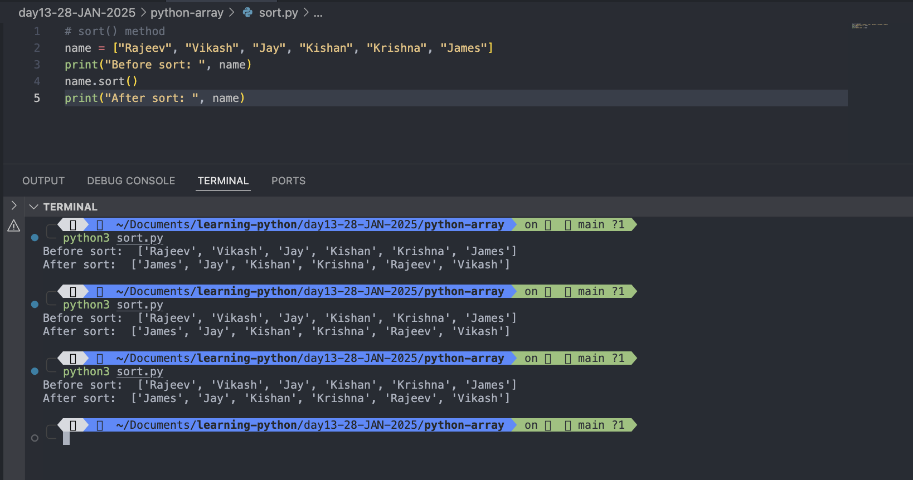

# Python Array

## Note: Python does not have built-in support for Arrays, but Python Lists can be used instead.

# Arrays

## Let's learn how to use list as ARRAYS, however, to work with arrays in python we will have to import a library, like <mark>NumPy library</mark>

- Arrays are used to store multiple values in one single variable.

## Example: Create an array containing car names

```
car = ["Ford", "Volvo", "BMW"]

```

# What is an Array?

- An array is a <mark>special variable</mark>, which can hold more than one value at a time.
- If you have a list of items (a list of car names, for example), storing the cars in single variables could look like this:

```
car1 = "Ford"
car2 = "Volvo"
car3 = "BMW"

```

However, what if you want to loop through the cars and find a specific one? And what if you had not 3 cars, but 300?

The solution is an array!

- An array can hold many values under a single name, and you can access the values by referring to an index number.

# Access the Elements of an Array

- You refer to an array element by referring to the index number.

```
car = ["Ford", "Volvo", "BMW"]
# Get the value of first array item
firstItem=car[0]
# Get the value of second array item
secondItem= car[1]
# Get the value of third array item
thirdItem = car[2]
print(firstItem)
print(secondItem)
print(thirdItem)
# check the type
print(type(car))


```

Output:

```

 python3 array.py
Ford
Volvo
BMW
<class 'list'>
```


#

# Modify an array items

```
# Create and access an array
car = ["Ford", "Volvo", "BMW"]
#
print("Before change: ", car)
# Get the value of first array item
firstItem=car[0]
# Get the value of second array item
secondItem= car[1]
# Get the value of third array item
thirdItem = car[2]
print(firstItem)
print(secondItem)
print(thirdItem)
# check the type
print(type(car))
# Modify the first item of array
car[0]="mini cooper"
# print the update items of an array
print("After change: ",car)

```

Output:

```
python3 modify-array-item.py
Before change:  ['Ford', 'Volvo', 'BMW']
Ford
Volvo
BMW
<class 'list'>
After change:  ['mini cooper', 'Volvo', 'BMW']

```


#

# The Length of an Array

```
# Create  an array
car = ["Ford", "Volvo", "BMW"]
# Get the length of an array
length = len(car)
print("Length of an array car is: ",length)


```

Output:

```
python3 array-length.py
Length of an array car is:  3
```


#

# Looping Array Elements

```
# Create  an array
car = ["Ford", "Volvo", "BMW"]
for items in car:
  print(items)
```

Output:

```
python3 looping-an-array.py
Ford
Volvo
BMW
```


#

# Adding Array Elements

```
# Create an array
items = ["item1", "item2", "item3", "item4"]
# Print array items before addition
print("current items: ", items)
# Adding an array items
items.append("item5")
#Print array items after addition of new item
print("After addition of new item: ", items)


```

Output:

```
python3 adding-an-array-items.py
current items:  ['item1', 'item2', 'item3', 'item4']
After addition of new item:  ['item1', 'item2', 'item3', 'item4', 'item5']
```


#

# Removing Array Elements

```
# Example of removing Array elements

# Create an array
items = ["item1", "item2", "item3", "item4"]
print("Before addition: ", items)
# add new item
items.append("item5")
print("After addition: ", items)
print("\n")
# Remove an array element
# You can use the pop() method to remove an element from the array.
items.pop(0)
print("Removed zeroth index element with pop() method: ",items)

# You can also use the remove() method to remove an element from the array.
items1 = ["item1", "item2", "item3", "item4"]
print("Before removal of an array elements: ", items1)
print("\n")
# remove an array elements with remove()
items.remove("item3")
print("After removal an array elements with remove(): ", items)
# check the type after an array element removal
print(type(items1))

# The list's remove() method only removes the first occurrence of the specified value

```

Output:

```
python3 removing-array-items.py
Before addition:  ['item1', 'item2', 'item3', 'item4']
After addition:  ['item1', 'item2', 'item3', 'item4', 'item5']


Removed zeroth index element with pop() method:  ['item2', 'item3', 'item4', 'item5']
Before removal of an array elements:  ['item1', 'item2', 'item3', 'item4']


After removal an array elements with remove():  ['item2', 'item4', 'item5']
<class 'list'>

```


#

## Note: The list's remove() method only removes the first occurrence of the specified value

# Array Methods

- append(): Adds an element at the end of the list
- clear(): Removes all the elements from the list
  ```
   # clear method
  items = ["item1", "item2", "item3", "item4"]
  print(items)
  print(type(items))
  items.clear()
  print(items)
  print(type(items))
  ```
  Output:
  ```
  python3 clear-method.py
  ['item1', 'item2', 'item3', 'item4']
  <class 'list'>
  []
  <class 'list'>
  ```
  
  #
- copy(): Returns a copy of the list

  ```
  # copy() method

  items = ["item1", "item2", "item3", "item4"]
  print("items array elements: ", items)
  newItem = items.copy()
  print("newItem array elements",newItem)
  # Let add one more element in items element to check newItem array is also gettin updated or not
  items.append("item5")
  print("After addition of new elements in items array: ",items)
  print("newItem array element: ", newItem)
  ```

  Output:

  ```
  python3 copy.py
  items array elements:  ['item1', 'item2', 'item3', 'item4']
  newItem array elements ['item1', 'item2', 'item3', 'item4']
  After addition of new elements in items array:  ['item1', 'item2', 'item3', 'item4', 'item5']
  newItem array element:  ['item1', 'item2', 'item3', 'item4']

  ```

  

  #

- count(): Returns the number of elements with the specified value

  ```
  # count() method
  items = ["item1", "item2", "item3", "item4", "item1", "item1"]
  x = "item2"
  y = "item1"
  item2 =items.count(x)
  item1 = items.count(y)

  print("Number of time 'item2' is available in items array:  ",item2)
  print("Number of time 'item1' is available in items array: ",item1)

  ```

  Output:

  ```
  python3 count.py
  Number of time 'item2' is available in items array:   1
  Number of time 'item1' is available in items array:  3
  ```

  

- extend(): Add the elements of a list (or any iterable), to the end of the current list
- index(): Returns the index of the first element with the specified value

  ```
   # index() method
  items = ["item1", "item2", "item3", "item4", "item1", "item1"]
  a = items.index("item1")
  b = items.index("item2")
  c = items.index("item3")
  d = items.index("item4")
  print("item1 index number is: ", a)
  print("item2 index number is: ", b)
  print("item3 index number is: ", c)
  print("item4 index number is: ", d)
  ```

  Output:

  ```
  python3 index.py
  item1 index number is:  0
  item2 index number is:  1
  item3 index number is:  2
  item4 index number is:  3
  ```

  

#

- insert(): Adds an element at the specified position

  ```
   # insert() method
  items = ["item1", "item2", "item3", "item4"]
  print("Befor instert: ", items)
  # Insert item5 at index 1
  items.insert(1, "item5")
  items.insert(3, "item6")
  print("After insert at index 1 and 3: ",items)

  ```

  Output:

  ```
  python3 insert.py
  Befor instert:  ['item1', 'item2', 'item3', 'item4']
  After insert at index 1 and 3:  ['item1', 'item5', 'item2', 'item6', 'item3', 'item4']
  ```

  

  #

- pop(): Removes the element at the specified position
- remove(): Removes the first item with the specified value
- reverse(): Reverses the order of the list

  ```
  # reverse() method
  items = ["item1", "item2", "item3", "item4"]
  print("Array items: ", items)
  items.reverse()
  print("Reverse of items array: ",items)
  ```

  Output:

  ```
  python3 reverse.py
  Array items:  ['item1', 'item2', 'item3', 'item4']
  Reverse of items array:  ['item4', 'item3', 'item2', 'item1']
  ```

  

  #

- sort() Sorts the list

  ```
  # sort() method
  name = ["Rajeev", "Vikash", "Jay", "Kishan", "Krishna", "James"]
  print("Before sort: ", name)
  name.sort()
  print("After sort: ", name)
  ```

  Output:

  ```
  python3 sort.py
  Before sort:  ['Rajeev', 'Vikash', 'Jay', 'Kishan', 'Krishna', 'James']
  After sort:  ['James', 'Jay', 'Kishan', 'Krishna', 'Rajeev', 'Vikash']
  ```

  

  #

  ```
  # sort() method
  name = ["Rajeev", "Vikash", "Jay", "Kishan", "Krishna", "James"]
  print("Before sort: ", name)
  name.sort()
  print("After sort: ", name)

  numbers = [55555,5555,55,555,5555555,555555,66666,66,666,76,89]
  print("Before sort: ",numbers)
  numbers.sort()
  print("After sort: ",numbers)
  ```

  Output:

  ```
   python3 sort.py
  Before sort:  ['Rajeev', 'Vikash', 'Jay', 'Kishan', 'Krishna', 'James']
  After sort:  ['James', 'Jay', 'Kishan', 'Krishna', 'Rajeev', 'Vikash']
  Before sort:  [55555, 5555, 55, 555, 5555555, 555555, 66666, 66, 666, 76, 89]
  After sort:  [55, 66, 76, 89, 555, 666, 5555, 55555, 66666, 555555, 5555555]
  ```

  
