# Python Funtion

- A function is a block of code which only runs when it is called.
- You can pass data, known as parameters, into a function.
- A function can return data as a result.

#

## Creating a Function

- In Python a function is defined using the def keyword:

```
def myFun():
  {
    print("I am from inside function)
  }
```

Output:

```
python3 def.py
I am from inside function
```

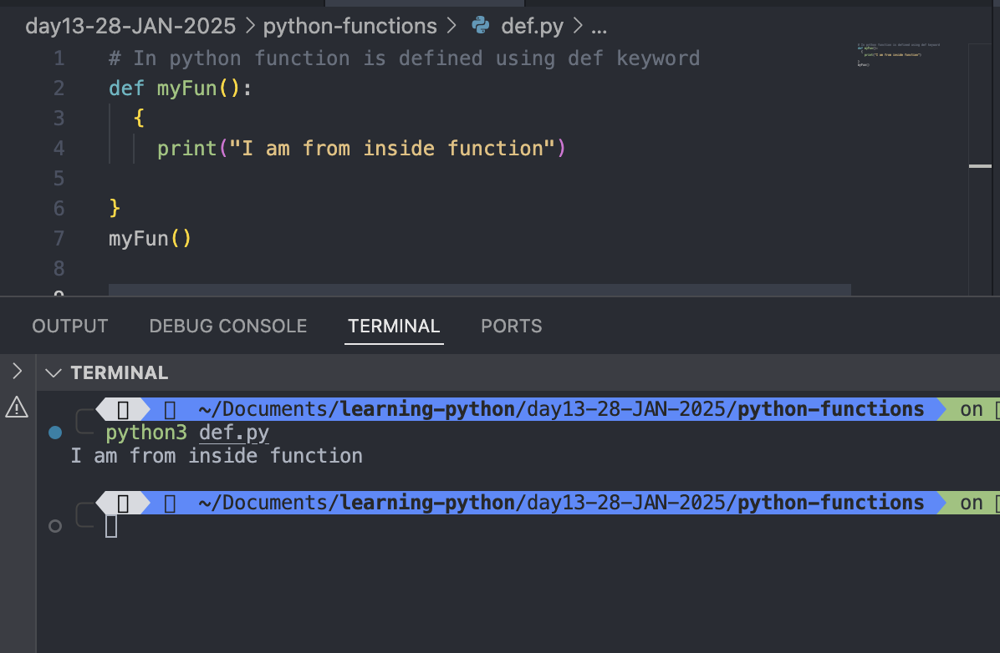

#

## Arguments

- Information can be passed into functions as arguments.
- Arguments are specified after the function name, inside the parentheses.
- You can add as many arguments as you want, just separate them with a comma.

### Example:

```
def my_fun(fname):{
  print("Welcome", fname,"to the python function class")

}

my_fun("Rajeev")
my_fun("Shiva")
```

Output:

```
python3 funtion-with-arguments.py
Welcome Rajeev to the python function class
Welcome Shiva to the python function class
```

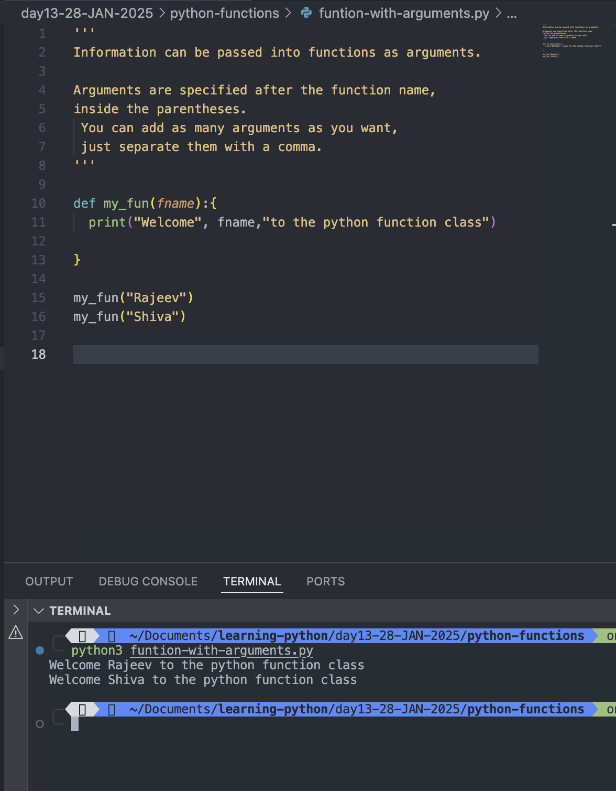

#

## Parameters or Arguments?

### The terms parameter and argument can be used for the same thing: information that are passed into a function.

### From a function's perspective:

- A parameter is the variable listed inside the parentheses in the function definition.
- An argument is the value that is sent to the function when it is called.

#

## Number of Arguments

- By default, a function must be called with the correct number of arguments.
- Meaning that if your function expects 2 arguments, you have to call the function with 2 arguments, not more, and not less.

### Example:

```
def add_function(first, second):
  {
    print("Addition of your passed arguments is :", first +second )
  }
add_function(5,5)
add_function(55,55)
```

Output:

```
python3 funtion-with-arguments.py
Addition of your passed arguments is : 10
Addition of your passed arguments is : 110
```

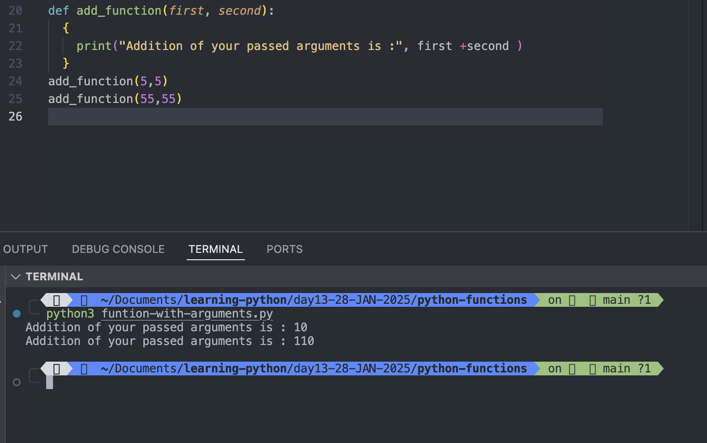

#

```
def display_name(fname, lname):
  {
    print("Hello", fname, "", lname)
  }
display_name("Rajeev", "Singh")

```

Output:

```
python3 funtion-with-arguments.py
Hello Rajeev  Singh
```

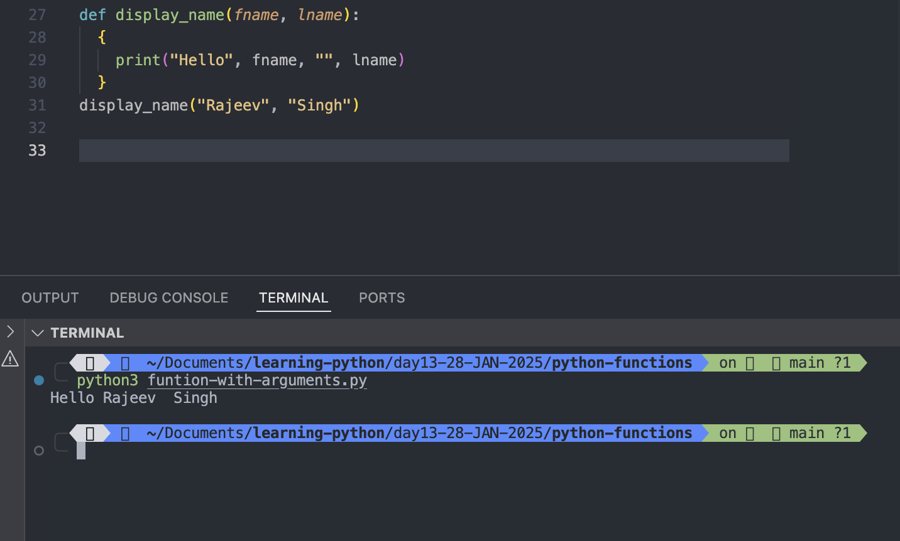

#

## If you try to call the function with less or more arguments than specified parameters, you will get an error:

### Example:

```
def display_name(fname, lname):
  {
    print("Hello", fname, "", lname)
  }
display_name("Rajeev", "Singh","DevOps")
```

Output:

```
python3 funtion-with-arguments.py
Traceback (most recent call last):
  File "/Users/rajeevsingh/Documents/learning-python/day13-28-JAN-2025/python-functions/funtion-with-arguments.py", line 31, in <module>
    display_name("Rajeev", "Singh","DevOps")
TypeError: display_name() takes 2 positional arguments but 3 were given
```

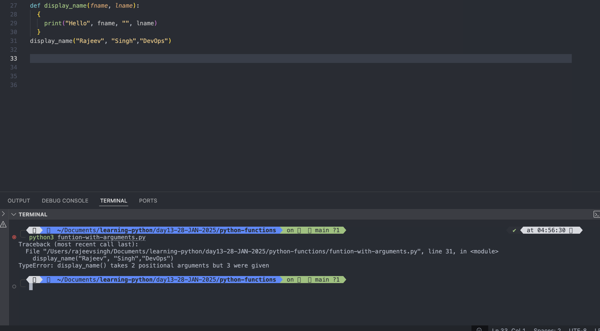

#

```
def display_name(fname, lname):
  {
    print("Hello", fname, "", lname)
  }
display_name("Rajeev")
```

Output:

```
python3 funtion-with-arguments.py
Traceback (most recent call last):
  File "/Users/rajeevsingh/Documents/learning-python/day13-28-JAN-2025/python-functions/funtion-with-arguments.py", line 31, in <module>
    display_name("Rajeev")
TypeError: display_name() missing 1 required positional argument: 'lname'
```

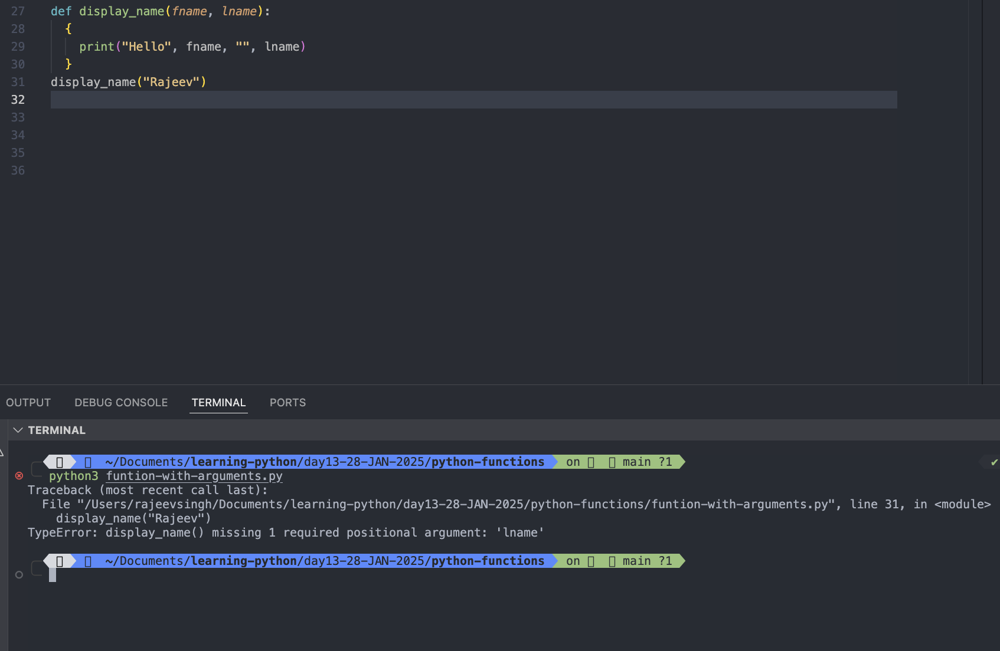

#

## Arbitrary Arguments, \*args

- If you do not know how many arguments that will be passed into your function, add a<mark> \* </mark>before the parameter name in the function definition.
- This way the function will receive a tuple of arguments, and can access the items accordingly:

### Example: If the number of arguments is unknown, add a \* before the parameter name:

```
# If the number of arguments is unknown, add a * before the parameter name:
def display_name(*name):
  print("Your fav fruit is: ", name[1])
  print("Your fav fruit is: ", name)
  print("Your fav fruit is: ", name[0])
display_name("Apple","Mango","Kiwi", "Banana")

```

Output:

```
python3 funtion-with-arguments.py
Your fav fruit is:  Mango
Your fav fruit is:  ('Apple', 'Mango', 'Kiwi', 'Banana')
Your fav fruit is:  Apple
```

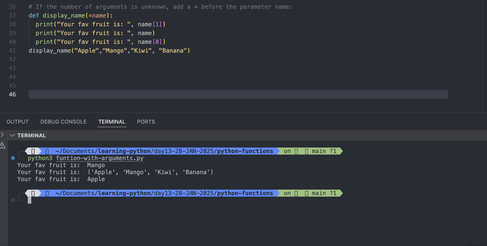

#

## Keyword Arguments

- You can also send arguments with the key = value syntax.
- This way the order of the arguments does not matter.

### Example:

```
def fruits(first,second,third,fourth,fifth):
  {
    print("My fav fruit is: ",fifth )

  }
fruits(first="Apple", second="Banana", third="Guava", fourth="Mango", fifth="Kiwi")
```

Output:

```
python3 funtion-with-arguments.py
My fav fruit is:  Kiwi

```

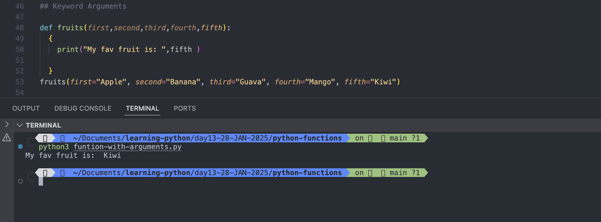
<mark>Note:</mark>The phrase Keyword Arguments are often shortened to kwargs in Python documentations.

#

## Arbitrary Keyword Arguments, \*\*kwargs

- If you do not know how many keyword arguments that will be passed into your function, add two asterisk: \*\* before the parameter name in the function definition.
- This way the function will receive a dictionary of arguments, and can access the items accordingly:

### Example: If the number of keyword arguments is unknown, add a double \*\* before the parameter name:

```

### Example: If the number of keyword arguments is unknown, add a double ** before the parameter name:
def all_name(**name):
  {
    print("First name is: ", name["fname"])
  }
all_name(fname = "Rajeev", lname="Singh", mname="Kumar")

```

Output:

```
python3 funtion-with-arguments.py
First name is:  Rajeev

```

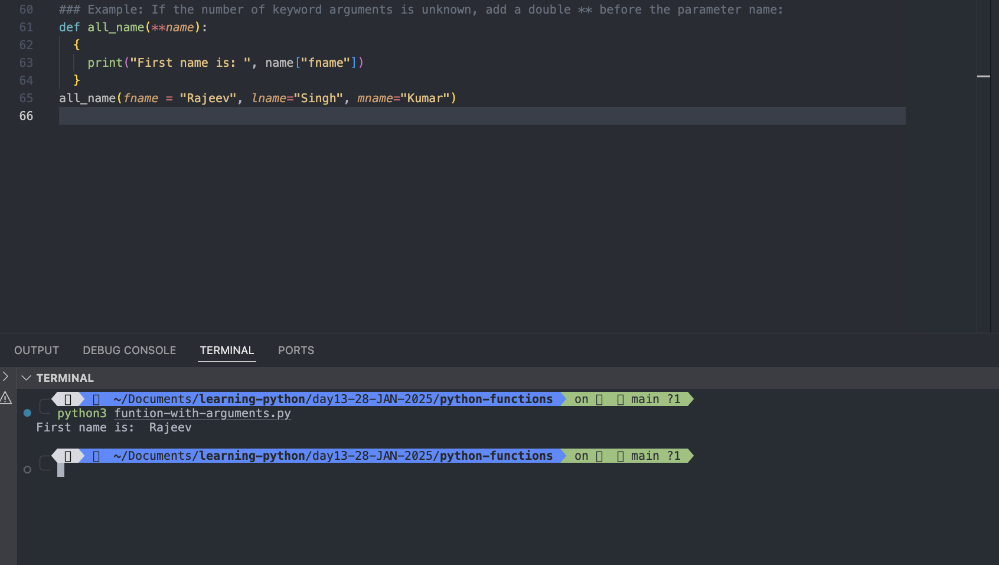

#

## Default Parameter Value

### If we call the function without argument, it uses the default value

### Ecample: The following example shows hot to use default paramaeter

```
## Default Parameter Value
# If we call the function without argument, it uses the default value:

def default_parameter_example(country = "India"):
  {
    print("I am from ", country)

  }
default_parameter_example("Dubai")
default_parameter_example("America")
default_parameter_example("India")
default_parameter_example()
default_parameter_example("Switzerland")

```

Output:

```
python3 funtion-with-arguments.py
I am from  Dubai
I am from  America
I am from  India
I am from  India
I am from  Switzerland

```

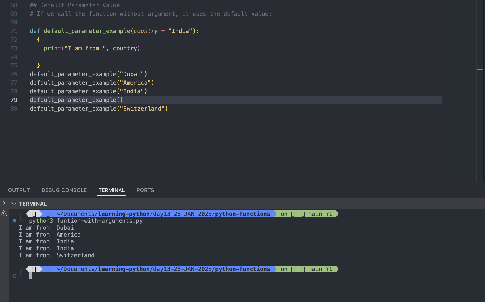

#

## Passing a List as an Argument

- You can send any data types of argument to a function (string, number, list, dictionary etc.), and it will be treated as the same data type inside the function.
- E.g. if you send a List as an argument, it will still be a List when it reaches the function:

### Example:

```
def my_fun(food):
  for x in food:
    print(x)

fruits = ["Apple","Banana", "Mango", "Kiwi"]
my_fun(fruits)

```

Output:

```
python3 list-as-an-argument.py
Apple
Banana
Mango
Kiwi

```

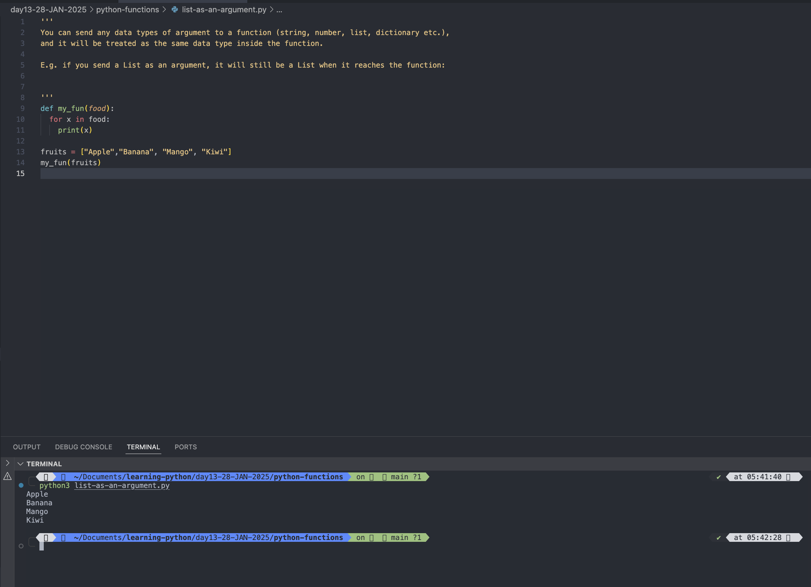

#

## Return Values

### To let a function return a value, use the return statement:

### Example:

```
def return_statement_example(x):
  return 5 * x
print(return_statement_example(5))
print(return_statement_example(55))
print(return_statement_example(555))
print(return_statement_example(5555))
print(return_statement_example(55555))

```

Output:

```
python3 return-statement.py
25
275
2775
27775
277775

```

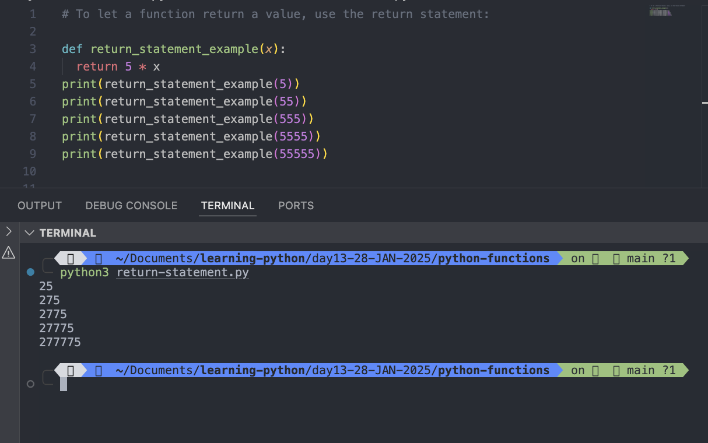

#

## The pass Statement

### function definitions cannot be empty, but if you for some reason have a function definition with no content, put in the pass statement to avoid getting an error.

### Example:

```
def my_fun():
  pass

```

Output:

```
python3 pass-statement.py

```

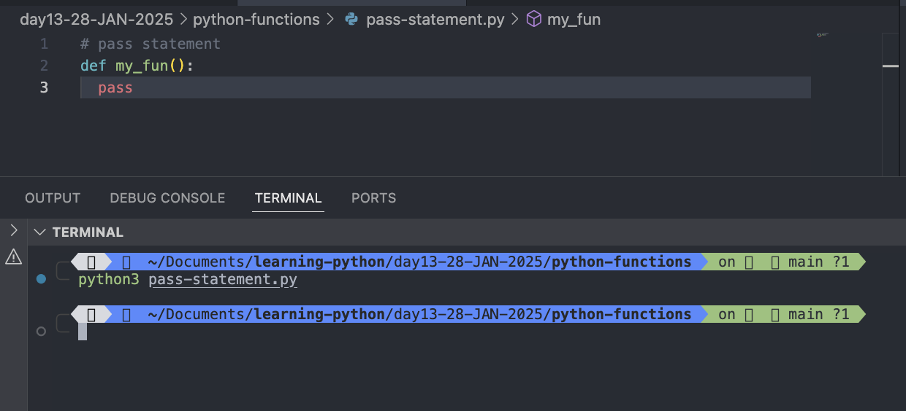

#

## Positional-Only Arguments

- You can specify that a function can have ONLY positional arguments, or ONLY keyword arguments.
- To specify that a function can have only positional arguments, add <mark>, /</mark> after the arguments:

```
def positional_only_arguments(x, /):
  print(x)
positional_only_arguments("Rajeev Kumar Singh")
positional_only_arguments(5)
positional_only_arguments(5.5)
positional_only_arguments(True)
positional_only_arguments(False)

```

Output:

```
python3 positional-only-arguments.py
Rajeev Kumar Singh
5
5.5
True
False

```

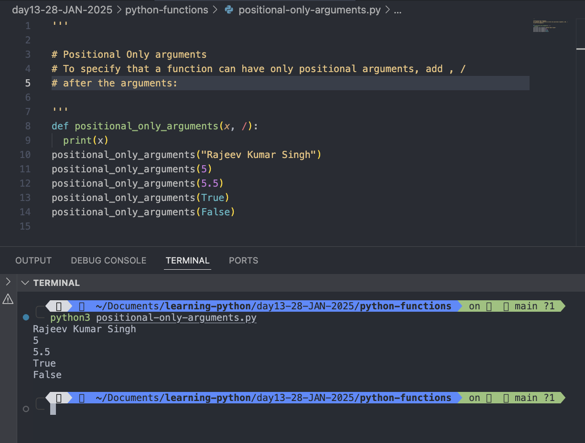

#

## Note: Without the , / you are actually allowed to use keyword arguments even if the function expects positional arguments:

### Example:

```
def positional_only_arguments(x):
  print(x)
positional_only_arguments(x=5)
```

Output:

```
python3 positional-only-arguments.py
5

```

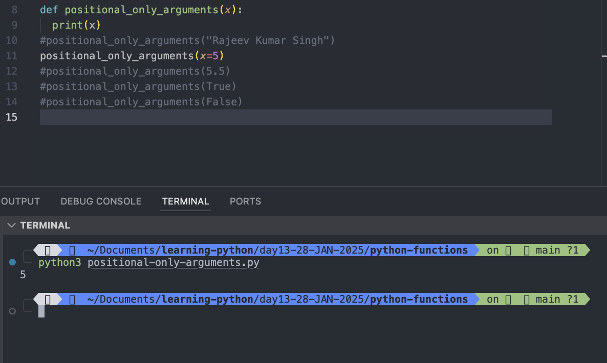

#

## But when adding the , / you will get an error if you try to send a keyword argument:

### Example:

```
def positional_only_arguments(x, /):
  print(x)
positional_only_arguments("Rajeev Kumar Singh")
positional_only_arguments(x=5)

```

Output:

```
python3 positional-only-arguments.py
Rajeev Kumar Singh
Traceback (most recent call last):
  File "/Users/rajeevsingh/Documents/learning-python/day13-28-JAN-2025/python-functions/positional-only-arguments.py", line 11, in <module>
    positional_only_arguments(x=5)
TypeError: positional_only_arguments() got some positional-only arguments passed as keyword arguments: 'x'

```

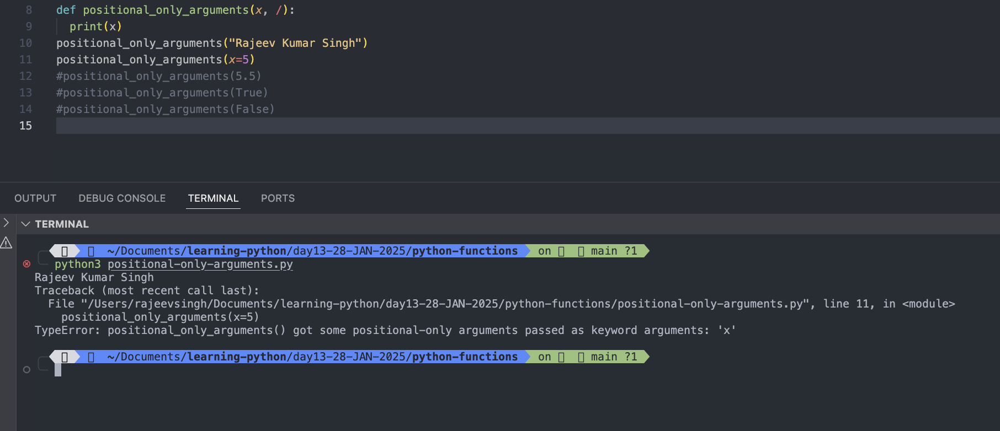

#

## Keyword-Only Arguments

### To specify that a function can have only keyword arguments, add \*, before the arguments:

### Example:

```
def keyword_only(*, x):
  print(x)
keyword_only(x = 3)

```

Output:

```
python3 keyword-only-argument.py
3

```

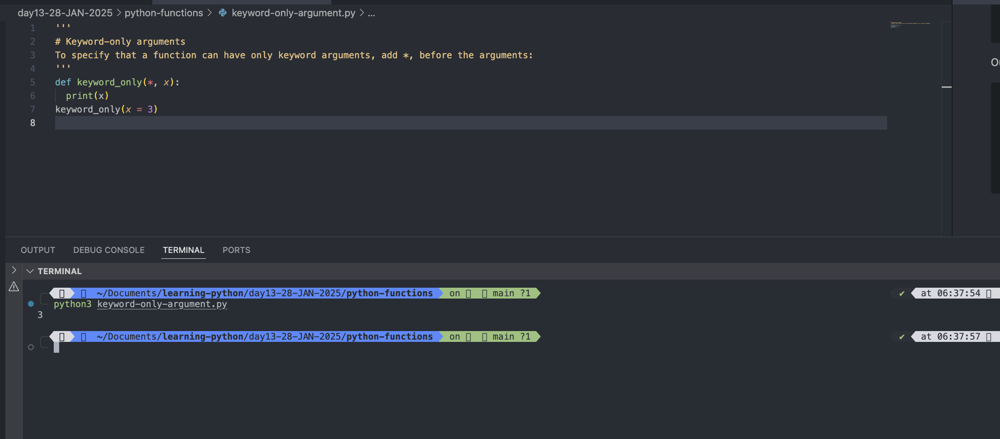

#

### Without the \*, you are allowed to use positionale arguments even if the function expects keyword arguments:

### Example:

```
# Without * You are only allowed to use positional arguments
def my_fun(x):
  print(x)
my_fun(5)

```

Output:

```
python3 keyword-only-argument.py
5

```

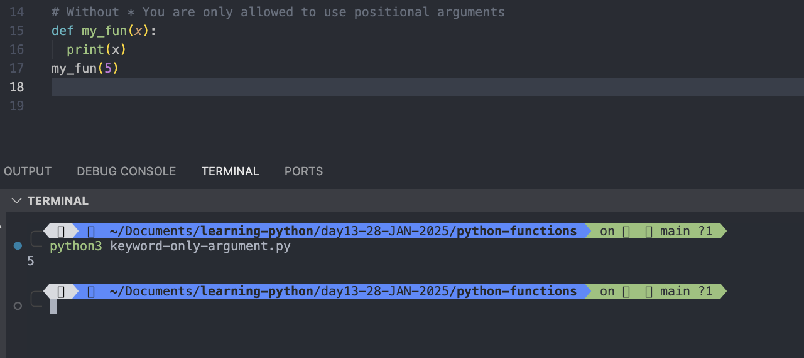

#

### But with the \*, you will get an error if you try to send a positional argument:

### Example:

```
# Without * You are only allowed to use positional arguments
def my_fun(x):
  print(x)
my_fun(5)
print("\n")
# But with the *, you will get an error if you try to send a positional argument:
def my_fun(*,x):
  print(x)
my_fun(x = 5)
my_fun(x = "Rajeev Kumar Singh")
my_fun(5)

```

Output:

```
python3 keyword-only-argument.py
5


5
Rajeev Kumar Singh
Traceback (most recent call last):
  File "/Users/rajeevsingh/Documents/learning-python/day13-28-JAN-2025/python-functions/keyword-only-argument.py", line 24, in <module>
    my_fun(5)
TypeError: my_fun() takes 0 positional arguments but 1 was given

```

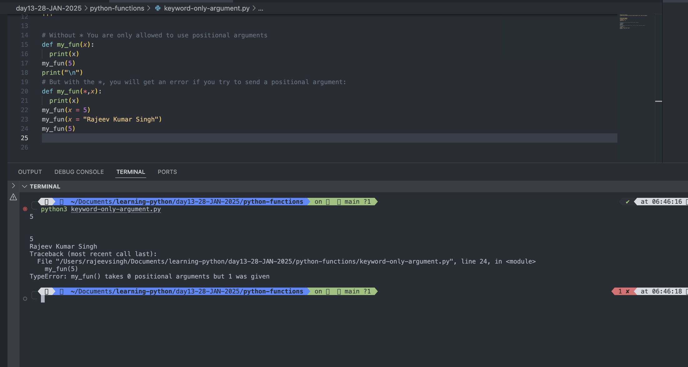

#

## Combine Positional-Only and Keyword-Only

- You can combine the two argument types in the same function.
- Any argument before the <mark>/ ,</mark> are positional-only, and any argument after the <mark>\*,</mark> are keyword-only.

### Example:

```
def my_fun(a,b,/,*,c,d):
  print(a+b+c+d)

```

Output:

```
python3 combine-positional-only-and-keyword-only.py
10

```

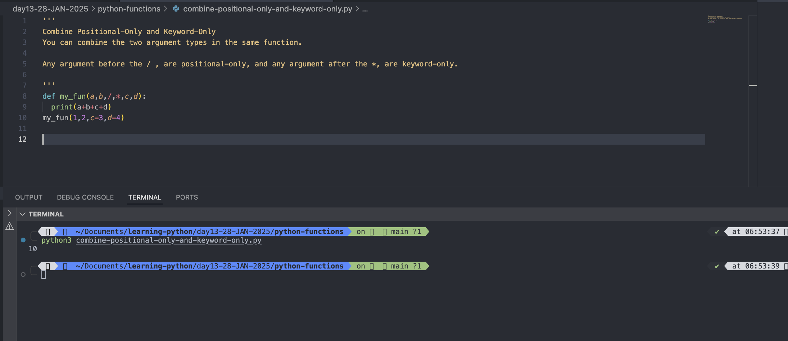

#

```
'''
Combine Positional-Only and Keyword-Only
You can combine the two argument types in the same function.

Any argument before the / , are positional-only, and any argument after the *, are keyword-only.
Any argument with *, are positional argument, and any argument with **, are keyword argument

'''
def my_fun(a,b,/,*,c,d):
  print(a+b+c+d)
my_fun(1,2,c=3,d=4)
print("\n")
def flexible_function(*args, **kwargs):
  print("Positional Arguments: ", args)
  print("Keyword Arguments: ", kwargs)
flexible_function("rajeev","name='rajeev'", 5, age=5)
flexible_function("rajeev","name='rajeev'", 5, age=5,name="rajeev")
print("\n")
def flexible_function(args,/, **kwargs):
  print("Positional Arguments: ", args)
  print("Keyword Arguments: ", kwargs)
flexible_function("rajeev","name='rajeev'", 5, age=5)
flexible_function("rajeev","name='rajeev'", 5, age=5,name="rajeev")

```

Output:

```
python3 combine-positional-only-and-keyword-only.py
10


Positional Arguments:  ('rajeev', "name='rajeev'", 5)
Keyword Arguments:  {'age': 5}
Positional Arguments:  ('rajeev', "name='rajeev'", 5)
Keyword Arguments:  {'age': 5, 'name': 'rajeev'}


Traceback (most recent call last):
  File "/Users/rajeevsingh/Documents/learning-python/day13-28-JAN-2025/python-functions/combine-positional-only-and-keyword-only.py", line 21, in <module>
    flexible_function("rajeev","name='rajeev'", 5, age=5)
TypeError: flexible_function() takes 1 positional argument but 3 were given

```

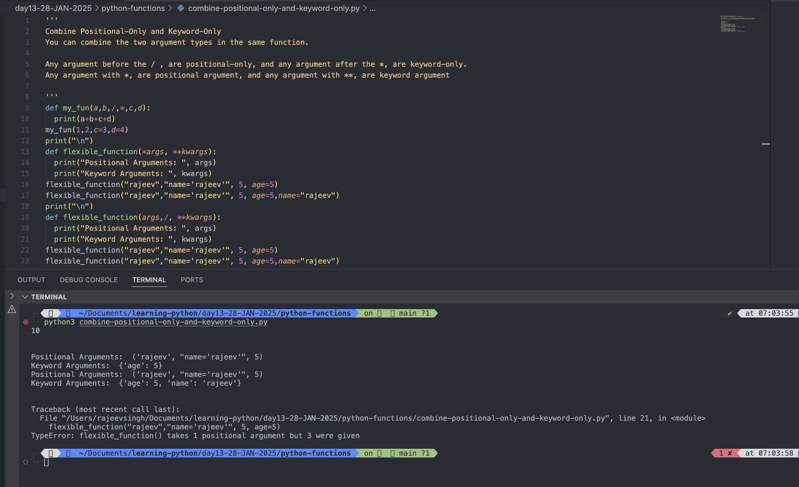

#

## Recursion

- Python also accepts function recursion, which means a defined function can call itself.
- Recursion is a common mathematical and programming concept. It means that a function calls itself. This has the benefit of meaning that you can loop through data to reach a result.
- The developer should be very careful with recursion as it can be quite easy to slip into writing a function which never terminates, or one that uses excess amounts of memory or processor power. However, when written correctly recursion can be a very efficient and mathematically-elegant approach to programming.

### Recursion in programming occurs when a function calls itself either directly or indirectly to solve a problem. It is commonly used for tasks that can be divided into similar sub-tasks. In Python, recursion is supported, but it has limits to prevent infinite loops.

### Key Features of Recursion

1. Base Case: A condition that stops the recursion to prevent infinite calls.
2. Recursive Case: The part where the function calls itself with a smaller problem.

### Structure of a Recursive Function

```
def recursive_function(parameters):
    if base_condition:
        return base_case_value  # Base case
    else:
        return recursive_function(smaller_parameters)  # Recursive call

```
