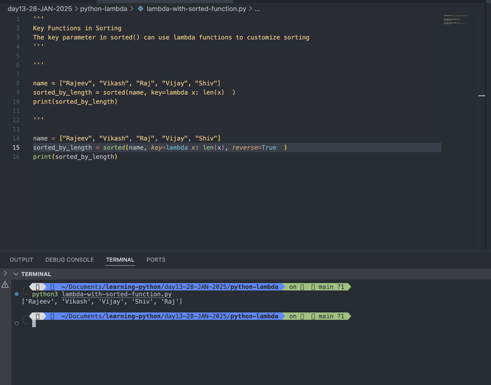

# Python Lambda

- A lambda function is a small anonymous function.
- A lambda function can take any number of arguments, but can only have one expression.

## Syntax

```

lambda arguments: expression

```

### The expression is executed and the result is returned:

#

### Example:

```
# lambda function
x = lambda a: a + 10
print(x(5))
result = x(10)
print(result)

```

Output:

```

python3 lambda.py
15
20

```


#

## Lambda functions can take any number of arguments:

### Example:

```

# Lambda function can take any number of arguments
lambda_multiArgs = lambda a,b: (a + b) * 10
print(lambda_multiArgs(10,20))
print("\n")
x = lambda a,b,c,d,e,f: ((a+b+c)*(d+e+f))/10
result = x(5,55,555,5555,55555,555555)
print(result)

```

Output:

```
python3 lambda-multiple-argument.py
300


37924897.5

```


#

## Why Use Lambda Functions?

- The power of lambda is better shown when you use them as an anonymous function inside another function.
- Say you have a function definition that takes one argument, and that argument will be multiplied with an unknown number:

### Example:

```
def my_fun(x):
  y=lambda a: a*55
  print(y(x))

my_fun(10)

```

Output:

```
python3 lambda-multiple-argument.py
550
```


#

```
# use return statement
def my_func(n):
  return lambda a: a * n
# Use that function definition to make a function
#  that always doubles the number you send in:
mydoubler = my_func(2)
print(mydoubler(5))
print(mydoubler(11))

```

Output:

```
python3 lambda-multiple-argument.py
10
22
```


#

```
# use return statement
def my_func(n):
  return lambda a: a ** n
# Use that function definition to make a function
#  that always square the number you send in:
mydoubler = my_func(2)
print(mydoubler(5))
print(mydoubler(11))

```

Output:

```
python3 lambda-multiple-argument.py
25
121
```


#

## Use Cases of Lambda Functions

1. Used with map() function

### The map() function applies a function to each item in an iterable.

```
# Lambda with map function
nums = [1,2,3,4,5]
squared = map(lambda x : x ** 2)
print(squared)
print(list(squared))

```

Output:

```
python3 lambda-with-map-function.py
Traceback (most recent call last):
  File "/Users/rajeevsingh/Documents/learning-python/day13-28-JAN-2025/python-lambda/lambda-with-map-function.py", line 3, in <module>
    squared = map(lambda x : x ** 2)
              ^^^^^^^^^^^^^^^^^^^^^^
TypeError: map() must have at least two arguments.

```


#

```
# Lambda with map function
nums = [1,2,3,4,5]
squared = map(lambda x : x ** 2, nums)
print(squared)
print(list(squared))
```

Output:

```
python3 lambda-with-map-function.py
<map object at 0x1027da050>
[1, 4, 9, 16, 25]

```


#

2. Used with filter()

### The filter() function filters elements based on a condition.

#### Example:

```
'''
Used with filter()
The filter() function filters elements based on a condition
'''
nums = [1, 2, 3, 4, 5, 6]
evens = filter(lambda x: x % 2 == 0, nums)
print(list(evens))  # Output: [2, 4, 6]

```

Output:

```
python3 lambda-with-filter-function.py
[2, 4, 6]
```


#

3. Used with reduce()

### The reduce() function (from functools) applies a function cumulatively to the items in a sequence

```
'''
Used with reduce()
The reduce() function (from functools) applies a function cumulatively to the items in a sequence
'''
from functools import reduce
nums = [1,2]
product = reduce(lambda x, y: x*y, nums)
print(product)
print("\n")
nums = [1,2,3]
product = reduce(lambda x, y: x*y, nums)
print(product)
print("\n")
nums = [1,2,3,4]
product = reduce(lambda x, y: x*y, nums)
print(product)
print("\n")
nums = [1,2,3,4,5]
product = reduce(lambda x, y: x*y, nums)
print(product)
print("\n")
nums = [1,2,3,4,5,6]
product = reduce(lambda x, y: x*y, nums)
print(product)

```

Output:

```
python3 lambda-with-reduce-funtion.py
2


6


24


120


720

```


#

4. Key Functions in Sorting

### The key parameter in sorted() can use lambda functions to customize sorting

### Example:

```
'''
Key Functions in Sorting
The key parameter in sorted() can use lambda functions to customize sorting
'''
name = ["Rajeev", "Vikash", "Raj", "Vijay", "Shiv"]
sorted_by_length = sorted(name, key=lambda x: len(x)  )
print(sorted_by_length)

```

Output:

```
python3 lambda-with-sorted-function.py
['Raj', 'Shiv', 'Vijay', 'Rajeev', 'Vikash']
```


#### Step-by-Step Explanation

1. Input List

```
["Rajeev", "Vikash", "Raj", "Vijay", "Shiv"]

```

The lengths of these names are:

- "Rajeev" → 6 characters
- "Vikash" → 6 character
- "Raj" → 3 characters
- "Vijay" → 5 characters
- "Shiv" → 4 characters

2. sorted() Function
   The sorted() function sorts elements of an iterable based on a key. By default:

- Strings are sorted alphabetically.
- Numbers are sorted numerically.
  In this case, you specify a key function using a lambda expression to customize the sorting criteria.

3. key Parameter with Lambda Function
   The key parameter is set to:

```
key=lambda x: len(x)

```

- The lambda function takes each name (x) as input and calculates its length using len(x).

  For each name in the list:

  - "Rajeev" → len("Rajeev") = 6
  - "Vikash" → len("Vikash") = 6
  - "Raj" → len("Raj") = 3
  - "Vijay" → len("Vijay") = 5
  - "Shiv" → len("Shiv") = 4

4. Sorting Process
   The sorted() function uses the lengths of the names as the criteria for sorting:
   1. "Raj" → 3
   2. "Shiv" → 4
   3. "Vijay" → 5
   4. "Rajeev" → 6
   5. "Vikash" → 6

Names with the same length (like "Rajeev" and "Vikash") are ordered based on their original order in the list because sorted() is stable (it preserves the order of elements with equal keys). 5. Output

The sorted list is

```
["Raj", "Shiv", "Vijay", "Rajeev", "Vikash"]

```

#

### Sort in Descending Order (Longest Names First): Use the reverse=True parameter:

```
name = ["Rajeev", "Vikash", "Raj", "Vijay", "Shiv"]
sorted_by_length = sorted(name, key=lambda x: len(x), reverse=True  )
print(sorted_by_length)
```

Output:

```
python3 lambda-with-sorted-function.py
['Rajeev', 'Vikash', 'Vijay', 'Shiv', 'Raj']
```



#

### Sort Alphabetically as a Secondary Key: If two names have the same length, you can sort alphabetically by using sorted() with a tuple in the key:

```
'''
Sort Alphabetically as a Secondary Key: If two names have the same length,
 you can sort alphabetically by using sorted() with a tuple in the key:

'''
name = ["Rajeev", "Vikash", "Raj", "Vijay", "Shiv"]
sorted_by_length_alpha = sorted(name, key=lambda x: (len(x), x)  )
print(sorted_by_length_alpha)

```

Output:

```
python3 lambda-with-sorted-function.py
['Raj', 'Shiv', 'Vijay', 'Rajeev', 'Vikash']

```


