# Python Classess and Objects

- Python is an object oriented programming language.
- Almost everything in the python is object, with it's properties and methods.
- A class is like an object constructor, or a "blueprint" for creating objects.

# Create a class

## Example: Create a class named myclass with a property named x:

```
class Myclass:
  x = 5
```

# Create Object

## Example: Create an object named p1, and get the values of x:

```
p1 = myClass()
print(p1.x)

```

#

```
# Create class and Object

# Create class
class myClass():
  x = 5
p1 = myClass()
print(p1.x)

```

Output:

```
python3 create-class-and-object.py
5
```

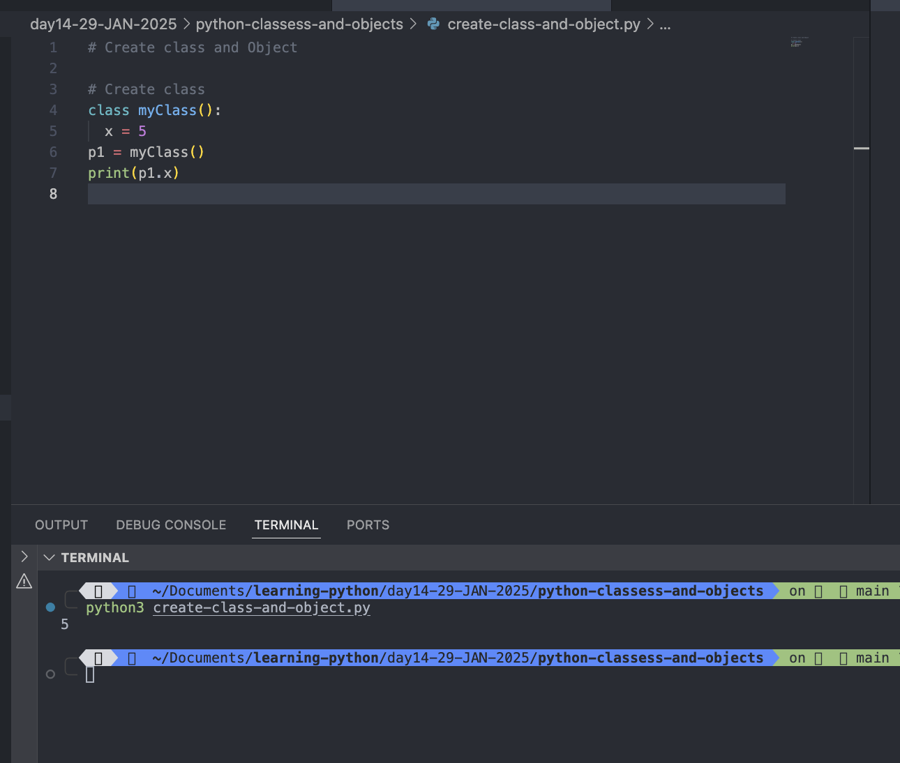

#

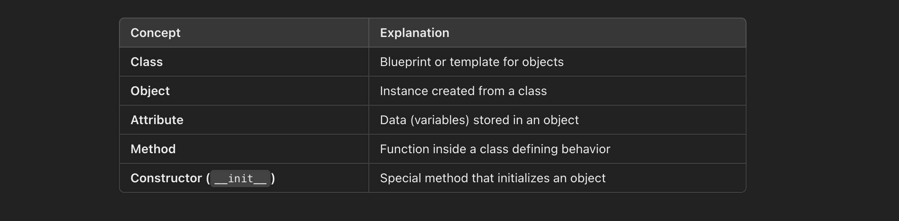

# The **init**() Function

- The examples above are classes and objects in their simplest form, and are not really useful in real life applications.
- To understand the meaning of classes we have to understand the built-in <mark>**init**()</mark> function.
- All classes have a function called **init**(), which is always executed when the class is being initiated.
- Use the "**init**()" function to assign values to object properties, or other operations that are necessary to do when the object is being created:

## Example: Create a class named Person, use the **init**() function to assign values for name and age:

```
''
# _init_() funtion:
Create a class named Person,
use the __init__() function to assign values for name and age:

'''
class Person:
  def __init__(self, name, age):
    self.name = name
    self.age = age
p1 = Person("Rajeev", 32)
print(p1.name)
print(p1.age)


```

Output:

```
python3 init-funtion-in-class.py
Rajeev
32

```

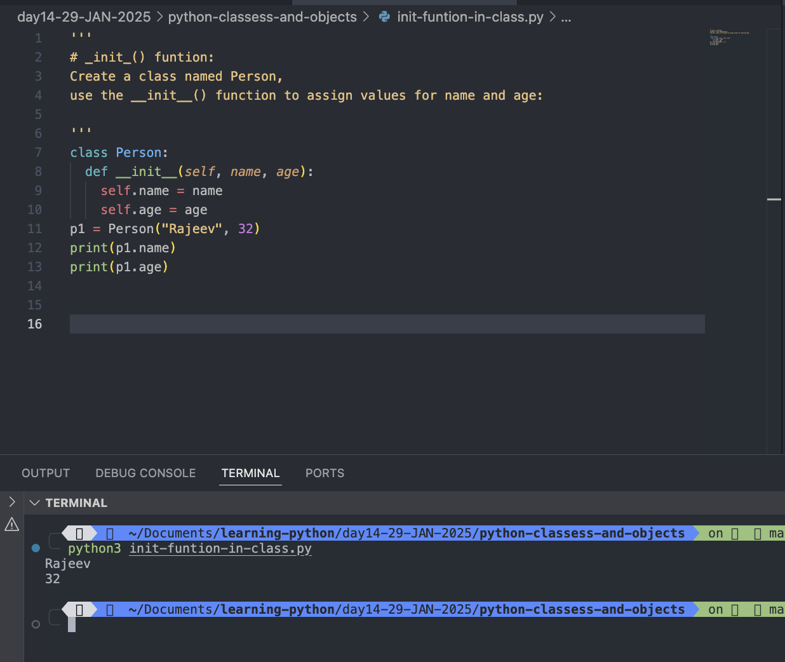

#

## Code Overview

1. The class Person is defined with a constructor (**init**) to initialize the attributes name and age.
2. An object p1 of the class is created with the values "Rajeev" for name and 32 for age.
3. The object's attributes are accessed using dot notation (p1.name and p1.age) and printed to the console.

#

# Note: the _init_() funtion is called automatically everytime the class is being used to create a new object.

# The **str**() Function

- The **str**() function controls what should be returned when the class object is represented as a string.
- If the **str**() function is not set, the string representation of the object is returned:

## Example: The string representation of an object WITHOUT the **str**() function:

```

#If the __str__() function is not set, the string representation of the object is returned:
# Example: The string representation of an object WITHOUT the __str__() function:
class Person:
  def __init__(self, name, age):
    self.name = name
    self.age = age
p1 = Person("Rajeev", 32)
print(p1)

```

Output:

```
python3 _str_funtion.py
<__main__.Person object at 0x10095e960>

```

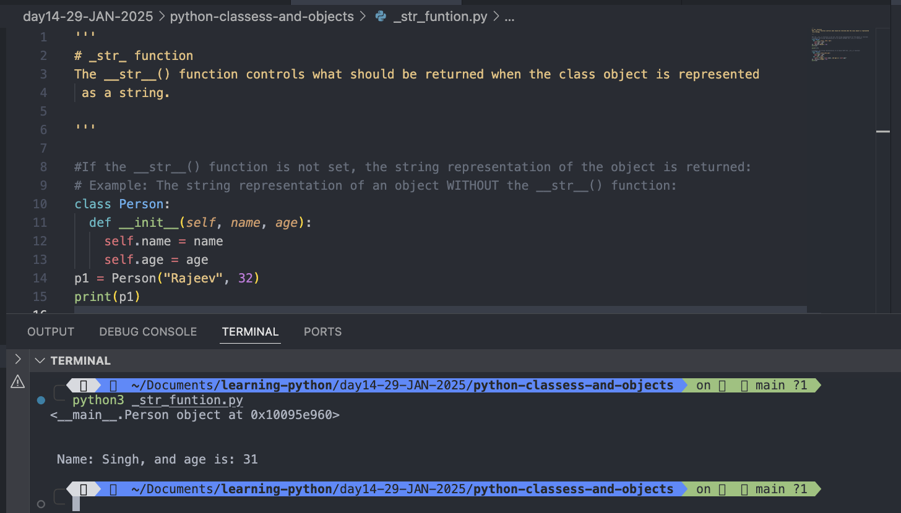

#

## The string representation of an object WITH the **str**() function:

```
#If the __str__() function is not set, the string representation of the object is returned:
# Example: The string representation of an object WITHOUT the __str__() function:
class Person:
  def __init__(self, name, age):
    self.name = name
    self.age = age
p1 = Person("Rajeev", 32)
print(p1)

print("\n")

# Example: The string representation of an object WITH the __str__() function:
class Person1:
  def __init__(self,name,age):
    self.name = name
    self.age = age
  def __str__(self):
    return f" Name: {self.name}, and age is: {self.age}"
p2 = Person1("Singh", 31)
print(p2)

```

Output:

```
python3 _str_funtion.py
<__main__.Person object at 0x10095e960>


 Name: Singh, and age is: 31

```

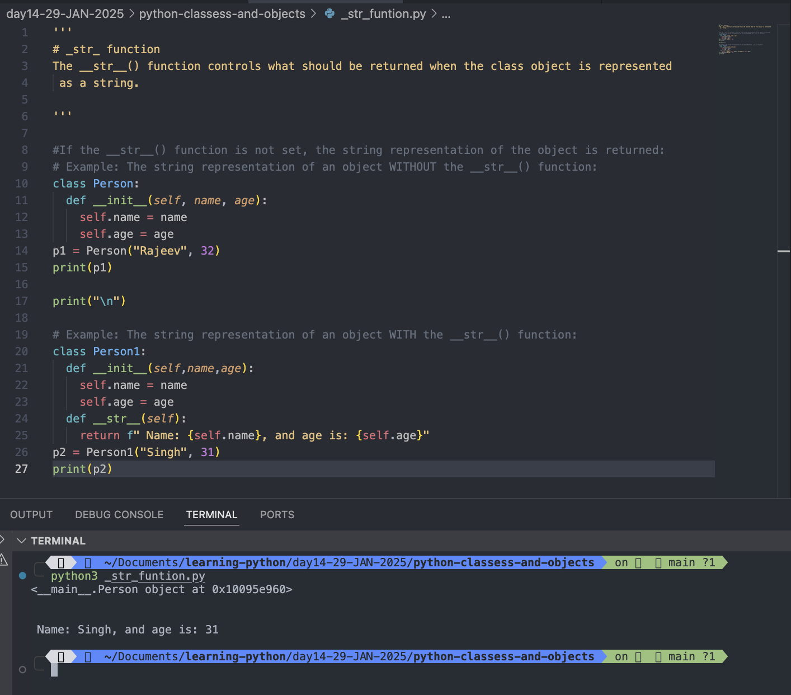

#

# Object Methods

## Objects can also contain methods. Methods in objects are functions that belong to the object.

```

'''
Let us create a method in the Person class:

Insert a function that prints a greeting, and execute it on the p1 object:
'''
class Person:
  def __init__(self, name, age):
    self.name = name
    self.age = age
  def my_fun(self):
    print("Hello my name is ", self.name)
p1 =Person("Rajeev Kumar Singh", 32)
p1.my_fun()

```

Output:

```
python3 object-method.py
Hello my name is  Rajeev Kumar Singh


```

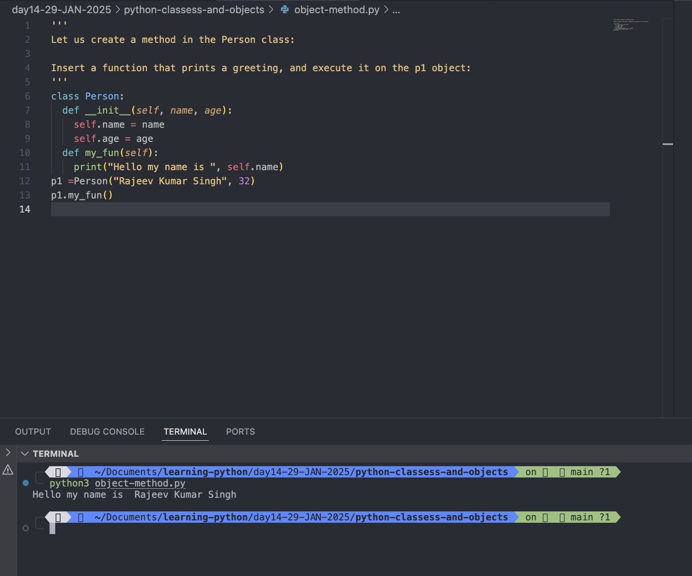

## Note: The self parameter is a reference to the current instance of the class, and is used to access variables that belong to the class.

#

# The self Parameter

- The self parameter is a reference to the current instance of the class, and is used to access variables that belong to the class.
- It does not have to be named self, you can call it whatever you like, but it has to be the first parameter of any function in the class:

## Example:

```
class Person:
  def __init__(myobject, name, age):
    myobject.name = name
    myobject.age = age
  def my_fun(abc):
    print("Hell my name is ", abc.name)
p1 = Person("Rajeev Kumar Singh", 30)
p1.my_fun()

```

Output:

```
python3 self-parameter.py
Hell my name is  Rajeev Kumar Singh
```

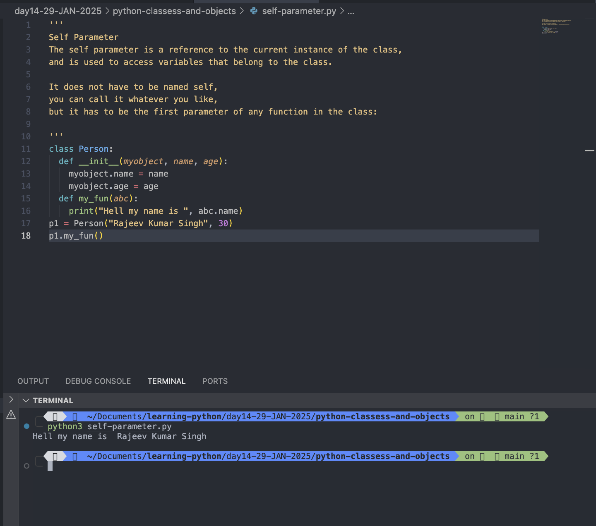

#

# Modify Object Properties

You can modify properties on objects like this:

```

p1.age = 28

```

## Example:

```
class Person:
  def __init__(myobject, name, age):
    myobject.name = name
    myobject.age = age
  def my_fun(abc):
    print("Hell my name is ", abc.name, "and I am ", abc.age)
p1 = Person("Rajeev Kumar Singh", 30)
p1.my_fun()

# Modify Object Properties
p1.age= 28
p1.my_fun()

```

Output:

```
python3 self-parameter.py
Hell my name is  Rajeev Kumar Singh and I am  30
Hell my name is  Rajeev Kumar Singh and I am  28

```

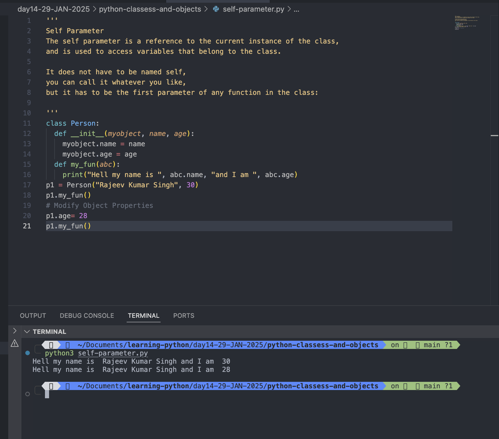

#

# Delete Object Properties

## You can delete properties on objects by using the del keyword:

```
# Create class
class Person:
  def __init__(forObject, name, age, addr):
    forObject.name = name
    forObject.age = age
    forObject.addr = addr
  def greet(self):
    print("Hello my name is ", self.name, "and I am ", self.age, "I am gonna delete addr properties")
  def delete(self):
    print("Hi", self.name , "addr properties is deleted successfully ")
# Delete the age properties from the p1 object
p1 = Person("Rajeev Kumar Singh", 32, "btm-bangalore")
p1.greet()

# Delete the addr properties from the p1 object
del p1.addr
p1.delete()
print(p1.addr)
```

Output:

```
python3 delete-object-property.py
Hello my name is  Rajeev Kumar Singh and I am  32 I am gonna delete addr properties
Hi Rajeev Kumar Singh addr properties is deleted successfully
Traceback (most recent call last):
  File "/Users/rajeevsingh/Documents/learning-python/day14-29-JAN-2025/python-classess-and-objects/delete-object-property.py", line 25, in <module>
    print(p1.addr)
          ^^^^^^^
AttributeError: 'Person' object has no attribute 'addr'
```

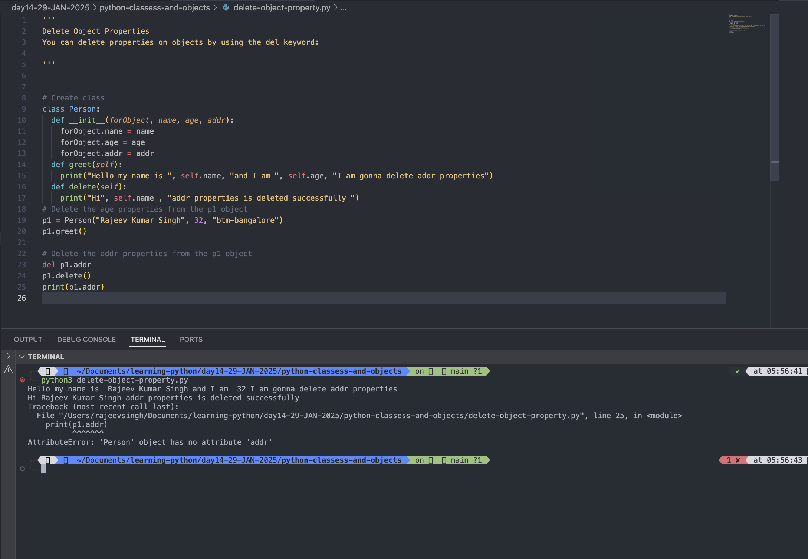

#

# Delete Objects

## You can delete objects by using the del keyword:

```
# Create the class and Object
class Person:
  def __init__(self, name, age):
    self.name = name
    self.age = age
  def my_fun(callme):
    print("Hello learners my name is ", callme.name, "and I am ", callme.age)
  def delete(mr):
    print("Hello ", mr.name, "Now I am gonna delete the Object p1 by using del keyword: del p1! ")
# Create Object
p1 = Person("Rajeev Kumar Singh", 30)
p1.my_fun()
# Delete the object p1
p1.delete()
del p1
print(p1)
```

Output:

```
python3 delete-object.py
Hello learners my name is  Rajeev Kumar Singh and I am  30
Hello  Rajeev Kumar Singh Now I am gonna delete the Object p1 by using del keyword: del p1!
Traceback (most recent call last):
  File "/Users/rajeevsingh/Documents/learning-python/day14-29-JAN-2025/python-classess-and-objects/delete-object.py", line 22, in <module>
    print(p1)
          ^^
NameError: name 'p1' is not defined
```

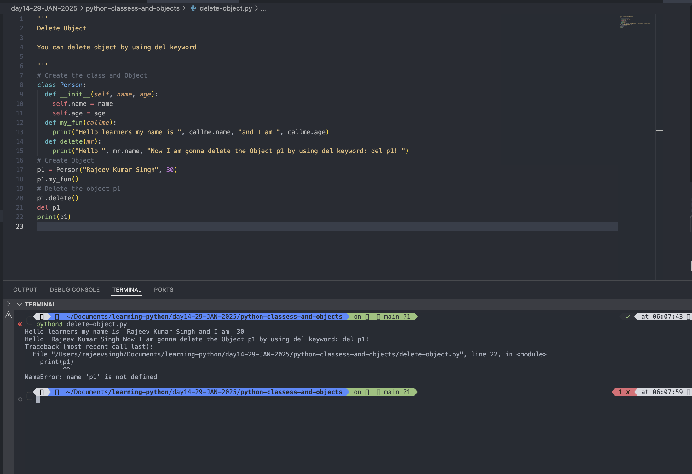

#

# The pass Statement

## class definitions cannot be empty, but if you for some reason have a class definition with no content, put in the pass statement to avoid getting an error.

## Example

```
# Create class
class myClass:
  def __init__(self):
    pass

```

Output:

```
python3 pass-statement.py

```

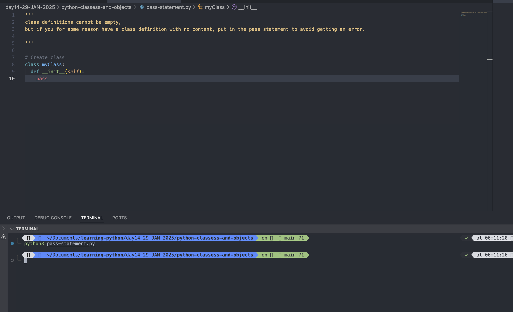

#
