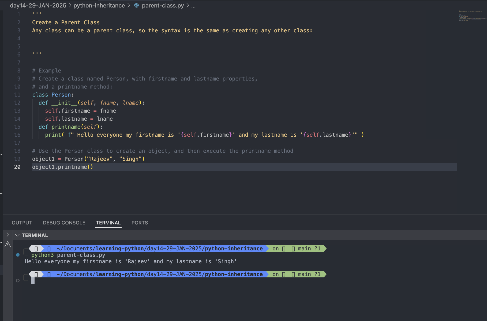
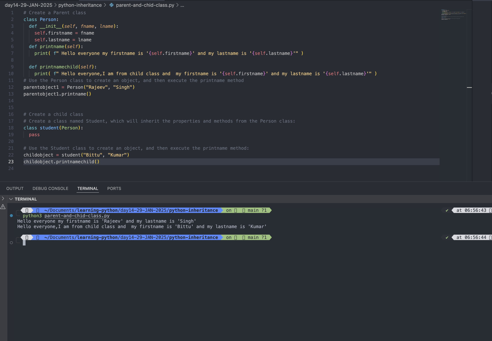
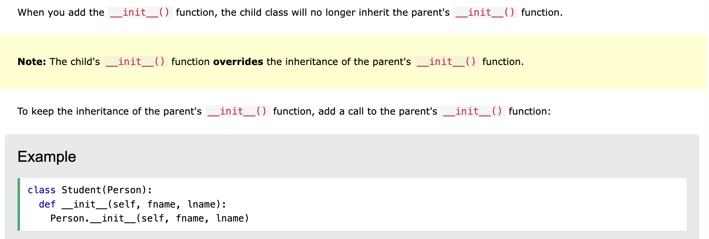
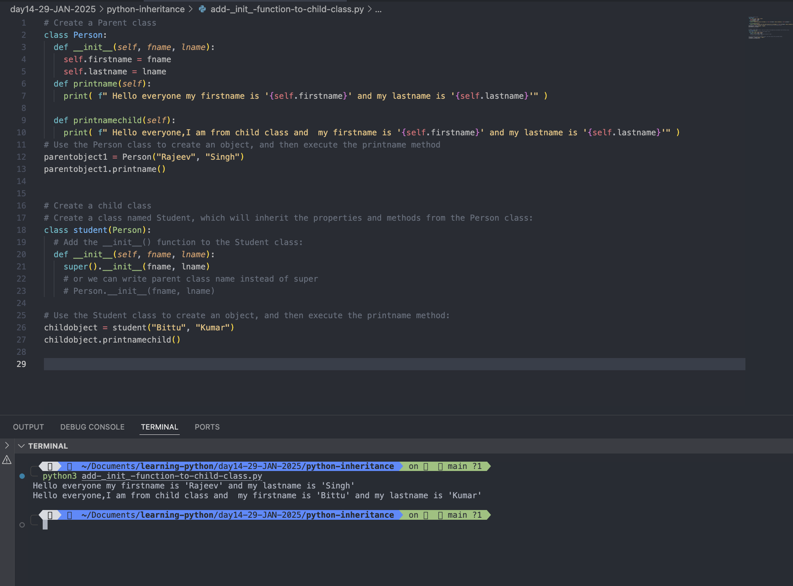
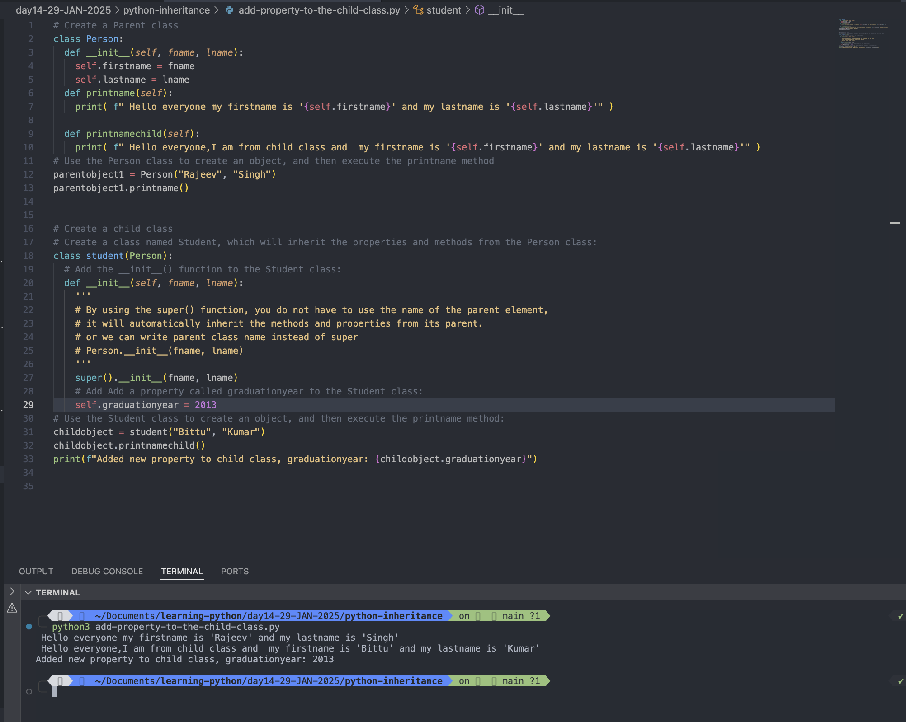
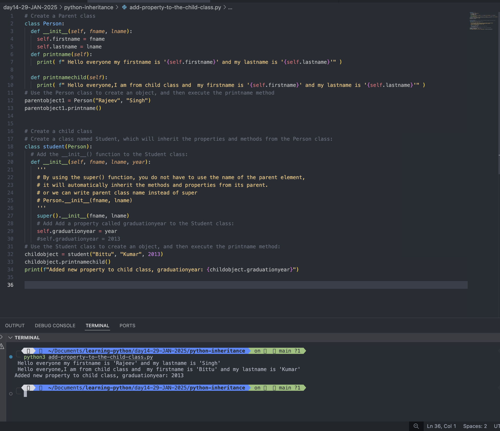

# Python Inheritance

- Inheritance allows us to define a class that inherits all the methods and properties from another class.
- <mark>Parent class</mark> is the class being inherited from, also called base class.
- <mark>Child class</mark> is the class that inherits from another class, also called derived class.

# Create a Parent Class

## Any class can be a parent class, so the syntax is the same as creating any other class:

# Example: Create a class named Person, with firstname and lastname properties, and a printname method:

```
class Person:
  def __init__(self, fname, lname):
    self.firstname = fname
    self.lastname = lname
  def printname(self):
    print( f" Hello everyone my firstname is '{self.firstname}' and my lastname is '{self.lastname}'" )

# Use the Person class to create an object, and then execute the printname method
object1 = Person("Rajeev", "Singh")
object1.printname()
```

Output:

```
python3 parent-class.py
 Hello everyone my firstname is 'Rajeev' and my lastname is 'Singh'

```



#

# Create a Child Class

## To create a class that inherits the functionality from another class, send the parent class as a parameter when creating the child class:

```

# Create a Parent class
class Person:
  def __init__(self, fname, lname):
    self.firstname = fname
    self.lastname = lname
  def printname(self):
    print( f" Hello everyone my firstname is '{self.firstname}' and my lastname is '{self.lastname}'" )

  def printnamechild(self):
    print( f" Hello everyone,I am from child class and  my firstname is '{self.firstname}' and my lastname is '{self.lastname}'" )
# Use the Person class to create an object, and then execute the printname method
parentobject1 = Person("Rajeev", "Singh")
parentobject1.printname()


# Create a child class
# Create a class named Student, which will inherit the properties and methods from the Person class:
class student(Person):
  pass

# Use the Student class to create an object, and then execute the printname method:
childobject = student("Bittu", "Kumar")
childobject.printnamechild()
```

Output:

```
python3 parent-and-chid-class.py
 Hello everyone my firstname is 'Rajeev' and my lastname is 'Singh'
 Hello everyone,I am from child class and  my firstname is 'Bittu' and my lastname is 'Kumar'

```



#

# Add the **init**() Function to child class

## So far we have created a child class that inherits the properties and methods from its parent.

## We want to add the **init**() function to the child class (instead of the pass keyword).

# Note: The **init**() function is called automatically every time the class is being used to create a new object.

### Example: Add the **init**() function to the Student class:

# Create a Parent class

```
class Person:
  def __init__(self, fname, lname):
    self.firstname = fname
    self.lastname = lname
  def printname(self):
    print( f" Hello everyone my firstname is '{self.firstname}' and my lastname is '{self.lastname}'" )

  def printnamechild(self):
    print( f" Hello everyone,I am from child class and  my firstname is '{self.firstname}' and my lastname is '{self.lastname}'" )
# Use the Person class to create an object, and then execute the printname method
parentobject1 = Person("Rajeev", "Singh")
parentobject1.printname()


# Create a child class
# Create a class named Student, which will inherit the properties and methods from the Person class:
class student(Person):
  # Add the __init__() function to the Student class:
  def __init__(self, fname, lname):
    super().__init__(fname, lname)
    # or we can write parent class name instead of super
    # Person.__init__(fname, lname)

# Use the Student class to create an object, and then execute the printname method:
childobject = student("Bittu", "Kumar")
childobject.printnamechild()
```


Output:

```
python3 add-_init_-function-to-child-class.py
 Hello everyone my firstname is 'Rajeev' and my lastname is 'Singh'
 Hello everyone,I am from child class and  my firstname is 'Bittu' and my lastname is 'Kumar'

```



#

# Add Properties

## Add a property called graduationyear to the Student class:

### Example:

```
# Create a Parent class
class Person:
  def __init__(self, fname, lname):
    self.firstname = fname
    self.lastname = lname
  def printname(self):
    print( f" Hello everyone my firstname is '{self.firstname}' and my lastname is '{self.lastname}'" )

  def printnamechild(self):
    print( f" Hello everyone,I am from child class and  my firstname is '{self.firstname}' and my lastname is '{self.lastname}'" )
# Use the Person class to create an object, and then execute the printname method
parentobject1 = Person("Rajeev", "Singh")
parentobject1.printname()


# Create a child class
# Create a class named Student, which will inherit the properties and methods from the Person class:
class student(Person):
  # Add the __init__() function to the Student class:
  def __init__(self, fname, lname):
    '''
    # By using the super() function, you do not have to use the name of the parent element,
    # it will automatically inherit the methods and properties from its parent.
    # or we can write parent class name instead of super
    # Person.__init__(fname, lname)
    '''
    super().__init__(fname, lname)
    # Add Add a property called graduationyear to the Student class:
    self.graduationyear = 2013
# Use the Student class to create an object, and then execute the printname method:
childobject = student("Bittu", "Kumar")
childobject.printnamechild()
print(f"Added new property to child class, graduationyear: {childobject.graduationyear}")
```

Output:

```
python3 add-property-to-the-child-class.py
 Hello everyone my firstname is 'Rajeev' and my lastname is 'Singh'
 Hello everyone,I am from child class and  my firstname is 'Bittu' and my lastname is 'Kumar'
Added new property to child class, graduationyear: 2013

```



#

## In the example below, the year 2019 should be a variable, and passed into the Student class when creating student objects. To do so, add another parameter in the **init**() function:

### Example:

### Add a year parameter, and pass the correct year when creating objects:

```
# Create a Parent class
class Person:
  def __init__(self, fname, lname):
    self.firstname = fname
    self.lastname = lname
  def printname(self):
    print( f" Hello everyone my firstname is '{self.firstname}' and my lastname is '{self.lastname}'" )

  def printnamechild(self):
    print( f" Hello everyone,I am from child class and  my firstname is '{self.firstname}' and my lastname is '{self.lastname}'" )
# Use the Person class to create an object, and then execute the printname method
parentobject1 = Person("Rajeev", "Singh")
parentobject1.printname()


# Create a child class
# Create a class named Student, which will inherit the properties and methods from the Person class:
class student(Person):
  # Add the __init__() function to the Student class:
  def __init__(self, fname, lname, year):
    '''
    # By using the super() function, you do not have to use the name of the parent element,
    # it will automatically inherit the methods and properties from its parent.
    # or we can write parent class name instead of super
    # Person.__init__(fname, lname)
    '''
    super().__init__(fname, lname)
    # Add Add a property called graduationyear to the Student class:
    self.graduationyear = year
    #self.graduationyear = 2013
# Use the Student class to create an object, and then execute the printname method:
childobject = student("Bittu", "Kumar", 2013)
childobject.printnamechild()
print(f"Added new property to child class, graduationyear: {childobject.graduationyear}")
```

Output:

```
python3 add-property-to-the-child-class.py
 Hello everyone my firstname is 'Rajeev' and my lastname is 'Singh'
 Hello everyone,I am from child class and  my firstname is 'Bittu' and my lastname is 'Kumar'
Added new property to child class, graduationyear: 2013
```



#
