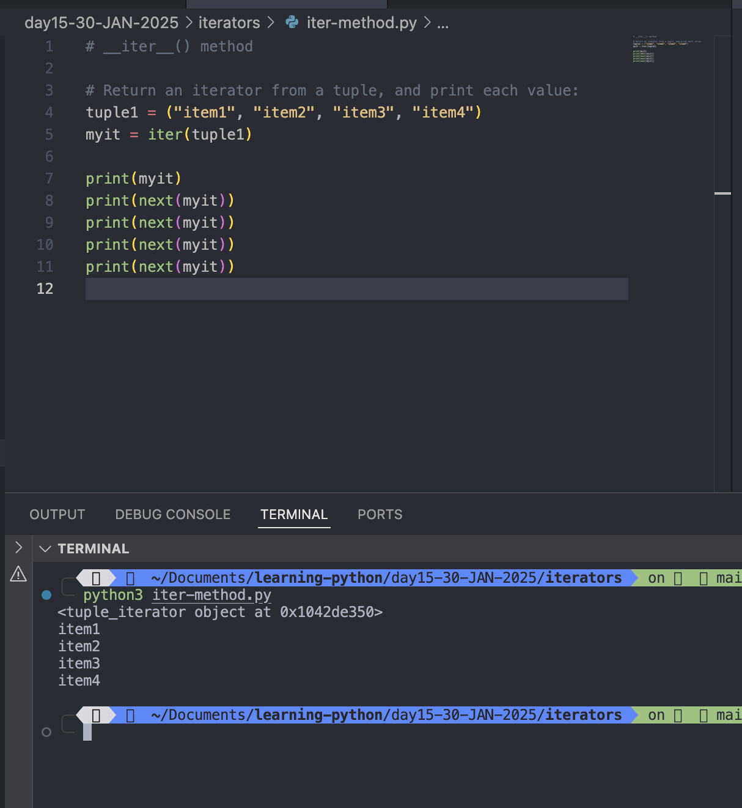
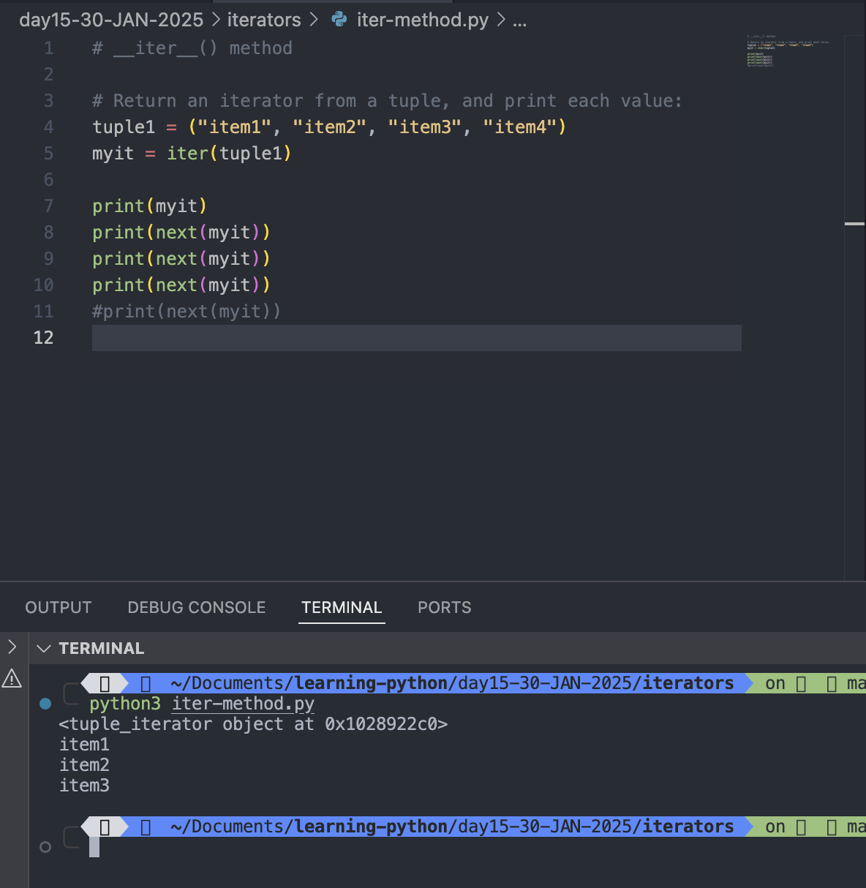
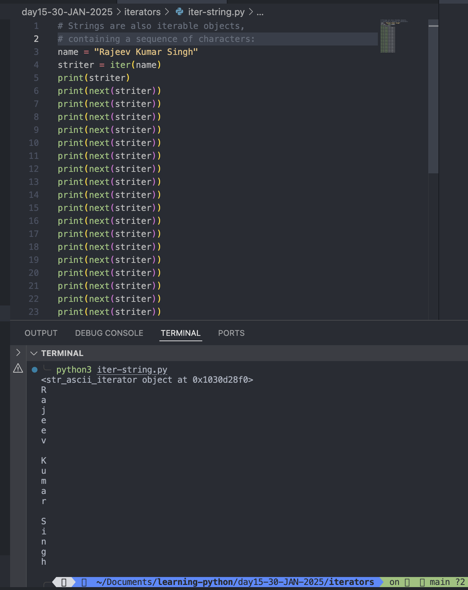
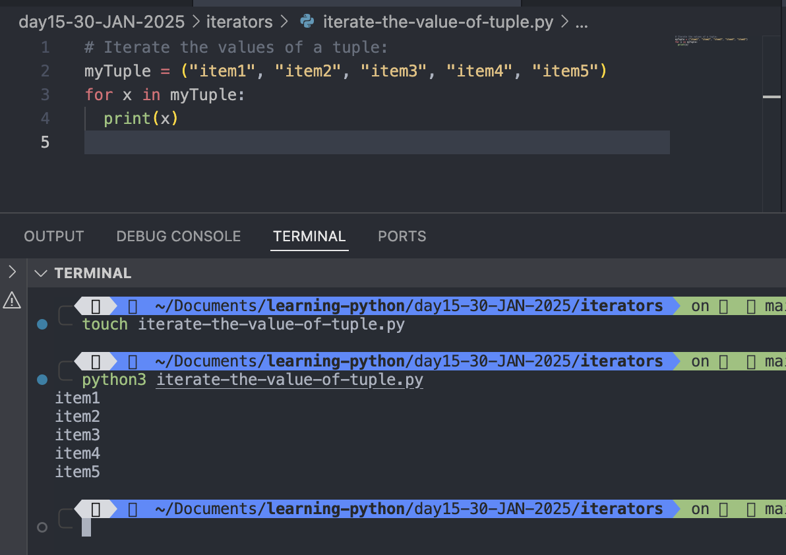
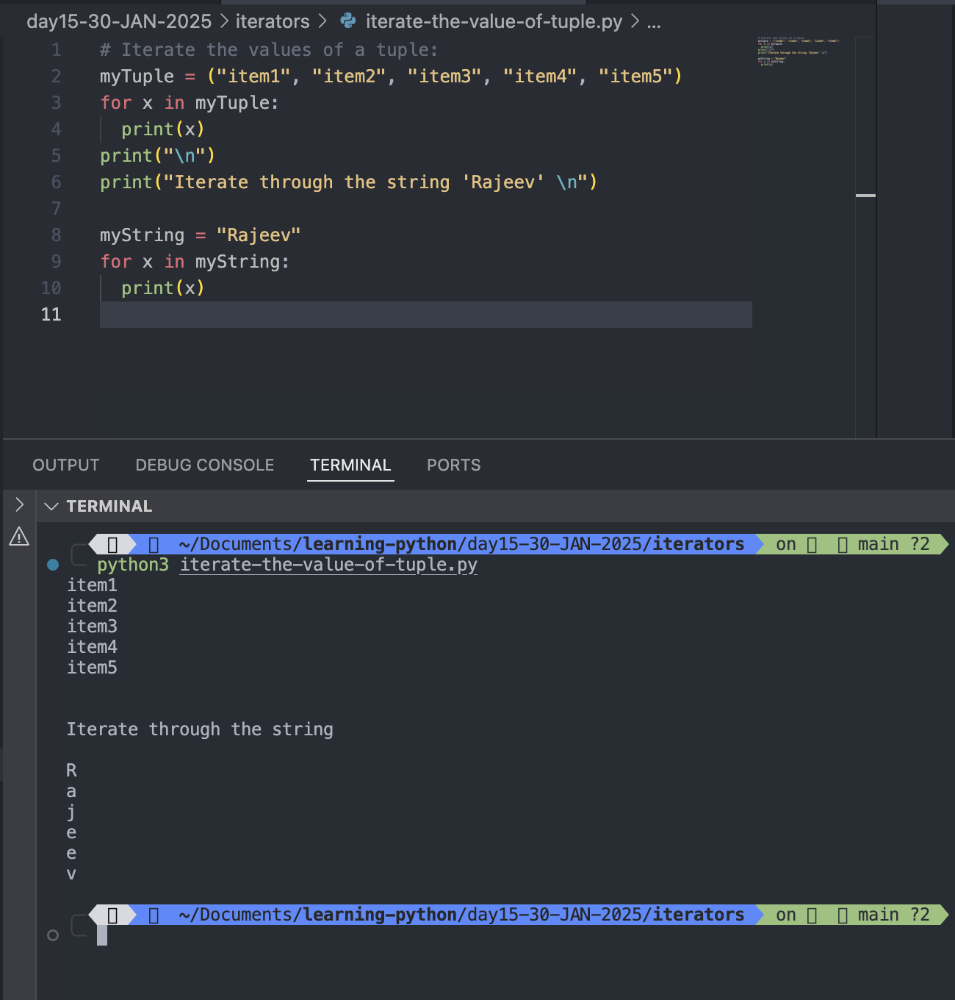
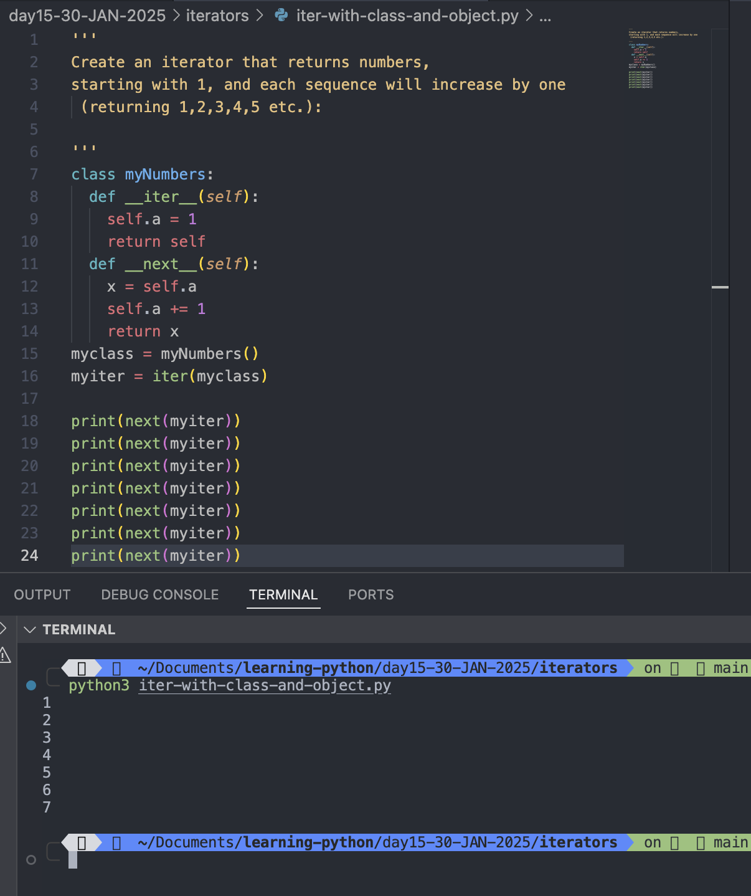
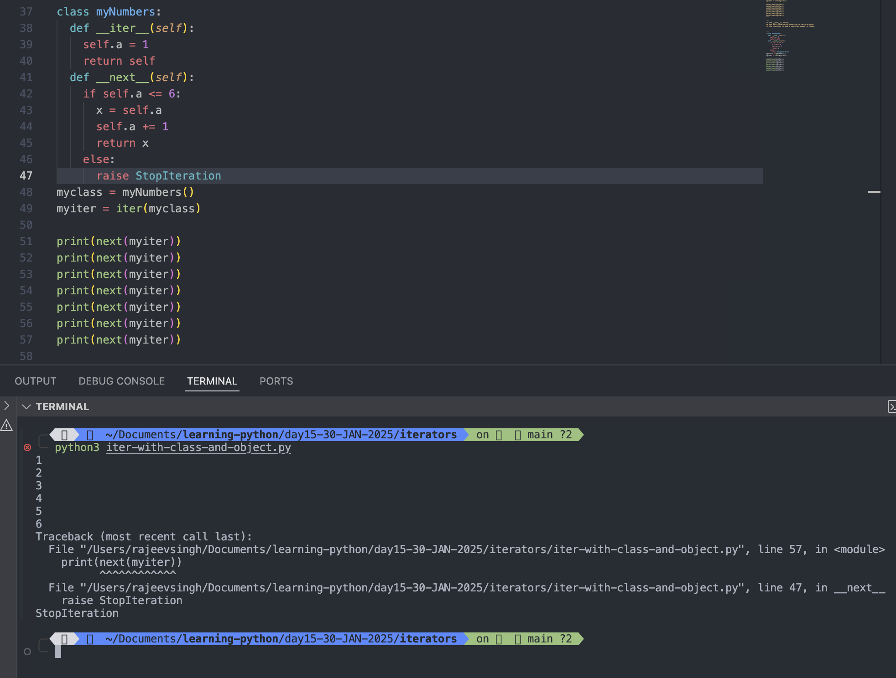

# Iterators

- An iterators is an object that contains countable number of values.
- An iterators is an object to iterates upon, meaning that you can traverse through all the values.
- Technically, in Python, an iterator is an object that implements the iterators protocol, which consist of the method<mark> _\_iter_\_() </mark>and <mark>_\_next_\_()</mark>.

#

## Iterator vs Iterable

- List, tuple, set, and dictionaries are all iterable objects. They are iterable containers which you can get an iterate from.
- All these objects have **_\_iter_\_()** method, which is used to get an iterator.

### Example: Return an iterator from a tuple, and print each value:

```
# __iter__() method

# Return an iterator from a tuple, and print each value:
tuple1 = ("item1", "item2", "item3", "item4")
myit = iter(tuple1)

print(myit)
print(next(myit))
print(next(myit))
print(next(myit))
print(next(myit))

```

Output:

```
python3 iter-method.py
<tuple_iterator object at 0x1042de350>
item1
item2
item3
item4
```



#

```
tuple1 = ("item1", "item2", "item3", "item4")
myit = iter(tuple1)

print(myit)
print(next(myit))
print(next(myit))
print(next(myit))
#print(next(myit))
```

Output:

```
python3 iter-method.py
<tuple_iterator object at 0x102996230>
item1
item2
item3

```



#

## Even strings are iterable objects, and can return an iterator:

### Example: Strings are also iterable objects, containing a sequence of characters:

```
# Strings are also iterable objects,
# containing a sequence of characters:
name = "Rajeev Kumar Singh"
striter = iter(name)
print(striter)
print(next(striter))
print(next(striter))
print(next(striter))
print(next(striter))
print(next(striter))
print(next(striter))
print(next(striter))
print(next(striter))
print(next(striter))
print(next(striter))
print(next(striter))
print(next(striter))
print(next(striter))
print(next(striter))
print(next(striter))
print(next(striter))
print(next(striter))
print(next(striter))
```

Output:

```
python3 iter-string.py
<str_ascii_iterator object at 0x1030d28f0>
R
a
j
e
e
v

K
u
m
a
r

S
i
n
g
h
```



#

## Looping Through an Iterator

## We can also use a for loop to iterate through an iterable object:

### Example: Iterate the values of a tuple:

```
# Iterate the values of a tuple:
myTuple = ("item1", "item2", "item3", "item4", "item5")
for x in myTuple:
  print(x)
```

Output:

```
python3 iterate-the-value-of-tuple.py
item1
item2
item3
item4
item5
```



#

### Iteratre the character of string

```
myString = "Rajeev"
for x in myString:
  print(x)
```

Output:

```
python3 iterate-the-value-of-tuple.py
item1
item2
item3
item4
item5


Iterate through the string 'Rajeev'

R
a
j
e
e
v
```



#

## The <span style="color: yellow">for </span>loop actually creates an iterator object and executes the<span style="color: yellow"> next() method for each loop</span>.

#

## Create an Iterator

- To create an object/class as an iterator you have to implement the methods **iter**() and **next**() to your object.
- all classes have a function called **init**(), which allows you to do some initializing when the object is being created.
- The _\_iter_\_() method acts similar, you can do operations (initializing etc.), but must always return the iterator object itself.
- The _\_next_\_() method also allows you to do operations, and must return the next item in the sequence.

### Example:

```
'''
Create an iterator that returns numbers,
starting with 1, and each sequence will increase by one
 (returning 1,2,3,4,5 etc.):

'''
class myNumbers:
  def __iter__(self):
    self.a = 1
    return self
  def __next__(self):
    x = self.a
    self.a += 1
    return x
myclass = myNumbers()
myiter = iter(myclass)

print(next(myiter))
print(next(myiter))
print(next(myiter))
print(next(myiter))
print(next(myiter))
print(next(myiter))
print(next(myiter))

```

Output:

```
python3 iter-with-class-and-object.py
1
2
3
4
5
6
7

```



#

## StopIteration

- The example above would continue forever if you had enough next() statements, or if it was used in a for loop.
- To prevent the iteration from going on forever, we can use the <mark>StopIteration</mark> statement.
- In the _\_next_\_() method, we can add a terminating condition to raise an error if the iteration is done a specified number of times:

### Example:

```

class myNumbers:
  def __iter__(self):
    self.a = 1
    return self
  def __next__(self):
    if self.a <= 6:
      x = self.a
      self.a += 1
      return x
    else:
      raise StopIteration
myclass = myNumbers()
myiter = iter(myclass)

print(next(myiter))
print(next(myiter))
print(next(myiter))
print(next(myiter))
print(next(myiter))
print(next(myiter))
print(next(myiter))
```

Output:

```
python3 iter-with-class-and-object.py
1
2
3
4
5
6
Traceback (most recent call last):
  File "/Users/rajeevsingh/Documents/learning-python/day15-30-JAN-2025/iterators/iter-with-class-and-object.py", line 57, in <module>
    print(next(myiter))
          ^^^^^^^^^^^^
  File "/Users/rajeevsingh/Documents/learning-python/day15-30-JAN-2025/iterators/iter-with-class-and-object.py", line 47, in __next__
    raise StopIteration
StopIteration
```


