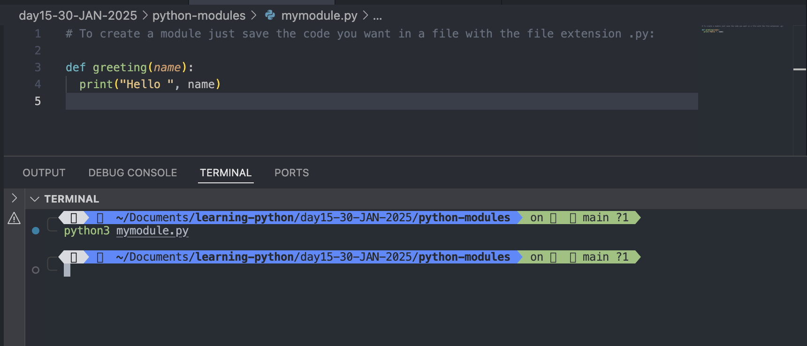
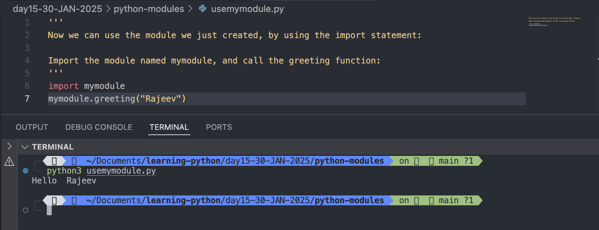
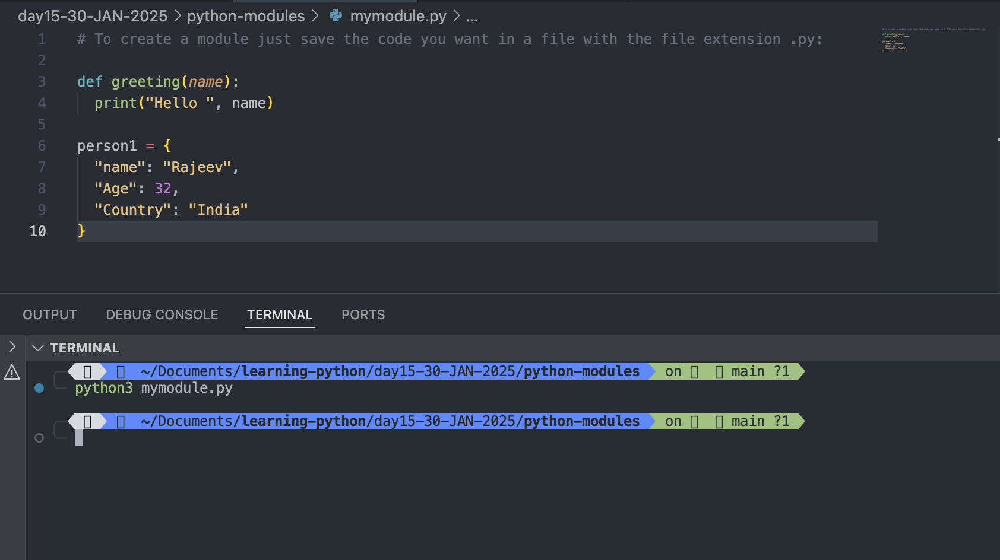
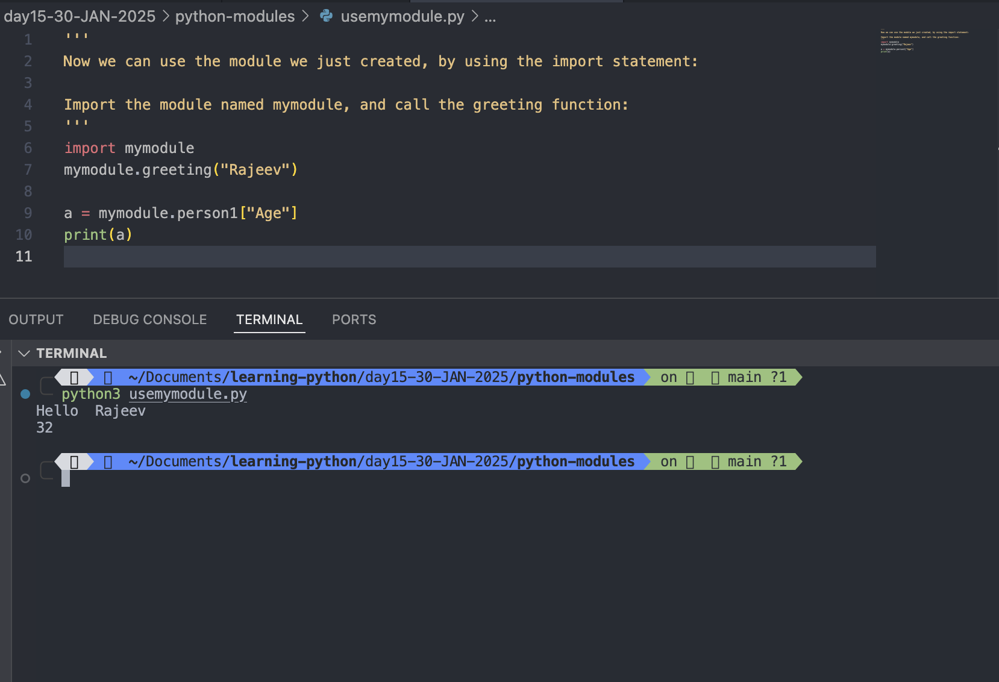
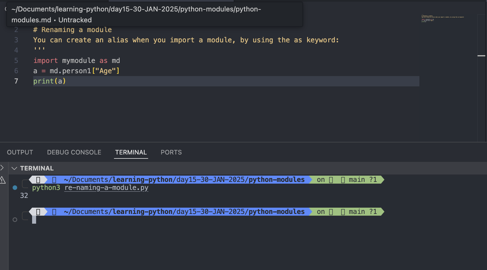
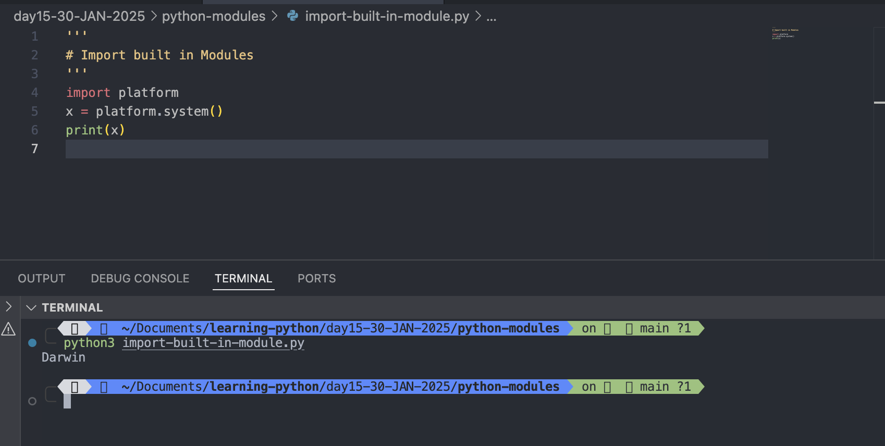
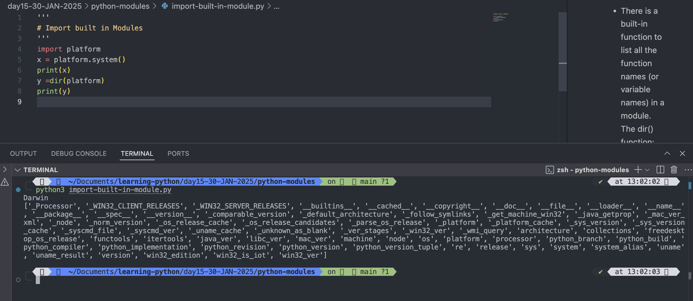
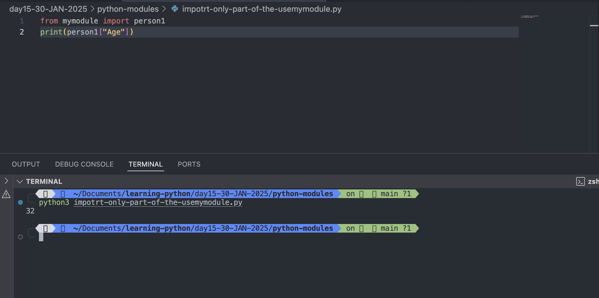

# Python Modules

## What is a Module?

- Consider a module to be the same as a code library.
- A file containing a set of functions you want to include in your application.

## Create a Module

- To create a module just save the code you want in a file with the file extension .py:

### Example: Save this code in a file named mymodule.py

```

def greeting(name):
  print("Hello, " + name)

```



#

## Use a Module

- Now we can use the module we just created, by using the import statement:

### Example: Import the module named mymodule, and call the greeting function:

```
import mymodule

mymodule.greeting("Jonathan")
```



#

# Note: When using a function from a module, use the syntax: module_name.function_name.

## Variables in Module

- The module can contain functions, as already described, but also variables of all types (arrays, dictionaries, objects etc):

### Example: Save this code in the file mymodule.py

```
vim mymodule.py

```

```
def greeting(name):
  print("Hello ", name)

person1 = {
  "name": "Rajeev",
  "Age": 32,
  "Country": "India"
}
```



### Import the module named mymodule, and access the person1 dictionary:

```
vim usemymodule.py
```

```
import mymodule
mymodule.greeting("Rajeev")

a = mymodule.person1["Age"]
print(a)
```



#

## Naming a Module

- You can name the module file whatever you like, but it must have the file extension .py

## Re-naming a Module

- You can create an alias when you import a module, by using the <mark>as</mark> keyword:

### Example: Create an alias for mymodule called md:

```
import mymodule as mx

a = mx.person1["age"]
print(a)

```

Output:

```
python3 re-naming-a-module.py
32
```



#

## Built-in Modules

- There are several built-in modules in Python, which you can import whenever you like.

### Example: import and use "platform" module

```
import platform
x = platform.system()
print(x)
```

Output:

```
python3 import-built-in-module.py
Darwin
```



#

## Using the dir() Function

- There is a built-in function to list all the function names (or variable names) in a module. The dir() function:

### Example: List all the defined names belonging to the platform module:

```
import platform
x = platform.system()
print(x)
y =dir(platform)
print(y)
```

Output:

```
python3 import-built-in-module.py
Darwin
['_Processor', '_WIN32_CLIENT_RELEASES', '_WIN32_SERVER_RELEASES', '__builtins__', '__cached__', '__copyright__', '__doc__', '__file__', '__loader__', '__name__', '__package__', '__spec__', '__version__', '_comparable_version', '_default_architecture', '_follow_symlinks', '_get_machine_win32', '_java_getprop', '_mac_ver_xml', '_node', '_norm_version', '_os_release_cache', '_os_release_candidates', '_parse_os_release', '_platform', '_platform_cache', '_sys_version', '_sys_version_cache', '_syscmd_file', '_syscmd_ver', '_uname_cache', '_unknown_as_blank', '_ver_stages', '_win32_ver', '_wmi_query', 'architecture', 'collections', 'freedesktop_os_release', 'functools', 'itertools', 'java_ver', 'libc_ver', 'mac_ver', 'machine', 'node', 'os', 'platform', 'processor', 'python_branch', 'python_build', 'python_compiler', 'python_implementation', 'python_revision', 'python_version', 'python_version_tuple', 're', 'release', 'sys', 'system', 'system_alias', 'uname', 'uname_result', 'version', 'win32_edition', 'win32_is_iot', 'win32_ver']
```



#

## Note: The dir() function can be used on all modules, also the ones you create yourself.

## Import From Module

- You can choose to import only parts from a module, by using the from keyword.

```
from mymodule import person1

print (person1["age"])
```

Output:

```
python3 impotrt-only-part-of-the-usemymodule.py
32

```



#

## Note: When importing using the from keyword, do not use the module name when referring to elements in the module. Example: person1["age"], not mymodule.person1["age"]
