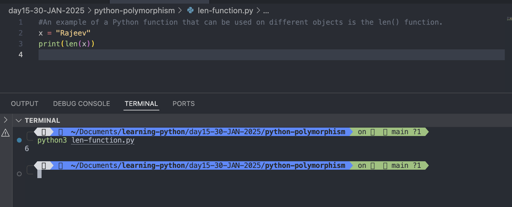
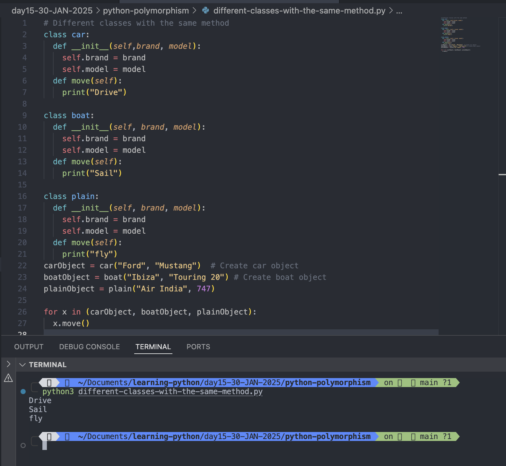
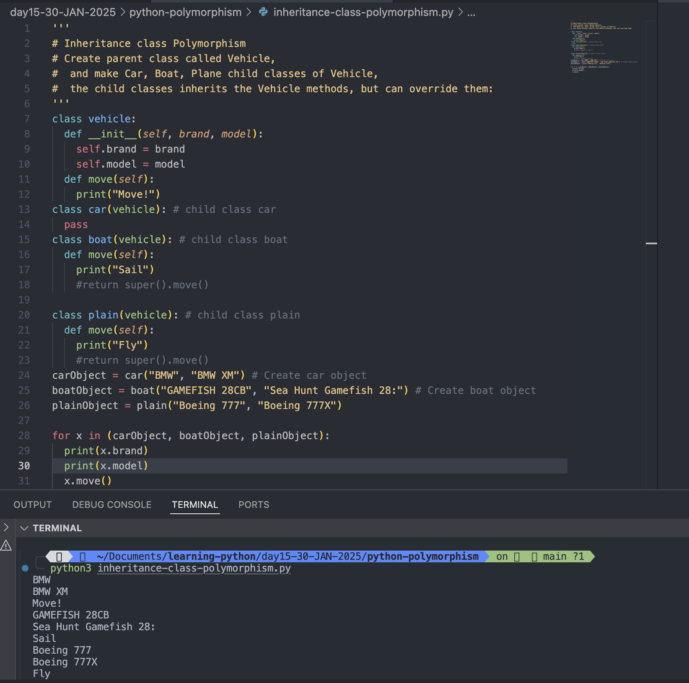

# Python Polymorphism

- The word "polymorphism" means "many forms", and in programming it refers to method/function/operators with the same name that can be executed on many objects or classes.

#

## Function Polymorphism

An example of a Python function that can be used on different objects is the <mark>len()</mark> function.

### String

### For strings len() returns the number of characters:

```
x = "Rajeev"

print(len(x))
```

Output:

```
python3 len-function.py
6
```



#

## Class Polymorphism

- Polymorphism is often used in Class methods, where we can have multiple classes with the same method name.
- For example, say we have three classes: Car, Boat, and Plane, and they all have a method called move():

# Example: Different classes with the same method:

```
class car:
  def __init__(self,brand, model):
    self.brand = brand
    self.model = model
  def move(self):
    print("Drive")

class boat:
  def __init__(self, brand, model):
    self.brand = brand
    self.model = model
  def move(self):
    print("Sail")

class plain:
  def __init__(self, brand, model):
    self.brand = brand
    self.model = model
  def move(self):
    print("fly")
carObject = car("Ford", "Mustang")  # Create car object
boatObject = boat("Ibiza", "Touring 20") # Create boat object
plainObject = plain("Air India", 747) # Create plain Object

for x in (carObject, boatObject, plainObject):
  x.move()
```

Output:

```
python3 different-classes-with-the-same-method.py
Drive
Sail
fly
```


Look at the for loop at the end. Because of polymorphism we can execute the same method for all three classes.

#

## Inheritance Class Polymorphism

- what about classes with child classes with the same name? can we use polymorphism there?
  Yes. If we use the example above and make a parent class called Vehicle, and make Car, Boat, Plane child classes of Vehicle, the child classes inherits the Vehicle methods, but can override them:

### Example

```
class vehicle:
  def __init__(self, brand, model):
    self.brand = brand
    self.model = model
  def move(self):
    print("Move!")
class car(vehicle): # child class car
  pass
class boat(vehicle): # child class boat
  def move(self):
    print("Sail")
    #return super().move()

class plain(vehicle): # child class plain
  def move(self):
    print("Fly")
    #return super().move()
carObject = car("BMW", "BMW XM") # Create car object
boatObject = boat("GAMEFISH 28CB", "Sea Hunt Gamefish 28:") # Create boat object
plainObject = plain("Boeing 777", "Boeing 777X")

for x in (carObject, boatObject, plainObject):
  print(x.brand)
  print(x.model)
  x.move()

```

Output:

```
python3 inheritance-class-polymorphism.py
BMW
BMW XM
Move!
GAMEFISH 28CB
Sea Hunt Gamefish 28:
Sail
Boeing 777
Boeing 777X
Fly

```



#

- Child classes inherits the properties and methods from the parent class.

- In the example above you can see that the Car class is empty, but it inherits brand, model, and move() from Vehicle.
- The Boat and Plane classes also inherit brand, model, and move() from Vehicle, but they both override the move() method.
- Because of polymorphism we can execute the same method for all classes.
