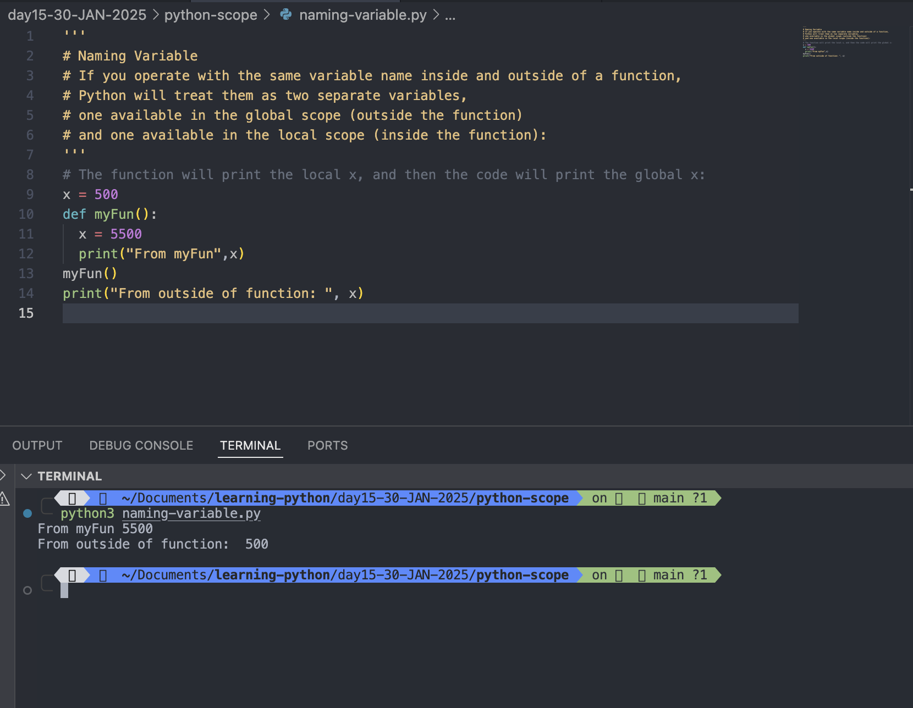

# Python Scope

- A variable is only available inside the region it is created. This is called <mark>scope</mark>

#

## Local Scope

- A variable created inside a function belongs to the local scope of that function, and can only be used inside that function.

### Example

```
def myFun():
  x = 500
  print("From Inside the frunction printing the values of x: ",x)

myFun()
print("From outside the function printing the values of x",x)
```

Output:

```
python3 local-scope.py
From Inside the frunction printing the values of x:  500
Traceback (most recent call last):
  File "/Users/rajeevsingh/Documents/learning-python/day15-30-JAN-2025/python-scope/local-scope.py", line 13, in <module>
    print("From outside the function printing the values of x",x)
                                                               ^
NameError: name 'x' is not defined
```


#

## Function Inside Function

- As explained in the example above, the variable x is not available outside the function, but it is available for any function inside the function:

### Example:

```
def myFun():
  x = 500
  print("From myFun: ",x)
  def myInnerFun():
    print("From myInnerFun: ", x)
  myInnerFun()

myFun()
```

Output:

```
python3 function-inside-function-scope.py
From myFun:  500
From myInnerFun:  500
```


#

## Global Scope

- A variable created in the main body of the Python code is a global variable and belongs to the global scope.
- Global variables are available from within any scope, global and local.

### Example: A variable created outside of a function is global and can be used by anyone:

```
x = 500
def myFun():
  print("From myFun accessing gloabal variable x: ", x)
  def myInnerFun():
    print("From myInnerFun accessing global variable x: ", x)
  myInnerFun()
myFun()
print("From Outside of function printing global variable x: ", x)
```

Output:

```
python3 global-variable.py
From myFun accessing gloabal variable x:  500
From myInnerFun accessing global variable x:  500
From Outside of function printing global variable x:  500
```


#

## Naming Variables

- If you operate with the same variable name inside and outside of a function, Python will treat them as two separate variables, one available in the global scope (outside the function) and one available in the local scope (inside the function):

### Example: The function will print the local x, and then the code will print the global x:

```
x = 500
def myFun():
  x = 5500
  print("From myFun",x)
myFun()
print("From outside of function: ", x)
```

Output:

```
python3 naming-variable.py
From myFun 5500
From outside of function:  500

```



#

## Global Keyword

- If you need to create a global variable, but are stuck in the local scope, you can use the global keyword.
- The global keyword makes the variable global.

### Example: If you use the global keyword, the variable belongs to the global scope:

```
def myFun():
  global x
  x = 500
  print("From myFun: ",x)
myFun()
print("From outside of function: ", x)
```

Output:

```
python3 global-keyword.py
From myFun:  500
From outside of function:  500

```


#

## Also, use the global keyword if you want to make a change to a global variable inside a function.

### Example: To change the value of a global variable inside a function, refer to the variable by using the global keyword:

```
x = 5500
def myFun():
  global x
  x = 5000
  print("From myFun: ",x)
myFun()
print("From outside of function: ", x)
```

Output:

```
python3 global-keyword.py
From myFun:  5000
From outside of function:  5000
```


#

## Nonlocal Keyword

- The nonlocal keyword is used to work with variables inside nested functions.
- The nonlocal keyword makes the variable belong to the outer function.

### Example: If you use the nonlocal keyword, the variable will belong to the outer function:

```
def myFun1():
  x = "Rajeev"
  def fun2():
    nonlocal x
    x = "hello"
  fun2()
  return x
myFun1()
print(myFun1())

```

Output:

```
python3 nonlocal-keyword.py
hello

```


#
