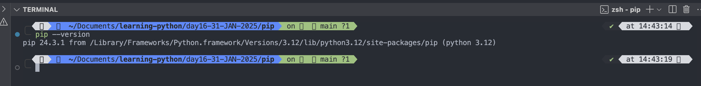
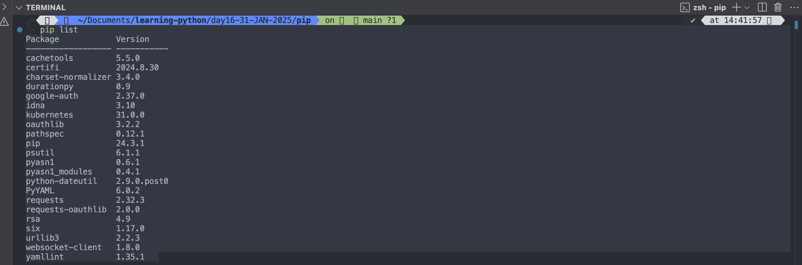

# Python PIP

## What is PIP?

### PIP is a package manager for Python packages, or modules if you like.

#### Note: If you have Python version 3.4 or later, PIP is included by default.

## What is a Package?

- A package contains all the files you need for a module.
- Modules are Python code libraries you can include in your project.

## Check if PIP is Installed

- Navigate your command line to the location of Python's script directory, and type the following:

#### Example: Check PIP version:

```
C:\Users\Your Name\AppData\Local\Programs\Python\Python36-32\Scripts>pip --version

```



## Install PIP

### If you do not have PIP installed, you can download and install it from this page: [https://pypi.org/project/pip/](https://pypi.org/project/pip/)

## Using a Package

- Once the package is installed, it is ready to use.
- Import the "camelcase" package into your project.

```
import camelcase

c = camelcase.CamelCase()

txt = "hello world"

print(c.hump(txt))
```

## Find Packages

### Find more packages at [https://pypi.org/](https://pypi.org/).

## Remove a Package

### Use the uninstall command to remove a package:

#### Example: Uninstall the package named "camelcase":

```
C:\Users\Your Name\AppData\Local\Programs\Python\Python36-32\Scripts>pip uninstall camelcase

```

The PIP Package Manager will ask you to confirm that you want to remove the camelcase package:

```
Uninstalling camelcase-02.1:
  Would remove:
    c:\users\Your Name\appdata\local\programs\python\python36-32\lib\site-packages\camelcase-0.2-py3.6.egg-info
    c:\users\Your Name\appdata\local\programs\python\python36-32\lib\site-packages\camelcase\*
Proceed (y/n)?
```

Press y and the package will be removed.

## List Packages

### Use the list command to list all the packages installed on your system:

#### Example: List installed packages:

```

C:\Users\Your Name\AppData\Local\Programs\Python\Python36-32\Scripts>pip list

```

Output:

```
pip list
Package            Version
------------------ -----------
cachetools         5.5.0
certifi            2024.8.30
charset-normalizer 3.4.0
durationpy         0.9
google-auth        2.37.0
idna               3.10
kubernetes         31.0.0
oauthlib           3.2.2
pathspec           0.12.1
pip                24.3.1
psutil             6.1.1
pyasn1             0.6.1
pyasn1_modules     0.4.1
python-dateutil    2.9.0.post0
PyYAML             6.0.2
requests           2.32.3
requests-oauthlib  2.0.0
rsa                4.9
six                1.17.0
urllib3            2.2.3
websocket-client   1.8.0
yamllint           1.35.1
```


