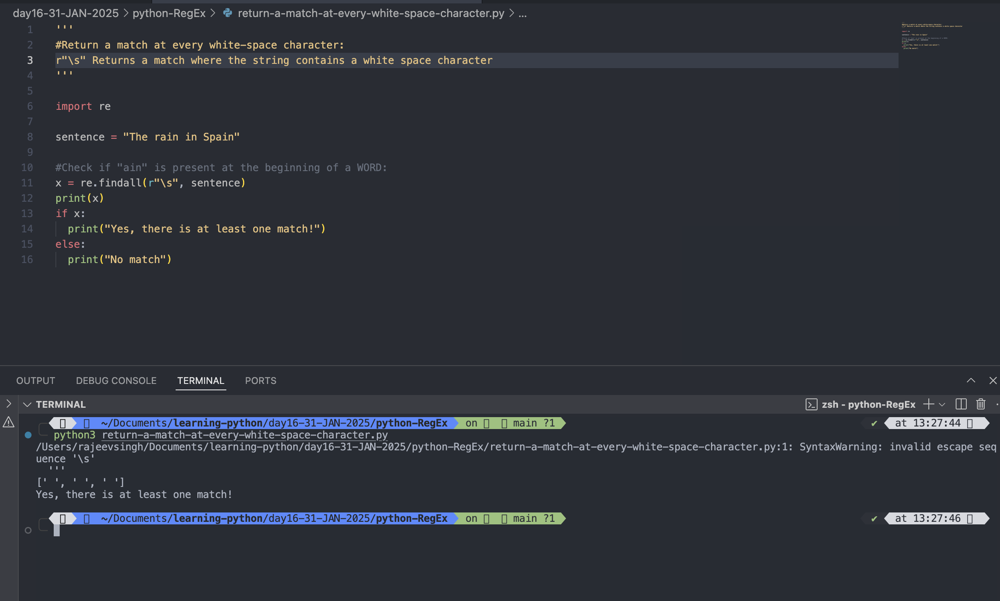

# Python RegEx

- A RegEx, or Regular Expression, is a sequence of characters that forms a search pattern.
- RegEx can be used to check if a string contains the specified search pattern.

## RegEx Module

- Python has a built-in package called re, which can be used to work with Regular Expressions.
- Import the re module:

```
import re
```

```
import re

# Search the string to see if it starts with "The" and ends with "Spain":
txt =  "The rain in Spain"
x = re.search("^The.*Spain$", txt)
```

- ^The ensures that the string starts with "The".
- .\* allows any number of characters (including none) between "The" and "Spain".
- Spain$ ensures that the string ends with "Spain".

#

## RegEx Functions

- The re module offer a set of functions that allows us to search for a match.
- <mark>findall()</mark>: Returns a list containing all matches.
- <mark>search</mark>: Returns a match object if there is a match anywhere in the string.
- <mark>split</mark>: Returns a list where the string has been split at each match.
- <mark>sub</mark>: Replaces one or many matches with a string.

# Metacharacters

- Metacharacters are character with special meaning.
- <mark>[ ]</mark>: A set of characters

### Example:

```
'''
# findall()
# Returns a list containing all matches.
# Metacharacter- []
'''
import re
txt = "I am learning RegEx or Regular Expression, is a sequence of characters that forms a search pattern. "

# Find all lower case characters alphabetically between "a" and "m"
x = re.findall("[a-m]", txt)
print(x)
```

Output:

```
python3 findall-function.py
['a', 'm', 'l', 'e', 'a', 'i', 'g', 'e', 'g', 'e', 'g', 'l', 'a', 'e', 'i', 'i', 'a', 'e', 'e', 'c', 'e', 'f', 'c', 'h', 'a', 'a', 'c', 'e', 'h', 'a', 'f', 'm', 'a', 'e', 'a', 'c', 'h', 'a', 'e']
```


#

- <mark>\</mark>: Signal a special sequence(can also be used to escape special characters)

### Example

```
import re
txt = "That will be 59 rupees"

#Find all digit characters:

x = re.findall("\d", txt)
# Find small letters between a to f
y = re.findall("[a-f]", txt)
print(x)
print(y)

```

Output:

```
python3 findall-function.py
/Users/rajeevsingh/Documents/learning-python/day16-31-JAN-2025/python-RegEx/findall-function.py:24: SyntaxWarning: invalid escape sequence '\d'
  x = re.findall("\d", txt)
['5', '9']
['a', 'b', 'e', 'e', 'e']
```


#

- <mark>.</mark>: Any character (except newline character)

### Example:

```
'''
# Metacharacter
# .	- Any character (except newline character)
'''
import re
txt =  "hello rajeev"
txt1 = "Great, you are learning RegEx or Regular Expression"
# Search for a sequence that start with "G", followed by three (any) characters, and an "t".
y = re.findall("G....", txt1)
# Search for a sequence that start with "he", followed by two (any) characters, and an "o".
x = re.findall("he..o", txt)
print(x)
print(y)

```

Output:

```
python3 findall-function.py
/Users/rajeevsingh/Documents/learning-python/day16-31-JAN-2025/python-RegEx/findall-function.py:21: SyntaxWarning: invalid escape sequence '\d'
  '''
['hello']
['Great']
```


#

- <mark>^</mark>: Starts with

### Example:

```
import re
txt = "hello Rajeev"

# #Check if the string starts with 'hello':
x = re.findall("^hello", txt)
print(x)

```

Output:

```
python3 findall-function1.py
['hello']
```


#

```
import re
txt = "hello Rajeev"

# #Check if the string starts with 'hello':
x = re.findall("^hello", txt)
if x:
  print("Yes, the string starts with 'hello'")
else:
  print("No Match")
```

Output:

```
python3 findall-function1.py
Yes, the string starts with 'hello'
```


#

- <mark>$</mark>: Ends with

### Example:

```
import re

details = "check if the string ends with 'planet'"
x = re.findall("planet$", details)
if x:
  print("Yes, the string ends with 'planet'")
else:
  print("No Match")

```

Output:

```
python3 ends-with-findall.py
No Match
```


#

```
import re

details = "check if the string ends with 'planet'"
x = re.findall("'planet'$", details)
if x:
  print("Yes, the string ends with 'planet'")
else:
  print("No Match")

```

Output:

```
python3 ends-with-findall.py
Yes, the string ends with 'planet'
```


#

- <mark>\*</mark>: Zero or more occurance

### Example:

```
import re
sample = "hello rajeev"
details = "Search for a sequence that starts with 'he', followed by 0 or more  (any) characters, and an 'o', hello rajeev"
x = re.findall("he.*o", details)
y = re.findall("he.*o", sample)
print(x)
print(y)

```

Output:

```
python3 zero-or-more-occurance-findall.py
["he', followed by 0 or more  (any) characters, and an 'o', hello"]
['hello']
```


#

- <mark>+</mark>: One or more occurance

### Example:

```
import re

details = 'Search for a sequence that starts with "he", followed by 1 or more  (any) characters, and an "o"'
sample = "hello rajeev"
x = re.findall("he.+o", details)
y = re.findall("he.+o", sample)
print(x)
print(y)
```

Output:

```
python3 one-or-more-occurance-findall.py
['he", followed by 1 or more  (any) characters, and an "o']
['hello']
```


#

- <mark>?</mark>: Zero or one occurance

### Example:

```
import re

details = 'Search for a sequence that starts with "he", followed by 1 or more  (any) characters, and an "o"'
sample = "hello rajeev"
x = re.findall("he.?o", details)
y = re.findall("he.?o", sample)
print(x)
print(y)

```

Output:

```
python3 zero-or-one-occurance-findall.py
[]
[]
```


### This time we got no match, because there were not zero, not one, but two characters between "he" and the "o"

#

```
import re

details = 'Search for a sequence that starts with "he", followed by o or one  (any) characters, and an "o"'
sample = "hello rajeev"
x = re.findall("he.?o", details)
y = re.findall("he.?o", sample)
print(x)
print(y)

details = 'rest rajeev'
#"re", followed by 0 or one  (any) characters, and an "q"'
sample = "req rajeev"
x = re.findall("re.?t", details)
y = re.findall("re.?q", sample)
print(x)
print(y)
```

Output:

```
python3 zero-or-one-occurance-findall.py
[]
[]
['rest']
['req']

```


#

- <mark>{}</mark>: Exactly the specified number of occurance

### Example:

```
import re

greet = "hello Rajeev"
#Search for a sequence that starts with "he", followed excactly 2 (any) characters, and an "o":
search1 = 'Search for a sequence that starts with "he", followed excactly 2 (any) characters, and an "o"- hello learner, love me'
x = re.findall("he.{2}o", greet)
y = re.findall("he.{2}o", search1)
z = re.findall("lo.{4}e", search1)
print(x)
print(y)
print(z)
```

Output:

```
python3 exactly-specified-number-of-occurance-findall.py
['hello']
['hello']
['lowed e', 'love me']
```


#

- <mark>|</mark>: Either or

### Example:

```
import re

sentance = "The rain in India falls mainly in the plain! "
x = re.findall("falls|stays", sentance)
print(x)
if x:
  print("Yes, There is atleast one match")
else:
  print("No Match")
```

Output:

```
python3 either-or-findall.py
['falls']
Yes, There is atleast one match

```


#

```
import re

sentance = "The rain in India falls mainly in the plain and stays for long! "
x = re.findall("falls|stays", sentance)
print(x)
if x:
  print("Yes, There is atleast one match")
else:
  print("No Match")
```

Output:

```
 python3 either-or-findall.py
['falls', 'stays']
Yes, There is both match
```


#

## Special Sequences

### A special sequence is a \ followed by one of the characters in the list below, and has a special meaning:

- \A : Returns a match if the specified characters are at the beginning of the string

  #### Example:

  ```
  import re

  sentence = "The rain in India"
  # check if the string start with 'the'
  x = re.findall(r"\AThe", sentence)
  print(x)
  if x:
  print("Yes, there is a match!")
  else:
  print("No match")
  ```

  Output:

  ```
  python3 -W ignore characters-are-at-the-beginning-of-the-string.py

  ['The']
  Yes, there is a match!
  ```

  

#

- \b : Returns a match where the specified characters are at the beginning or at the end of a word
  (the "r" in the beginning is making sure that the string is being treated as a "raw string")

  #### Example:

  ```
  import re


  sentence = "The rain in Spain"


  #Check if "ain" is present at the beginning of a WORD:

  x = re.findall(r"\bSpain", sentence)


  print(x)

  if x:
  print("Yes, there is at least one match!")
  else:
  print("No match")

  ```

  Output:

  ```
   python3 characters-are-at-the-beginning-or-at-the-end-of-a-word.py
  ['Spain']
  Yes, there is at least one match!
  ```

  

#

- \B : Returns a match where the specified characters are present, but NOT at the beginning (or at the end) of a word
  (the "r" in the beginning is making sure that the string is being treated as a "raw string")

#### Example:

```
import re

sentence = "The rain in Spain"

#Check if "ain" is present at the beginning of a WORD:

x = re.findall(r"\Bain", sentence)

print(x)

if x:
  print("Yes, there is at least one match!")
else:
  print("No match")
```

Output:

```
python3 present-but-NOT-at-the-beginning.py
['ain', 'ain']
Yes, there is at least one match!
```


#

- \d : Returns a match where the string contains digits (numbers from 0-9)

#### Example:

```
import re

sentence = "The rain in Spain"

#Check if "ain" is present at the beginning of a WORD:

x = re.findall(r"\d", sentence)

print(x)

if x:
  print("Yes, there is at least one match!")
else:
  print("No match")
```

Output:

```
python3 returns-a-match-where-the-string-contains-digits.py
[]
No match

```


#

- \D : Returns a match where the string DOES NOT contain digits

#### Example:

```
import re

sentence = "The rain in Spain"

#Check if "ain" is present at the beginning of a WORD:
x = re.findall(r"\D", sentence)
print(x)
if x:
  print("Yes, there is at least one match!")
else:
  print("No match")
```

Output:

```
python3 returns-a-match-where-the-string-does-not-contain-digits
/Users/rajeevsingh/Documents/learning-python/day16-31-JAN-2025/python-RegEx/returns-a-match-where-the-string-does-not-contain-digits:1: SyntaxWarning: invalid escape sequence '\D'
  '''
['T', 'h', 'e', ' ', 'r', 'a', 'i', 'n', ' ', 'i', 'n', ' ', 'S', 'p', 'a', 'i', 'n']
Yes, there is at least one match!

```


#

- \s : Returns a match where the string contains a white space character

#### Example:

```
import re

sentence = "The rain in Spain"

#Check if "ain" is present at the beginning of a WORD:
x = re.findall(r"\s", sentence)
print(x)
if x:
  print("Yes, there is at least one match!")
else:
  print("No match")
```

Output:

```
python3 return-a-match-at-every-white-space-character.py
/Users/rajeevsingh/Documents/learning-python/day16-31-JAN-2025/python-RegEx/return-a-match-at-every-white-space-character.py:1: SyntaxWarning: invalid escape sequence '\s'
  '''
[' ', ' ', ' ']
Yes, there is at least one match!
```



#

- \S : Returns a match where the string DOES NOT contain a white space character

#### Example:

```
import re

sentence = "The rain in Spain"

#Check if "ain" is present at the beginning of a WORD:
x = re.findall(r"\S", sentence)
print(x)
if x:
  print("Yes, there is at least one match!")
else:
  print("No match")
```

Output:

```
python3 return-a-match-at-every-non-white-space-character.py
/Users/rajeevsingh/Documents/learning-python/day16-31-JAN-2025/python-RegEx/return-a-match-at-every-non-white-space-character.py:1: SyntaxWarning: invalid escape sequence '\S'
  '''
['T', 'h', 'e', 'r', 'a', 'i', 'n', 'i', 'n', 'S', 'p', 'a', 'i', 'n']
Yes, there is at least one match!

```


#

- \w : Returns a match where the string contains any word characters (characters from a to Z, digits from 0-9, and the underscore \_ character)

#### Example:

```
import re

sentence = "The rain in Spain"

#Check if "ain" is present at the beginning of a WORD:
x = re.findall(r"\w", sentence)
print(x)
if x:
  print("Yes, there is at least one match!")
else:
  print("No match")
```

Output:

```
python3 return-a-match-at-every-word-character.py
/Users/rajeevsingh/Documents/learning-python/day16-31-JAN-2025/python-RegEx/return-a-match-at-every-word-character.py:1: SyntaxWarning: invalid escape sequence '\w'
  '''
['T', 'h', 'e', 'r', 'a', 'i', 'n', 'i', 'n', 'S', 'p', 'a', 'i', 'n']
Yes, there is at least one match!
```


#

- \W : Returns a match where the string DOES NOT contain any word characters

#### Example:

```
import re

sentence = "The rain in Spain"

#Check if "ain" is present at the beginning of a WORD:
x = re.findall(r"\W", sentence)
print(x)
if x:
  print("Yes, there is at least one match!")
else:
  print("No match")
```

Output:

```
python3 return-a-match-at-every-NON-word-character.py
/Users/rajeevsingh/Documents/learning-python/day16-31-JAN-2025/python-RegEx/return-a-match-at-every-NON-word-character.py:1: SyntaxWarning: invalid escape sequence '\W'
  '''
[' ', ' ', ' ']
Yes, there is at least one match!
```


#

- \Z : Returns a match if the specified characters are at the end of the string

#### Example:

```
import re

sentence = "The rain in Spain"

#Check if "ain" is present at the beginning of a WORD:
x = re.findall(r"Spain\Z", sentence)
print(x)
if x:
  print("Yes, there is at least one match!")
else:
  print("No match")
```

Output:

```
python3 check-if-the-string-ends-with-specific-word.py
/Users/rajeevsingh/Documents/learning-python/day16-31-JAN-2025/python-RegEx/check-if-the-string-ends-with-specific-word.py:1: SyntaxWarning: invalid escape sequence '\Z'
  '''
['Spain']
Yes, there is at least one match!
```


#

## Sets

A set is a set of characters inside a pair of square brackets [] with a special meaning:


#

## The search() Function

- The search() function searches the string for a match, and returns a Match object if there is a match.
- If there is more than one match, only the first occurrence of the match will be returned:

### Example:

```
import re

txt = "The rain in Spain"
x = re.search(r"\s", txt)

print("The first white-space character is located in position:", x.start())
```

Output:

```

python3 search-function.py
The first white-space character is located in position: 3

```


#

## If no matches are found, the value None is returned:

### Example:

```
import re
txt = "The rain in Spain"
x = re.search("Portugal", txt)
print(x)

```

Output:

```
python3 search-function.py
None
```


#

## The split() Function

### The split() function returns a list where the string has been split at each match:

#### Example:

```
txt = "The rain in Spain"
x = re.split(r"\s", txt)
print(x)
```

Output:

```
python3 split-function
['The', 'rain', 'in', 'Spain']
```


#

## You can control the number of occurrences by specifying the maxsplit parameter:

#### Example:

```
import re
txt = "The rain in Spain"
x = re.split(r"\s", txt, 1)
y = re.split(r"\s", txt, 2)
print(x)
print(y)
```

Output:

```
python3 maxsplit-parameter-with-split-function.py
['The', 'rain in Spain']
['The', 'rain', 'in Spain']
```


#

## The sub() Function

### The sub() function replaces the matches with the text of your choice:

#### Example: Replace every white-space character with the number 9:

```
import re

txt = "The rain in Spain"
x = re.sub(r"\s", "9", txt)
print(x)
```

Output:

```
python3 sub-function.py
The9rain9in9Spain
```


#

## You can control the number of replacements by specifying the count parameter:

```
import re

txt = "The rain in Spain"
x = re.sub(r"\s", "9", txt, 2)
print(x)
```

Output:

```
python3 count-paramenter-in-sub-function.py
The9rain9in Spain
```


#

## Match Object

### A Match Object is an object containing information about the search and the result.

#### Note: If there is no match, the value None will be returned, instead of the Match Object.

##### Example: Do a search that will return a Match Object:

```
import re

txt = "The rain in Spain"
x = re.search("ai", txt)
print(x) #this will print an object
```

Output:

```
python3 match-object.py
<re.Match object; span=(5, 7), match='ai'>
```


The Match object has properties and methods used to retrieve information about the search, and the result:

.span() returns a tuple containing the start-, and end positions of the match.
.string returns the string passed into the function
.group() returns the part of the string where there was a match

#
