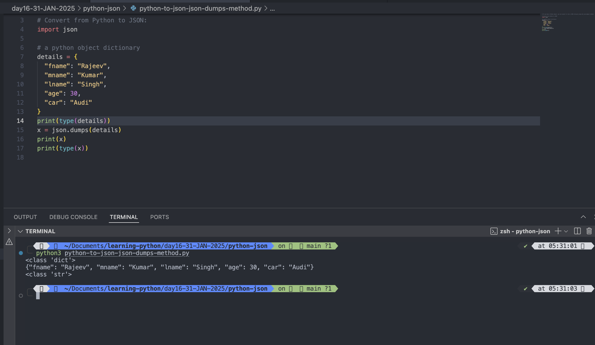

# Python JSON

- JSON is a syntax for storing and exchanging data.
- JSON is text, written with JavaScript object notation.

## JSON in Python

- Python has a built-in package called json, which can be used to work with json data.

### Example: import the json module

```
import json
```

## Parse JSON - Convert from JSON to Python

- If you have a JSON string, you can parse it by using the json.loads() method.
- The result will be a Python dictionary.

### Example: Convert from JSON to Python:

```
# Convert from JSON to Python:
import json

# Some JSON
details = '{"fname": "Rajeev", "mname": "Kumar", "lname":"Singh", "age": 30,"car": "none" }'

# # parse x:
x = json.loads(details)

# # the result is a Python dictionary:
print(x["fname"])
print(x["mname"])
print(x["lname"])
print(x["age"])
print(x["car"])

```

Output:

```
python3 convert-from-json-to-python.py
Rajeev
Kumar
Singh
30
none

```


#

## Convert from Python to JSON

- If you have a Python object, you can convert it into a JSON string by using the json.dumps() method.

### Example: Convert from Python to Json

```
import json

# a python object dictionary
details = {
  "fname": "Rajeev",
  "mname": "Kumar",
  "lname": "Singh",
  "age": 30,
  "car": "Audi"
}
print(type(details))
x = json.dumps(details)
print(x)
print(type(x))
```

Output:

```
python3 python-to-json-json-dumps-method.py
<class 'dict'>
{"fname": "Rajeev", "mname": "Kumar", "lname": "Singh", "age": 30, "car": "Audi"}
<class 'str'>

```



#

## You can convert Python objects of the following types, into JSON strings:

- dict
- list
- tuple
- string
- int
- float
- True
- False
- None

### Example: Convert Python objects into JSON strings, and print the values:

```
tupleDetails = json.dumps(("Rajeev", "Kumar", "Singh"))
listDetails = json.dumps(["Rajeev", "Kumar", "Singh"])
stringDetails = json.dumps("Rajeev")
integerDetails = json.dumps(55)
floatDetails = json.dumps(55.55)
boolDetails = json.dumps(True)
boolDetailsFalse = json.dumps(False)
noneTypeDetails = json.dumps(None)

print('json.dumps(("Rajeev", "Kumar", "Singh"))', tupleDetails)
print(type(tupleDetails))
print('json.dumps(["Rajeev", "Kumar", "Singh"])', listDetails)
print(type(listDetails))
print('json.dumps("Rajeev") ', stringDetails )
print(type(stringDetails))
print('json.dumps(55) ', integerDetails)
print(type(integerDetails))
print('json.dumps(55.55) ', floatDetails)
print(type(floatDetails))
print('json.dumps(True) ', boolDetails)
print(type(boolDetails))
print('json.dumps(False) ', boolDetailsFalse)
print(type(boolDetailsFalse))
print('json.dumps(None) ', noneTypeDetails)
print(type(noneTypeDetails))

```

Output:

```
python3 python-to-json-json-dumps-method.py
<class 'dict'>
{"fname": "Rajeev", "mname": "Kumar", "lname": "Singh", "age": 30, "car": "Audi"}
<class 'str'>


json.dumps(("Rajeev", "Kumar", "Singh")) ["Rajeev", "Kumar", "Singh"]
<class 'str'>
json.dumps(["Rajeev", "Kumar", "Singh"]) ["Rajeev", "Kumar", "Singh"]
<class 'str'>
json.dumps("Rajeev")  "Rajeev"
<class 'str'>
json.dumps(55)  55
<class 'str'>
json.dumps(55.55)  55.55
<class 'str'>
json.dumps(True)  true
<class 'str'>
json.dumps(False)  false
<class 'str'>
json.dumps(None)  null
<class 'str'>

```


#


### Example: Convert a Python object containing all the legal data types:

```
x = {
  "name": "Rajeev",
  "age": 30,
  "employed": True,
  "married": False,
  "books": ("Linux","javascript"),
  "pets": None,
  "cars": [
    {"model": "BMW 230", "mpg": 27.5},
    {"model": "Ford Edge", "mpg": 24.1}
  ]
}

y = json.dumps(x)
print(type(y))
print(y)
```

Output:

```
python3 python-to-json-json-dumps-method.py
<class 'str'>
{"name": "Rajeev", "age": 30, "employed": true, "married": false, "books": ["Linux", "javascript"], "pets": null, "cars": [{"model": "BMW 230", "mpg": 27.5}, {"model": "Ford Edge", "mpg": 24.1}]}

```


#

## Format the Result

- The example above prints a JSON string, but it is not very easy to read, with no indentations and line breaks.
- The json.dumps() method has parameters to make it easier to read the result:

### Example: Use the indent parameter to define the numbers of indents:

```
x = {
  "name": "Rajeev",
  "age": 30,
  "employed": True,
  "married": False,
  "books": ("Linux","javascript"),
  "pets": None,
  "cars": [
    {"model": "BMW 230", "mpg": 27.5},
    {"model": "Ford Edge", "mpg": 24.1}
  ]
}

y = json.dumps(x, indent=4)
print(type(y))
print(y)
```

Output:

```
python3 python-to-json-json-dumps-method.py
<class 'str'>
{
    "name": "Rajeev",
    "age": 30,
    "employed": true,
    "married": false,
    "books": [
        "Linux",
        "javascript"
    ],
    "pets": null,
    "cars": [
        {
            "model": "BMW 230",
            "mpg": 27.5
        },
        {
            "model": "Ford Edge",
            "mpg": 24.1
        }
    ]
}


```


#

## You can also define the separators, default value is (", ", ": "), which means using a comma and a space to separate each object, and a colon and a space to separate keys from values:

### Example

```
x = {
  "name": "Rajeev",
  "age": 30,
  "employed": True,
  "married": False,
  "books": ("Linux","javascript"),
  "pets": None,
  "cars": [
    {"model": "BMW 230", "mpg": 27.5},
    {"model": "Ford Edge", "mpg": 24.1}
  ]
}

y = json.dumps(x, indent=4, separators=(". ", " = ") )
print(type(y))
print(y)
```

Output:

```
python3 python-to-json-json-dumps-method.py
<class 'str'>
{
    "name" = "Rajeev".
    "age" = 30.
    "employed" = true.
    "married" = false.
    "books" = [
        "Linux".
        "javascript"
    ].
    "pets" = null.
    "cars" = [
        {
            "model" = "BMW 230".
            "mpg" = 27.5
        }.
        {
            "model" = "Ford Edge".
            "mpg" = 24.1
        }
    ]
}

```


#

## Order the Result

- The json.dumps() method has parameters to order the keys in the result:

### Example: Use the sort_keys parameter to specify if the result should be sorted or not:

```
import json
# Order the Result
x = {
  "name": "Rajeev",
  "age": 30,
  "employed": True,
  "married": False,
  "books": ("Linux","javascript"),
  "pets": None,
  "cars": [
    {"model": "BMW 230", "mpg": 27.5},
    {"model": "Ford Edge", "mpg": 24.1}
  ]
}

y = json.dumps(x, indent=4, separators=(". ", " = "), sort_keys= True )
print(type(y))
print(y)

```

Output:

```
python3 json-dumps-sort-keys-parameter.py
<class 'str'>
{
    "age" = 30.
    "books" = [
        "Linux".
        "javascript"
    ].
    "cars" = [
        {
            "model" = "BMW 230".
            "mpg" = 27.5
        }.
        {
            "model" = "Ford Edge".
            "mpg" = 24.1
        }
    ].
    "employed" = true.
    "married" = false.
    "name" = "Rajeev".
    "pets" = null
}
```


#
