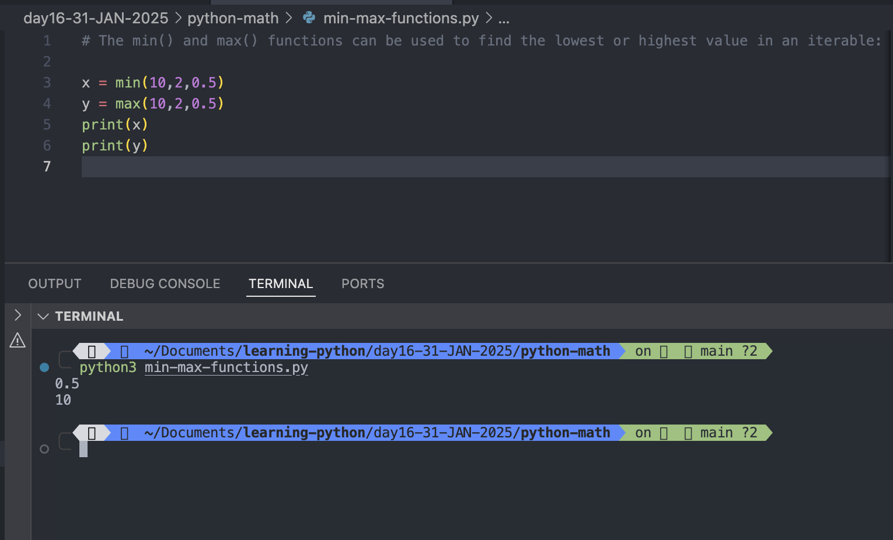
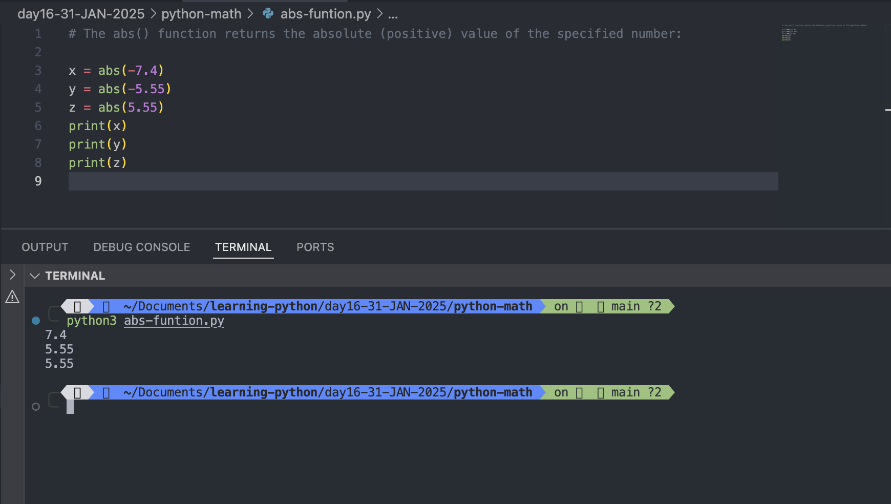
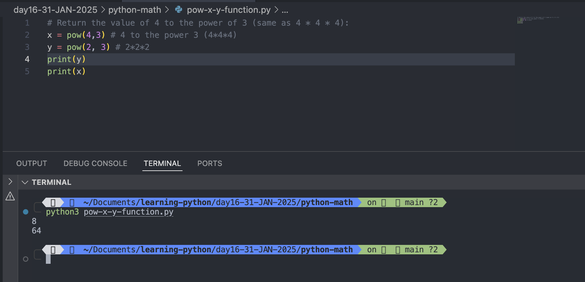
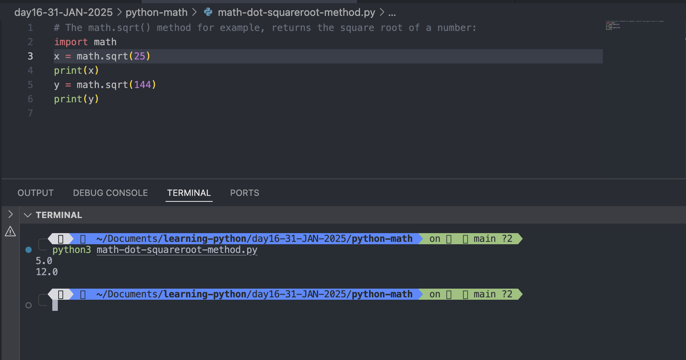
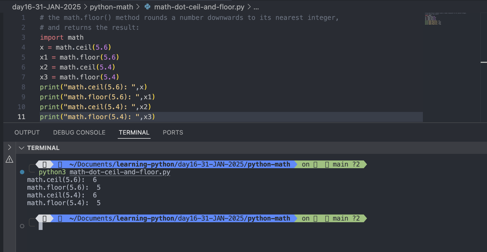
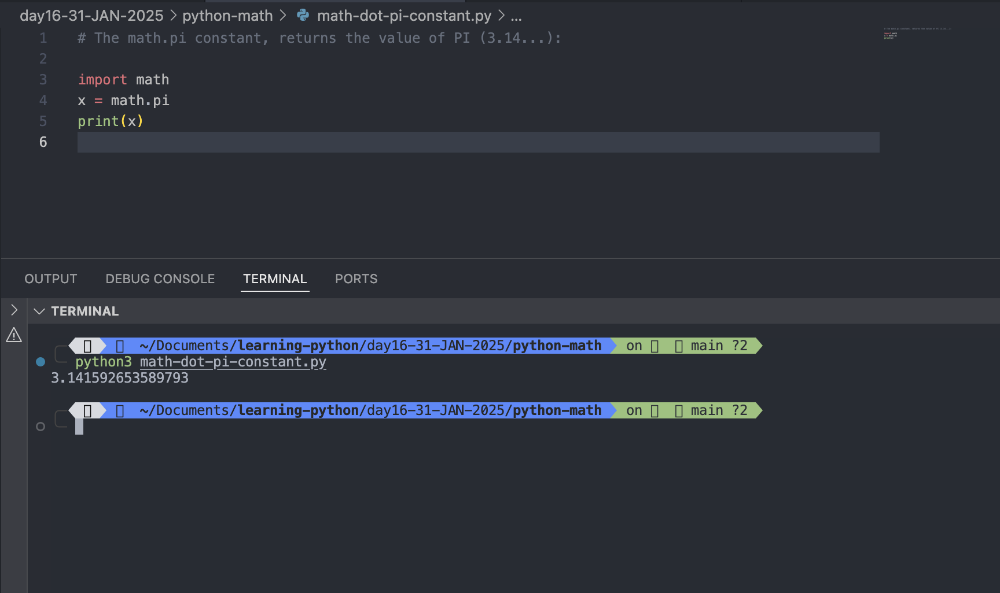

# Python Math

- Python has a set of built-in math functions, including an extensive math module, that allows you to perform mathematical tasks on numbers.

## Built-in Math Functions

- The min() and max() functions can be used to find the lowest or highest value in an iterable:

### Example:

```
x = min(10,2,0.5)
y = max(10,2,0.5)
print(x)
print(y)
```

Output:

```
python3 min-max-functions.py
0.5
10
```



#

## The abs() function returns the absolute (positive) value of the specified number:

```
x = abs(-7.4)
y = abs(-5.55)
z = abs(5.55)
print(x)
print(y)
print(z)

```



#

## The pow(x, y) function returns the value of x to the power of y (xy).

### Example:

```
# Return the value of 4 to the power of 3 (same as 4 * 4 * 4):
x = pow(4,3) # 4 to the power 3 (4*4*4)
y = pow(2, 3) # 2*2*2
print(y)
print(x)

```

Output:

```
python3 pow-x-y-function.py
8
64

```



#

## The Math Module

- Python has also a built-in module called math, which extends the list of mathematical functions.
- To use it, you must import the math module:

### Example:

```
import math
```

- When you have imported the math module, you can start using methods and constants of the module.
- The math.sqrt() method for example, returns the square root of a number:

### Example: math.sqrt() method

```
import math
x = math.sqrt(25)
print(x)
y = math.sqrt(144)
print(y)
```

Output:

```
python3 math-dot-squareroot-method.py
5.0
12.0
```



#

## math.ceil()

- The math.ceil() method rounds a number upwards to its nearest integer

## math.floor()

- the math.floor() method rounds a number downwards to its nearest integer, and returns the result

### Example:

```
import math
x = math.ceil(5.6)
x1 = math.floor(5.6)
x2 = math.ceil(5.4)
x3 = math.floor(5.4)
print("math.ceil(5.6): ",x)
print("math.floor(5.6): ",x1)
print("math.ceil(5.4): ",x2)
print("math.floor(5.4): ",x3)

```

Output:

```
python3 math-dot-ceil-and-floor.py
math.ceil(5.6):  6
math.floor(5.6):  5
math.ceil(5.4):  6
math.floor(5.4):  5
```



#

## The math.pi constant, returns the value of PI (3.14...):

### Example:

```
import math
x = math.pi
print(x)
```

Output:

```
python3 math-dot-pi-constant.py
3.141592653589793

```



#

# [Math Methods](https://www.w3schools.com/python/module_math.asp)
