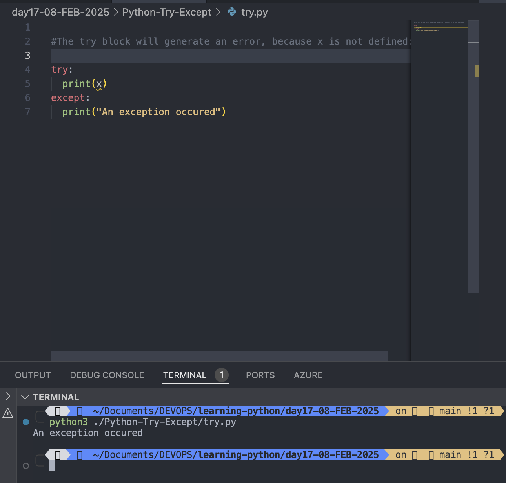
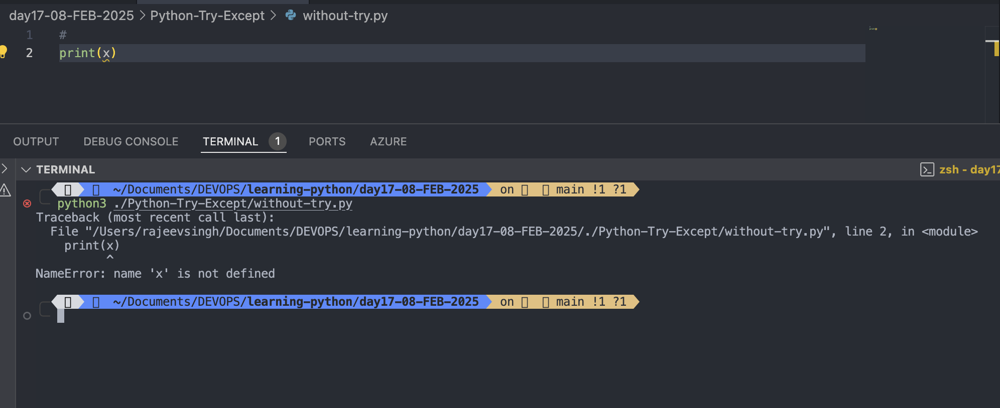
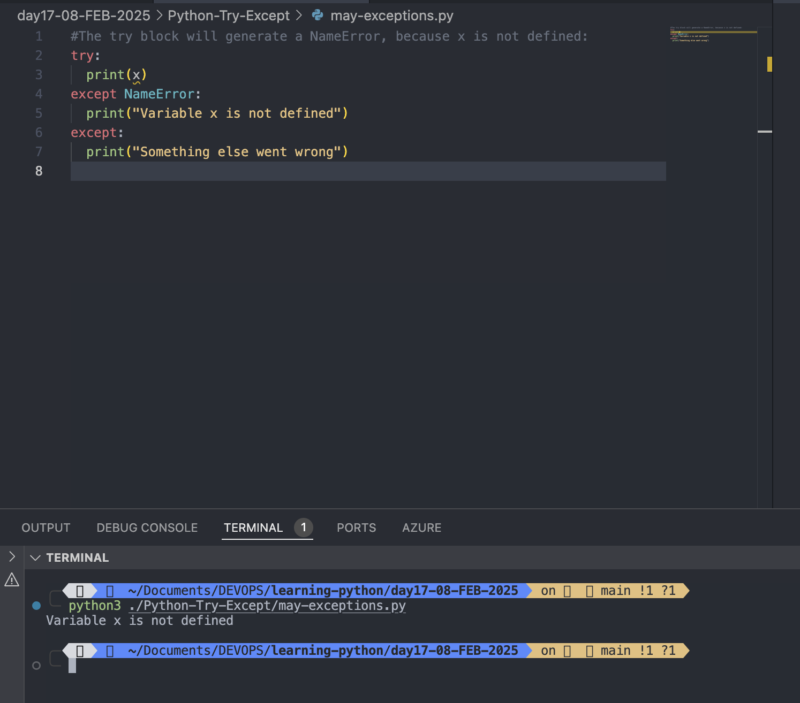
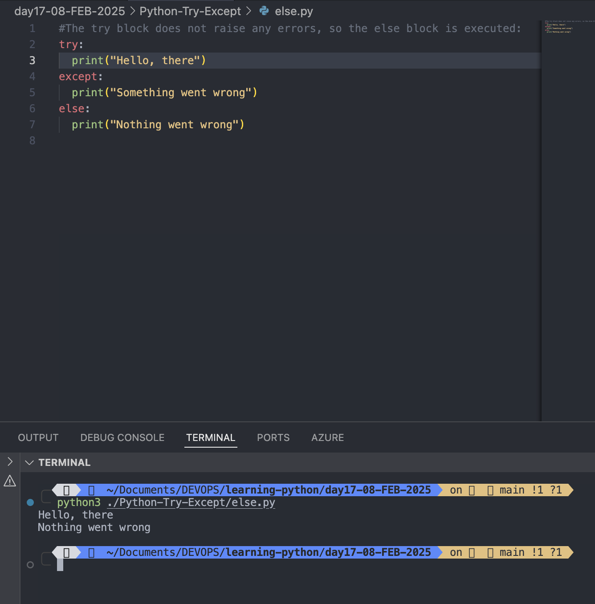
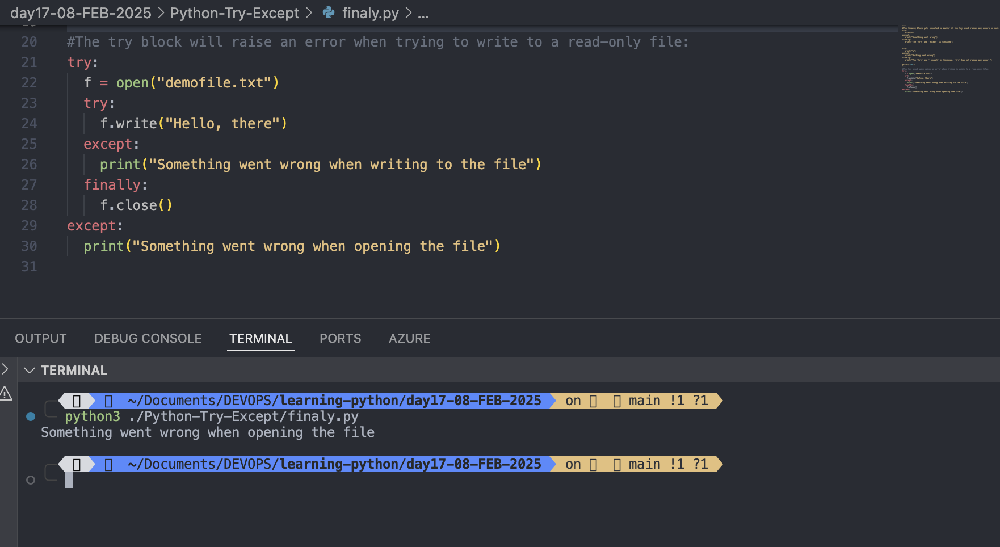
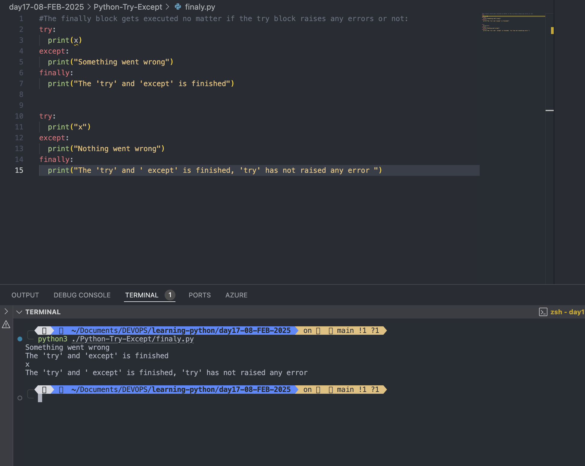
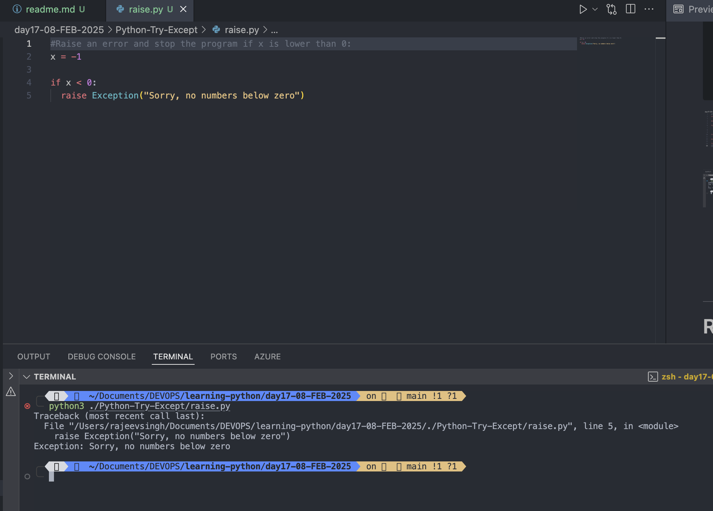

# Python Try Except

- The <mark>try</mark> block let you test a block of code for errors
- The <mark>except</mark> block let you handle the errors.
- The <mark>else</mark> block let you execute code when there is no error.
- The <mark>finaly</mark> block let you execute code, regardless of the result of try- and except blocks.

#

# Exception Handling.

- When an error occur or exception as we call it, Python will generally stop and generate an error message.
- These exceptions can be handled using the <mark>try</mark> statement:

## Example

```
#The try block will generate an error, because x is not defined:

try:
  print(x)
except:
  print("An exception occured")

```



- Since the try block raises and error, the except block will be executed.
- Without the try block, the program will crash and raise an error:

## Example

```
#This will raise an exception, because x is not defined:

print(x)
```



#

# Many Exceptions

- You can define as many exception blocks as you want
- e.g. if you want to execute a special block of code for a special kind of error:

### Example

```

#The try block will generate a NameError, because x is not defined:
try:
  print(x)
except NameError:
  print("Variable x is not defined")
except:
  print("Something else went wrong")

```



#

# Else

- You can use the else keyword to define a block of code to be executed if no errors were raised:

### Example:

```
#The try block does not raise any errors, so the else block is executed:
try:
  print("Hello, there")
except:
  print("Something went wrong")
else:
  print("Nothing went wrong")
```



#

# Finally

- The finally block, if specified, will be executed regardless if the try block raises an error or not.

### Example

```
#The finally block gets executed no matter if the try block raises any errors or not:
try:
  print(x)
except:
  print("Something went wrong")
finally:
  print("The 'try' and 'except' is finished")


try:
  print("x")
except:
  print("Nothing went wrong")
finally:
  print("The 'try' and ' except' is finished, 'try' has not raised any error ")
```



#

- This can be useful to close objects and clean up resources:

### Example:

```
#The try block will raise an error when trying to write to a read-only file:
try:
  f = open("demofile.txt")
  try:
    f.write("Hello, there")
  except:
    print("Something went wrong when writing to the file")
  finally:
    f.close()
except:
  print("Something went wrong when opening the file")
```



- The program can continue, without leaving the file object open.

#

# Raise an exception

- As a Python developer you can choose to throw an exception if a condition occurs.
- To throw (or raise) an exception, use the raise keyword.

### Example

```
Raise an error and stop the program if x is lower than 0:
x = -1

if x < 0:
  raise Exception("Sorry, no numbers below zero")

```



#

- The raise keyword is used to raise an exception.
- You can define what kind of error to raise, and the text to print to the user.

```
# Raise a TypeError if x is not an integer:
x = "hello"

if not type(x) is int:
  raise TypeError("Only integers are allowed")
```


#
