# Python String Formatting

- F-String was introduced in Python 3.6, and is now the preferred way of formatting strings.
- Before Python 3.6 we had to use the <mark>format()</mark> method.

# F-Strings

- F-string allows you to format selected parts of a string.
- To specify a string as an f-string, simply put an f in front of the string literal, like this:

```
txt =f"The price is 49Rs."
print(txt)
```

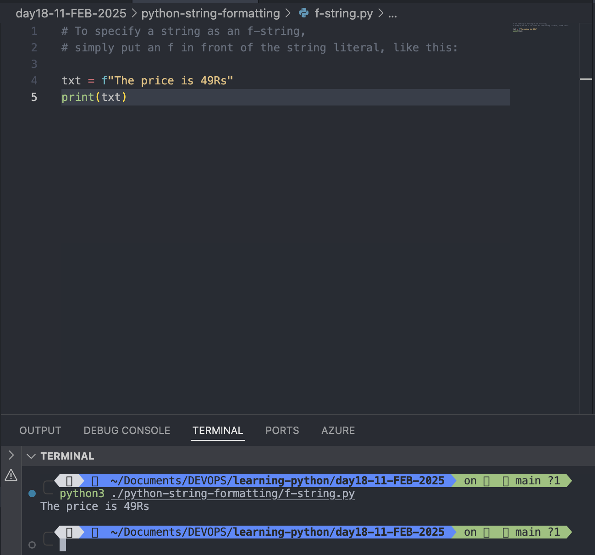

#

# Placeholders and Modifiers

- To format values in an f-string, add placeholders {}
- a placeholder can contain variables, operations, functions, and modifiers to format the value.

```
txt = f"The price is 49Rs"
print(txt)

price = 49
txt1 = f"The price is {price}Rs"
print(txt1)
txt2 = f"The price is price Rs"
print(txt2)
```

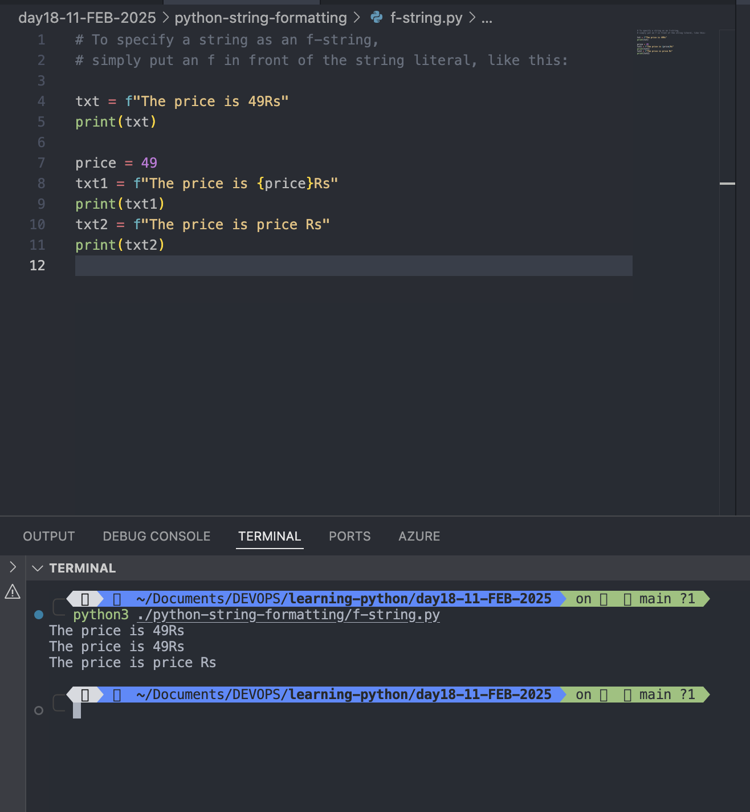

#

- A placeholder can also include a modifier to format the value.
- A modifier is included by adding a colon :
- followed by a legal formatting type, like .2f which means fixed point number with 2 decimals

```
# A modifier is included by adding a colon :
price = 49
txt1 = f"The price is {price:.1f}Rs"
txt2 = f"The price is {price:.2f}Rs"
txt3 = f"The price is {price:.3f}Rs"
txt4 = f"The price is {price:.4f}Rs"
txt5 = f"The price is {price:.5f}Rs"
print(txt1)
print(txt2)
print(txt3)
print(txt4)
print(txt5)
```

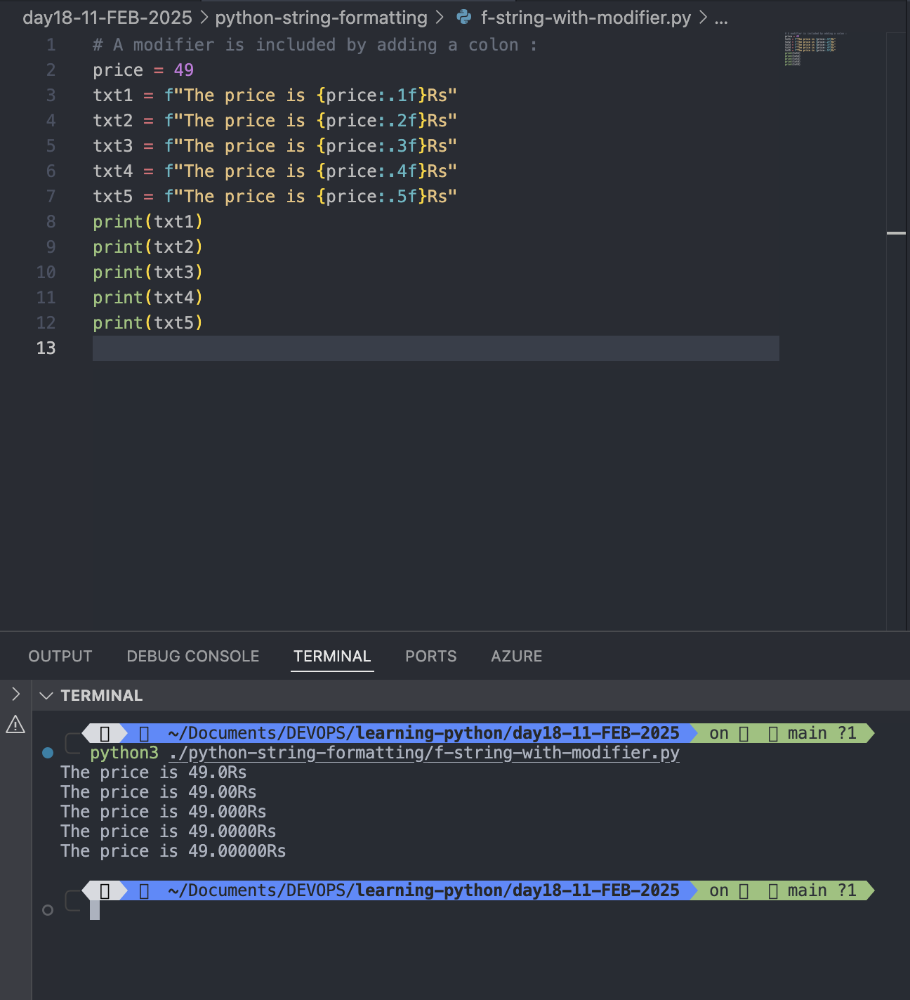

#

## Display the value 49 with 2 decimals:

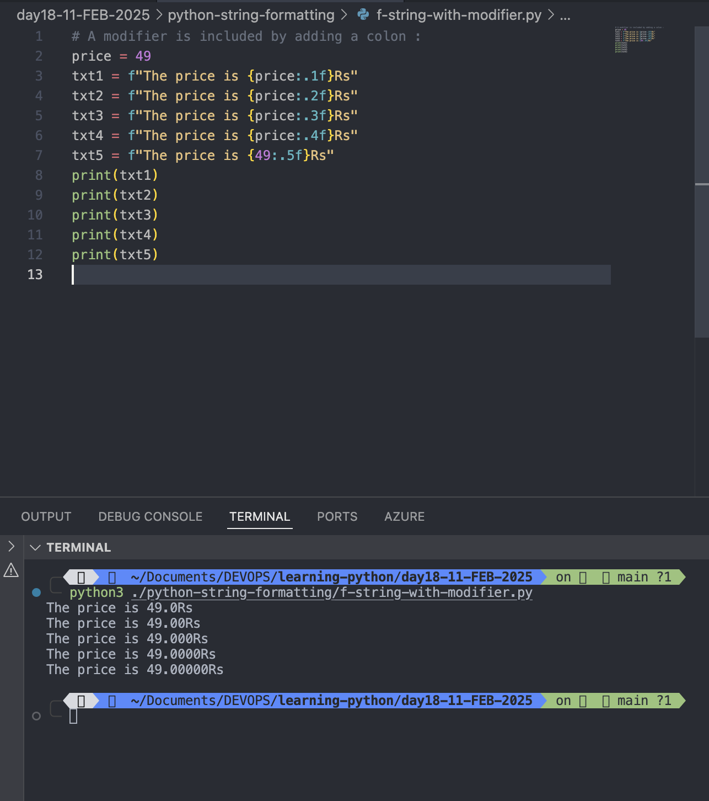

#

# Perform Operations in F-Strings

- You can perform Python operations inside the placeholders.
- You can do math operations:

```
num1 = int(input("Enter 1st number: \n"))
num2 = int(input("Enter 2ns number: \n"))
addition = f"Addition of {num1} and {num2} is {num1 + num2}"
multiplication = f"Multiplication of {num1} and {num2} is { num1 * num2}"
division = f"Division of {num1} and {num2} is {num1/num2}"
substraction = f"Substraction of {num1} and {num2} is {num1 - num2}"
print(addition)
print(multiplication)
print(multiplication)
print(division)
print(substraction)

```

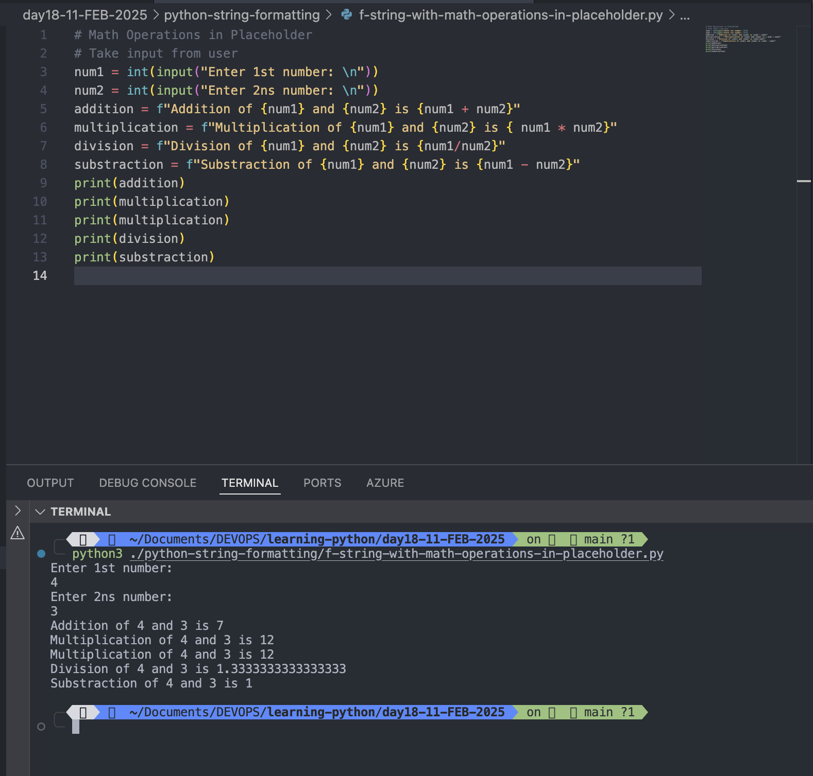

#

## Note: we are trying here to math operations with string values which we are taking from user

```
num1 = input("Enter 1st number: \n")
num2 = input("Enter 2ns number: \n")
addition = f"Addition of {num1} and {num2} is {num1 + num2}"
multiplication = f"Multiplication of {num1} and {num2} is { num1 * num2}"
division = f"Division of {num1} and {num2} is {num1/num2}"
substraction = f"Substraction of {num1} and {num2} is {num1 - num2}"
print(addition)
print(multiplication)
print(multiplication)
print(division)
print(substraction)
```

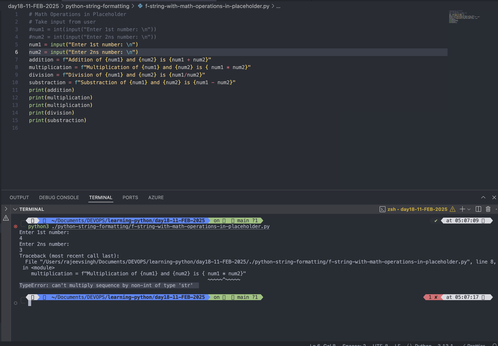

#

# You can perform if...else statements inside the placeholders:

```
# if-else in placeholder

price = int(input("Kindly enter the price: "))
result = f"It is very {'Expensive' if price>=100 else 'Cheap'} "
print(result)
```

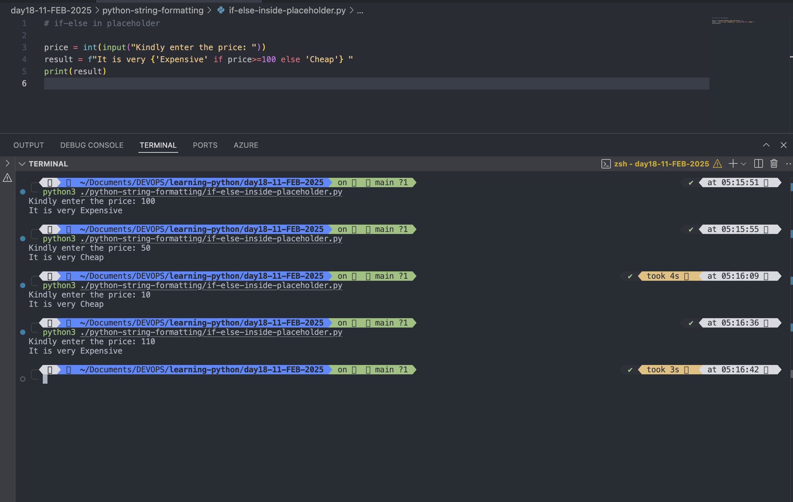

#

# Execute Functions in F-Strings

```
# Functions in F-strings
def  calculator(num1, num2):

  #num1 = float(input("Enter 1st number: "))
  #num2 = float(input("Enter 2nd number: "))
  addition = f"Addition of {num1} and {num2} is {num1 + num2}"
  multiplication = f"Multiplication of {num1} and {num2} is { num1 * num2}"
  division = f"Division of {num1} and {num2} is {num1/num2}" if num2!= 0 else "Division by 0 is not allowed"
  subtraction = f"subtraction of {num1} and {num2} is {num1 - num2}" if num1 >num2 else f"Subtraction of {num2} and {num1} is {num2 - num1}"
  return f"\n{addition}\n{multiplication}\n{division}\n{subtraction}"

# Now we will above finction in f-string

num1 = float(input("Enter 1st number: "))
num2 = float(input("Enter 2nd number: "))
result = f"Mathmatical Operations :\n {calculator(num1,num2)}"
print(result)

```

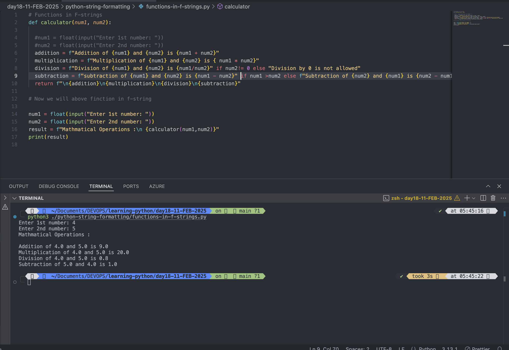

#

## Use the string method upper()to convert a value into upper case letters:

```
fruit = "apples"
txt = f"I love {fruit.upper()}"
print(txt)
```

# More Modifiers

- There are several other modifiers that can be used to format values:
  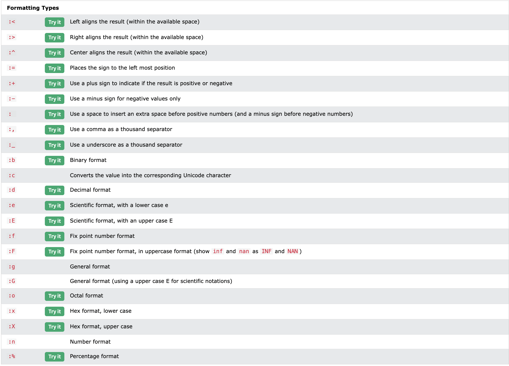

```
price = 59000
txt = f"The price is {price:,} rupees"
print(txt)
```

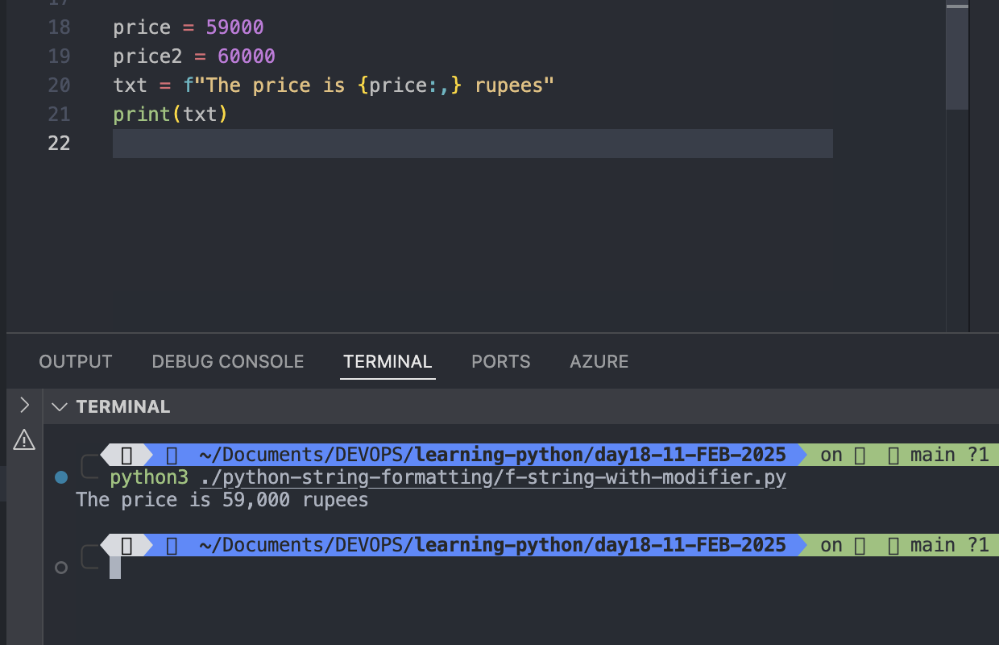

#

# Multiple Values

- If you want to use more values, just add more values to the format() method:

```
print(txt.format(price, itemno, count))


```

- And add more placeholders:

```
quantity = 3
itemno = 567
price = 49
myorder = "I want {} pieces of item number {} for {:.2f} dollars."
print(myorder.format(quantity, itemno, price))
```

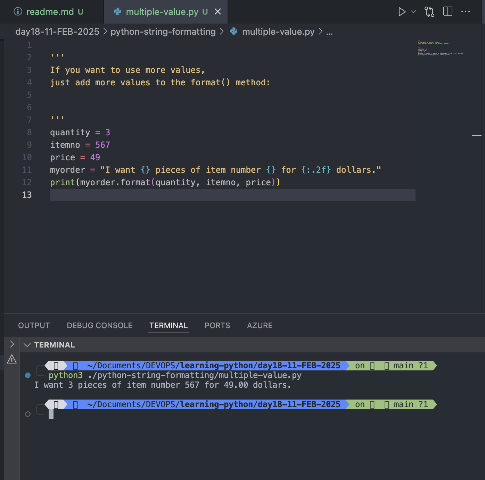

#

# Index Numbers

- You can use index numbers (a number inside the curly brackets {0}) to be sure the values are placed in the correct placeholders:

```

quantity = 3
itemno = 567
price = 49
myorder = "I want {0} pieces of item number {1} for {2:.2f} dollars."
print(myorder.format(quantity, itemno, price))
```

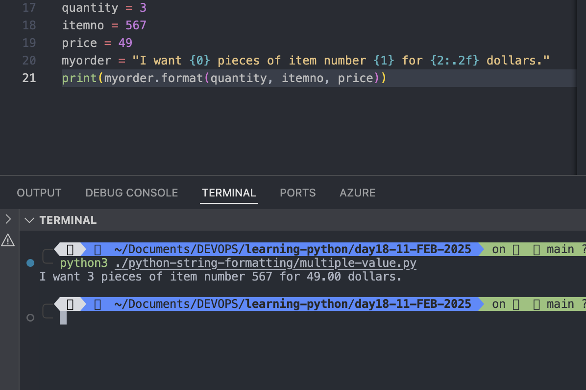

#

- Also, if you want to refer to the same value more than once, use the index number:

```
age = 32
name = "Rajeev"
txt = "My name is {1}. {1} is {0} years old."
print(txt.format(age, name))
```

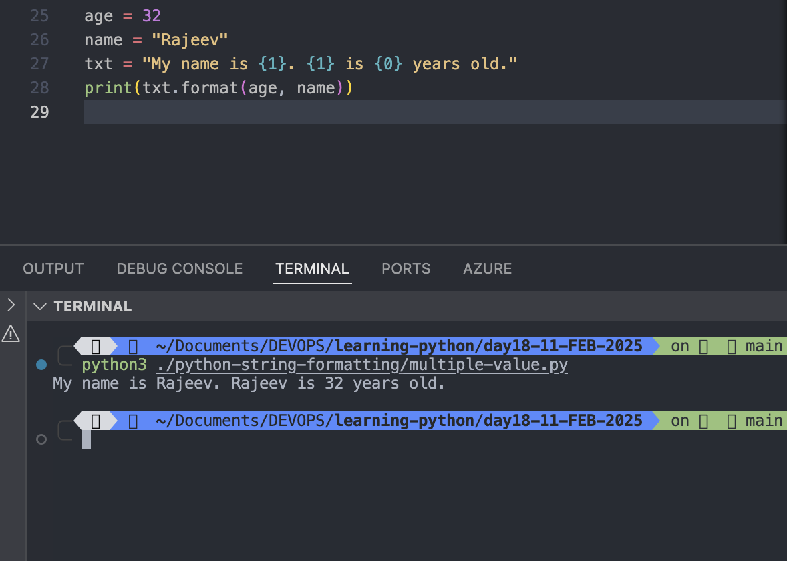

#

# Named Indexes

- You can also use named indexes by entering a name inside the curly brackets {carname}, but then you must use names when you pass the parameter values txt.format(carname = "Ford"):

```
myorder = "I have a {carname}, it is a {model}."
print(myorder.format(carname = "Ford", model = "Mustang"))
```

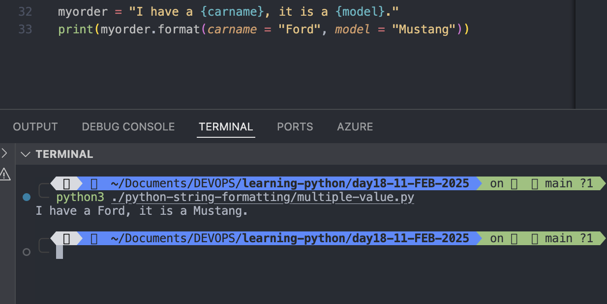

#
