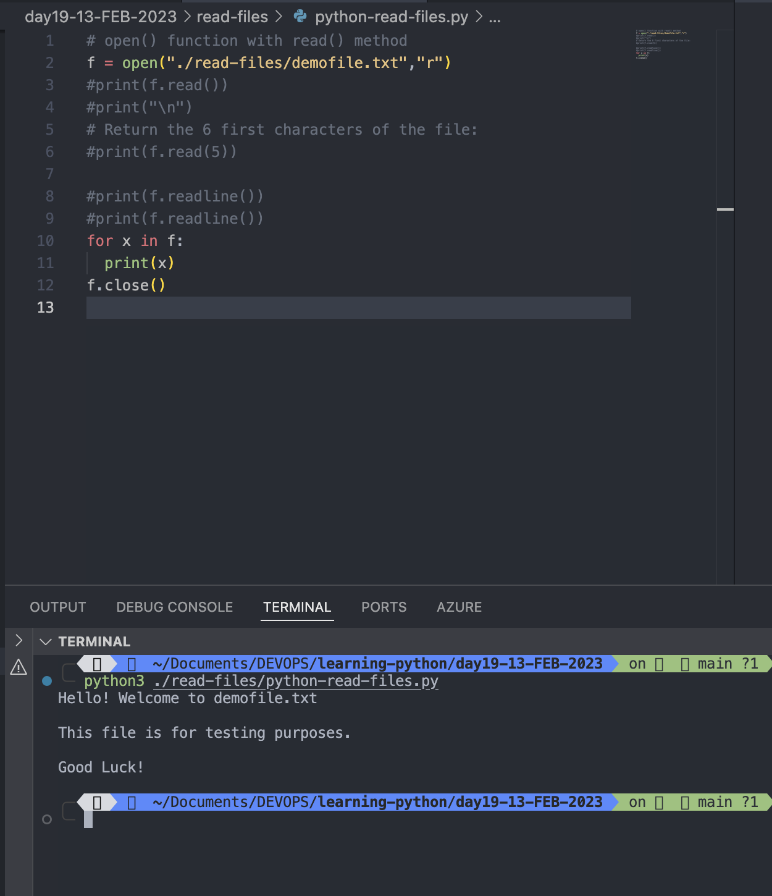

# Python File Handling

- File handling is an important part of web application
- Python has several functions for creating, reading, updating and deleting files.

# File Handling

- The key function for working with files in Python is the <mark>open() </mark>function.
- The open() function takes two parameters

  - filename
  - mode

- There are four different methods (modes) for opening a file:
  - "r" - Read - Default value. Opens a file for reading, error if the file does not exist
  - "a" - Append - Opens a file for appending, creates the file if it does not exist
  - "w" - Write - Opens a file for writing, creates the file if it does not exist
  - "x" - Create - Creates the specified file, returns an error if the file exists
- ## In addition you can specify if the file should be handled as binary or text mode
  - "t" - Text - Default value. Text mode
  - "b" - Binary - Binary mode (e.g. images)

# Syntax

- To open a file for reading it is enough to specify the name of the file:

```
f = open("demofile.txt")

```

- The code above is the same as:

```
f = open("demofile.txt", "rt")
```

### Note: Make sure the file exists, or else you will get an error.

#

```

f = open("/Users/rajeevsingh/Documents/DEVOPS/learning-python/day19-13-FEB-2023/demofile.txt ", "x")
#f = open("demofile.txt ")
```


#

# Python File Open

## Open a File on the Server

- Assume we have the following file, located in the same folder as Python:

```
demofile.txt

```

```
Hello! Welcome to demofile.txt
This file is for testing purposes.
Good Luck!
```

- To open the file, we use the built in function<mark> open()</mark>
- The open() function return a file object, which has a read() method for reading the content of the file.
-

```
# open() function with read() method
f = open("./read-files/demofile.txt","r")
print(f.read())
```


#

# Read Only Parts of the File

- By default the read() method returns the whole text, but you can also specify how many characters you want to return:

```
f = open("./read-files/demofile.txt","r")
#print(f.read())
#print("\n")
# Return the 6 first characters of the file:
print(f.read(5))
```


#

# Read Lines

- You can return one line by using the readline() method:

```
f = open("./read-files/demofile.txt","r")
print(f.readline())
```


#

- By calling readline() two times, you can read the two first lines:

```
f = open("./read-files/demofile.txt","r")
print(f.readline())
print(f.readline())
```


#

- By looping through the lines of the file, you can read the whole file, line by line:

```
f = open("./read-files/demofile.txt","r")
for x in f:
  print(x)
```


#

# Close Files

- It is a good practice to always close the file when you are done with it.

```
f = open("./read-files/demofile.txt","r")
for x in f:
  print(x)
f.close()
```



#

# Note: You should always close your files. In some cases, due to buffering, changes made to a file may not show until you close the file.

#

# Python File Write

## Write to an existing file

- To write to an existing file, you must add a parameter to the open() function:

  - "a" - Append - will append to the end of the file

  - "w" - Write - will overwrite any existing content

### Example: Open the file "demofile2.txt" and append content to the file:

```
# Open and read the file before appending
f = open("./write-or-create-file/demofile2.txt", "r")
print(f.read())
f.close()


f = open("./write-or-create-file/demofile2.txt", "a")
f.write("Now the file has more content")
f.close()

# Open and read the file afer appending
f = open("./write-or-create-file/demofile2.txt", "r")
print(f.read())
f.close()
```


#

```
# Open and read the file before writing
f = open("./write-or-create-file/demofile3.txt", "r")
print(f.read())
f.close()


f = open("./write-or-create-file/demofile3.txt", "w")
f.write("Woops, I have deleted the content!")
f.close()

# Open and read the file afer writing
f = open("./write-or-create-file/demofile3.txt", "r")
print(f.read())
f.close()

```


#

# Note: the "w" method will overwrite the entire file.

# Create a New File

- To create a new file in Python, use the open() method, with one of the following parameters:

  - "x" - Create - will create a file, returns an error if the file exists

  - "a" - Append - will create a file if the specified file does not exists

  - "w" - Write - will create a file if the specified file does not exists

#

### Example

```
# Create a file called myfile
f = open("./write-or-create-file/myfile", "x")
# write the content in myfile
f = open("./write-or-create-file/myfile", "w")
f.write("Hi There, My name is Rajeev Kumar Singh ")
f.close()

# Read the file after creating file and writing content
f = open("./write-or-create-file/myfile", "r")
print(f.read())
f.close()

```


#
