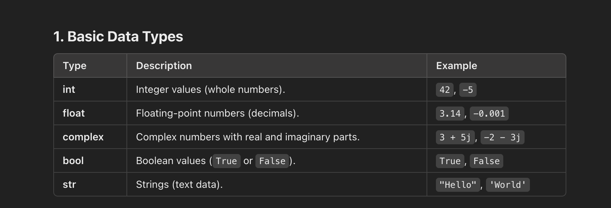
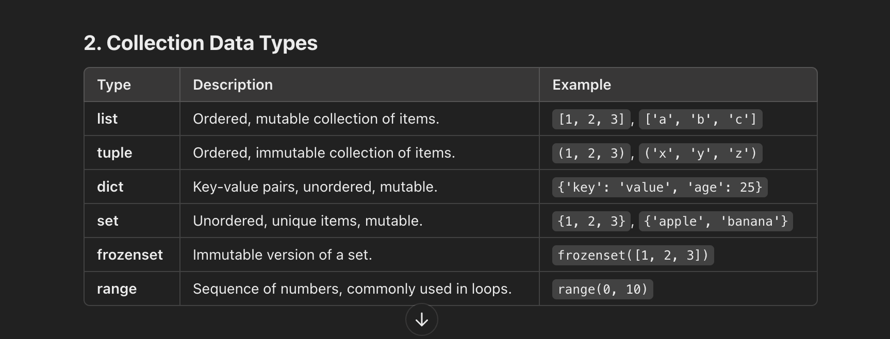

Python Data Types
Python offers several built-in data types that allow you to store and manipulate data efficiently.
These datatypes can be broadly categorised into

1. Basic
2. Collection
3. Custom
   
   
   
   
   
   
   
   
   
   
