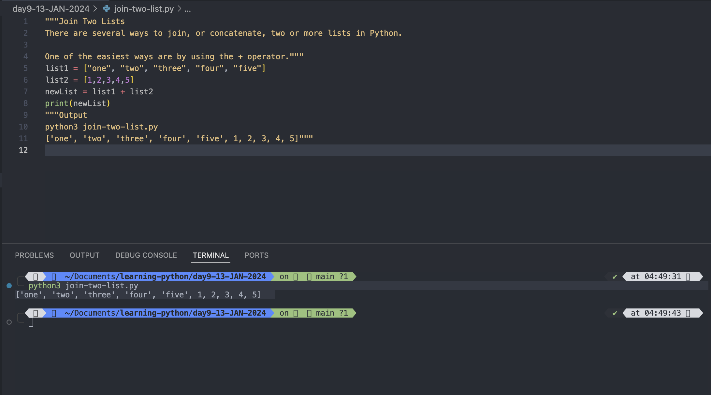

Join Two Lists
There are several ways to join, or concatenate, two or more lists in Python.

One of the easiest ways are by using the + operator.
list1 = ["one", "two", "three", "four", "five"]
list2 = [1,2,3,4,5]
newList = list1 + list2
print(newList)
"""Output
python3 join-two-list.py
['one', 'two', 'three', 'four', 'five', 1, 2, 3, 4, 5]"""
Another way to join two lists is by appending all the items from list2 into list1, one by one:
for i in list1:
list2.append(i)
for i in list2:
list1.append(i)
print(list1)
print(list2)
"""Output:
python3 join-two-list.py
['one', 'two', 'three', 'four', 'five', 1, 2, 3, 4, 5]
['one', 'two', 'three', 'four', 'five', 1, 2, 3, 4, 5, 'one', 'two', 'three', 'four', 'five']
[1, 2, 3, 4, 5, 'one', 'two', 'three', 'four', 'five']
['one', 'two', 'three', 'four', 'five', 1, 2, 3, 4, 5, 'one', 'two', 'three', 'four', 'five']"""

Or you can use the extend() method, where the purpose is to add elements from one list to another list:
list1 = ["one", "two", "three", "four", "five"]
list2 = [1,2,3,4,5]
print(list1)
print(list2)
list1.extend(list2)
print(list1)

for i in list2:
list1.extend(list2)
#list1.extend(i) # TypeError: 'int' object is not iterable
print(list1)
list1.extend(list2)
print(list1)
"""Output:
python3 extend-method-in-list.py
['one', 'two', 'three', 'four', 'five']
[1, 2, 3, 4, 5]
['one', 'two', 'three', 'four', 'five', 1, 2, 3, 4, 5]
['one', 'two', 'three', 'four', 'five', 1, 2, 3, 4, 5, 1, 2, 3, 4, 5, 1, 2, 3, 4, 5, 1, 2, 3, 4, 5, 1, 2, 3, 4, 5, 1, 2, 3, 4, 5]
['one', 'two', 'three', 'four', 'five', 1, 2, 3, 4, 5, 1, 2, 3, 4, 5, 1, 2, 3, 4, 5, 1, 2, 3, 4, 5, 1, 2, 3, 4, 5, 1, 2, 3, 4, 5, 1, 2, 3, 4, 5]"""
